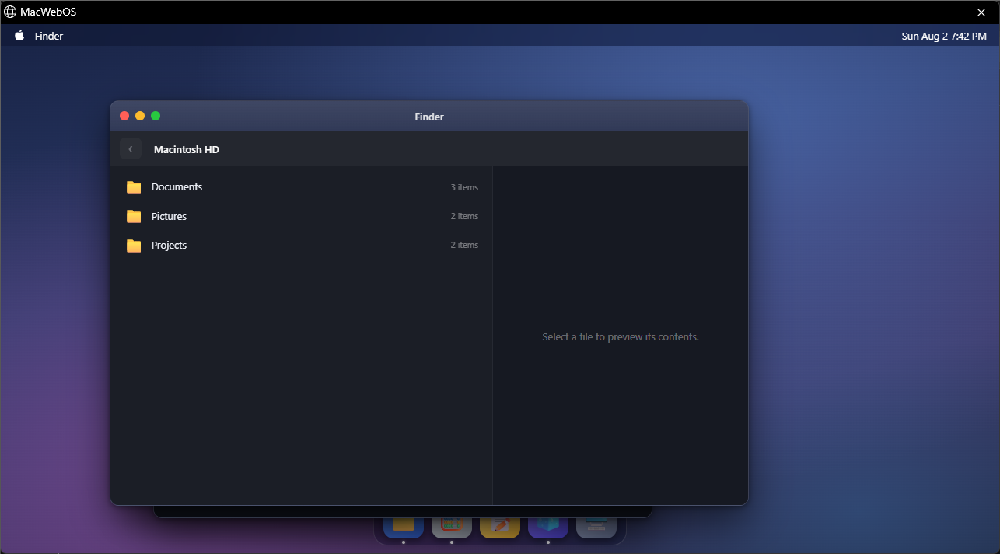
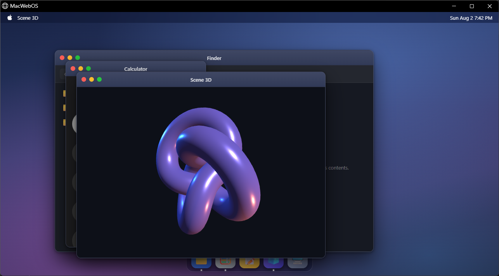

# Auto Code

**Agentic coding assistant for your terminal, built on .NET 10.**
**Asisten koding agentik untuk terminal Anda, dibangun di atas .NET 10.**

Dibuat oleh **Gravicode Studios**, dipimpin oleh **Kang Fadhil**.
Built by **Gravicode Studios**, led by **Kang Fadhil**.

[English](#english) · [Bahasa Indonesia](#bahasa-indonesia)


*Auto Code searching, reading, and answering — with the running token and cost line underneath.
Note that it says what it could **not** verify rather than guessing.*

---

### Auto Code Studio

A desktop panel for providers, endpoints, models and API keys — with a connection test that sends a
real request and reports latency, tokens and the model's reply.


---

### Built by Auto Code: MacWebOS

A macOS-like desktop in the browser — Blazor Server, custom CSS, vanilla-JS window manager, and
three.js — written by Auto Code driving DeepSeek. Draggable and resizable windows, working traffic
lights, a virtual filesystem, a calculator, notes, and a live WebGL scene.

| Finder over a virtual filesystem | three.js, resizing with the window frame |
| --- | --- |
|  |  |

---

## English

### What it is

Auto Code is a terminal coding agent. You describe what you want in plain language; it reads your
code, makes changes, runs your build and tests, and reports what actually happened.

It works in a loop of three phases, repeated as many times as the task needs:

1. **Gather context** — search and read the code before reasoning about it.
2. **Take action** — edit files, run commands.
3. **Verify results** — build, test, re-read. A change that has not been verified is not done.

**Any model, your choice.** Auto Code is not tied to a vendor. Configure OpenAI, Anthropic, Gemini,
DeepSeek, Qwen, Ollama, LM Studio, OpenRouter, Groq, Mistral, xAI, Azure OpenAI — or any endpoint
that speaks the OpenAI chat-completions format — from the app or from `app.config`.

### Requirements

- [.NET 10 SDK](https://dotnet.microsoft.com/download) or later
- An API key for a hosted model, **or** a local runtime such as [Ollama](https://ollama.com)

### Install

One command. It checks prerequisites, builds, installs `autocode`, puts it on your PATH, and
verifies it runs. No administrator rights needed.

```powershell
git clone https://github.com/gravicode/autocode.git
cd autocode
.\install.ps1                            # Windows
```

```bash
git clone https://github.com/gravicode/autocode.git
cd autocode
chmod +x install.sh && ./install.sh      # macOS and Linux
```

Add `-Studio` / `--studio` to also install the desktop settings app. Re-run it any time to upgrade;
`-Uninstall` / `--uninstall` removes it. Full detail: **[docs/en/installation.md](docs/en/installation.md)**.

Or run it straight from the repository without installing:

```bash
dotnet run --project src/AutoCode.Cli -- --help
```

### Quick start

The fastest path is an environment variable — Auto Code picks up the conventional vendor variables
with no configuration at all:

```bash
export OPENAI_API_KEY=sk-...      # or ANTHROPIC_API_KEY, GEMINI_API_KEY, DEEPSEEK_API_KEY…
autocode
```

Fully local, no key and no network:

```bash
ollama pull qwen2.5-coder:14b
autocode --provider ollama
```

Check that everything is wired up, including a real round trip to the model:

```bash
autocode doctor
```

### Using it

```bash
autocode                                   # interactive session
autocode "why does the build fail on CI?"  # interactive, seeded with a question
autocode -p "list every TODO in src"       # run once, print, exit
autocode --continue                        # resume the last session here
autocode --permission-mode plan "how would you add OAuth?"

git diff | autocode -p "review this change"
autocode -p "summarise the API surface" --output-format json | jq .result
```

Inside a session, `/help` lists every command. The ones you will reach for most:

| Command | What it does |
| --- | --- |
| `/model`, `/provider` | Switch model or provider mid-conversation |
| `/permissions` | Move between ask, acceptEdits, plan and bypassPermissions |
| `/cost` | Token and money accounting so far |
| `/compact` | Summarise the conversation to free context |
| `/agents`, `/teams` | Dispatch subagents, alone or as a team |
| `/init` | Generate an `AUTOCODE.md` for the project |
| `/export` | Write the transcript to markdown |

### Permissions

Auto Code asks before it changes anything. Read-only work never prompts.

| Mode | Behaviour |
| --- | --- |
| `ask` *(default)* | Approve each write, command and network call |
| `acceptEdits` | File edits apply unattended; shell and network still ask |
| `plan` | Read-only. Every mutation is refused, so you get a plan and nothing else |
| `bypassPermissions` | No prompts. Sandboxes and CI only |

Answers can be persisted as rules — `Bash(npm run:*)`, `Write(src/**)` — and **deny always wins**,
including over `bypassPermissions`.

### Configuration

Settings are layered, lowest to highest precedence:

1. Built-in vendor presets
2. `app.config` / `autocode.dll.config` `<appSettings>`
3. `~/.autocode/settings.json` — yours, every project
4. `<workspace>/.autocode/settings.json` — the project's, committed
5. `<workspace>/.autocode/settings.local.json` — yours, gitignored
6. `AUTOCODE_*` environment variables
7. Command-line flags

```jsonc
{
  "activeProvider": "openai",
  "providers": {
    "openai":   { "model": "gpt-4.1",             "apiKey": "env:OPENAI_API_KEY" },
    "local":    { "model": "qwen2.5-coder:14b",   "endpoint": "http://localhost:11434/v1" },
    "claude":   { "kind": "Anthropic", "model": "claude-sonnet-4-5", "enableExtendedThinking": true }
  },
  "permissionMode": "ask",
  "permissions": {
    "allow": ["Read", "Grep", "Glob", "Bash(git status)", "Bash(dotnet build)"],
    "deny":  ["Read(**/.env)", "Bash(rm -rf:*)"]
  },
  "verifyCommands": ["dotnet build", "dotnet test"]
}
```

`"apiKey": "env:NAME"` reads the variable at use time, so no secret has to sit in a committed file.
Run `autocode config init` to scaffold this.

Full reference: **[docs/en/configuration.md](docs/en/configuration.md)**

### Extending it

| Extension | Where it lives | What it does |
| --- | --- | --- |
| **Context** | `AUTOCODE.md`, `CLAUDE.md` | Standing instructions for the project |
| **Skills** | `.autocode/skills/<name>/SKILL.md` | Reusable workflows, invoked as `/name` |
| **Subagents** | `.autocode/agents/<name>.md` | Isolated workers dispatched with the `Task` tool |
| **Agent teams** | `teams` in settings | Several subagents on one brief, in parallel or in sequence |
| **Hooks** | `hooks` in settings | Shell commands bound to lifecycle events |
| **Plugins** | `.autocode/plugins/<name>/` | Bundles of all of the above |
| **MCP** | `mcpServers` in settings | Any Model Context Protocol server's tools |

Auto Code also reads `.claude/skills/` and `.claude/agents/`, so an existing Claude Code project
works unchanged.

### Built on

| Library | Used for |
| --- | --- |
| **Microsoft.Extensions.AI** | The `IChatClient` abstraction every provider is reached through |
| **Microsoft Agent Framework** | Subagent execution and isolation |
| **Microsoft.Extensions.VectorData** | The semantic code index contract |
| **Semantic Kernel** | Prompt templating for skills |
| **OllamaSharp** | Native local embeddings via Ollama |
| **ONNX Runtime + ML.Tokenizers** | Fully offline embeddings — no server, no network |
| **Model Context Protocol SDK** | MCP client |
| **Spectre.Console** | The terminal interface |

### Local embeddings

The semantic code index does not need a paid API. Point it at a local model:

```jsonc
// Ollama — free and private
{ "enableSemanticIndex": true, "embeddings": { "kind": "Ollama", "model": "nomic-embed-text" } }

// Or fully offline: no server, no network, no key
{ "enableSemanticIndex": true,
  "embeddings": { "kind": "Onnx", "modelPath": "models/model.onnx", "vocabPath": "models/vocab.txt" } }
```

Embeddings are configured independently of chat, so you can reason with Claude while indexing the
repository locally. See [providers](docs/en/providers.md#embeddings).

### Documentation

- [Installation](docs/en/installation.md)
- [Getting started](docs/en/getting-started.md)
- [Configuration](docs/en/configuration.md)
- [Providers and models](docs/en/providers.md)
- [Tools](docs/en/tools.md)
- [Permissions](docs/en/permissions.md)
- [Skills](docs/en/skills.md)
- [Subagents and teams](docs/en/subagents.md)
- [Hooks](docs/en/hooks.md)
- [MCP](docs/en/mcp.md)
- [Plugins](docs/en/plugins.md)
- [Architecture](docs/en/architecture.md)
- [CLI reference](docs/en/cli-reference.md)

### Development

```bash
dotnet build                                    # build everything
dotnet test                                     # run the suite
dotnet test --filter FullyQualifiedName~Permission   # one class
dotnet run --project src/AutoCode.Cli -- doctor
```

---

## Bahasa Indonesia


*Auto Code mencari, membaca, lalu menjawab — dengan baris token dan biaya di bawahnya. Perhatikan
bahwa ia menyebutkan apa yang **tidak** bisa ia verifikasi alih-alih menebak.*

### Auto Code Studio

Panel desktop untuk provider, endpoint, model, dan API key — dengan uji koneksi yang mengirim
permintaan sungguhan lalu melaporkan latensi, token, dan balasan model.


### Dibuat oleh Auto Code: MacWebOS

Desktop bergaya macOS di peramban — Blazor Server, CSS custom, window manager JavaScript murni, dan
three.js — ditulis oleh Auto Code yang menjalankan DeepSeek. Jendela bisa digeser dan diubah
ukurannya, traffic light berfungsi, ada virtual filesystem, kalkulator, catatan, dan scene WebGL.

| Finder di atas virtual filesystem | three.js, ikut ukuran bingkai jendela |
| --- | --- |
|  |  |

---

### Apa ini

Auto Code adalah agen koding untuk terminal. Anda menjelaskan keinginan Anda dengan bahasa biasa; ia
membaca kode Anda, melakukan perubahan, menjalankan build dan test, lalu melaporkan apa yang
sebenarnya terjadi.

Ia bekerja dalam siklus tiga fase, diulang sebanyak yang dibutuhkan tugas:

1. **Kumpulkan konteks** — cari dan baca kodenya sebelum menyimpulkan apa pun.
2. **Ambil tindakan** — ubah berkas, jalankan perintah.
3. **Verifikasi hasil** — build, test, baca ulang. Perubahan yang belum diverifikasi belum selesai.

**Model apa pun, pilihan Anda.** Auto Code tidak terikat vendor mana pun. Konfigurasikan OpenAI,
Anthropic, Gemini, DeepSeek, Qwen, Ollama, LM Studio, OpenRouter, Groq, Mistral, xAI, Azure OpenAI —
atau endpoint apa pun yang berbicara format OpenAI chat-completions — dari aplikasi maupun dari
`app.config`.

### Kebutuhan

- [.NET 10 SDK](https://dotnet.microsoft.com/download) atau lebih baru
- API key untuk model daring, **atau** runtime lokal seperti [Ollama](https://ollama.com)

### Instalasi

Satu perintah. Ia memeriksa prasyarat, melakukan build, memasang `autocode`, menaruhnya di PATH, dan
memverifikasi bahwa ia berjalan. Tanpa perlu hak administrator.

```powershell
git clone https://github.com/gravicode/autocode.git
cd autocode
.\install.ps1                            # Windows
```

```bash
git clone https://github.com/gravicode/autocode.git
cd autocode
chmod +x install.sh && ./install.sh      # macOS dan Linux
```

Tambahkan `-Studio` / `--studio` untuk sekaligus memasang aplikasi pengaturan desktop. Jalankan ulang
kapan saja untuk memutakhirkan; `-Uninstall` / `--uninstall` untuk menghapus. Rincian lengkap:
**[docs/id/installation.md](docs/id/installation.md)**.

Atau jalankan langsung dari repositori tanpa memasang apa pun:

```bash
dotnet run --project src/AutoCode.Cli -- --help
```

### Mulai cepat

Jalur tercepat adalah environment variable — Auto Code mengenali variabel vendor yang lazim tanpa
konfigurasi sama sekali:

```bash
export OPENAI_API_KEY=sk-...      # atau ANTHROPIC_API_KEY, GEMINI_API_KEY, DEEPSEEK_API_KEY…
autocode
```

Sepenuhnya lokal, tanpa key dan tanpa internet:

```bash
ollama pull qwen2.5-coder:14b
autocode --provider ollama
```

Periksa semuanya sudah tersambung, termasuk uji panggil sungguhan ke model:

```bash
autocode doctor
```

### Cara memakai

```bash
autocode                                    # sesi interaktif
autocode "kenapa build gagal di CI?"        # interaktif, langsung dengan pertanyaan
autocode -p "daftar semua TODO di src"      # sekali jalan, cetak, keluar
autocode --continue                         # lanjutkan sesi terakhir di sini
autocode --permission-mode plan "bagaimana cara menambah OAuth?"

git diff | autocode -p "tinjau perubahan ini"
autocode -p "ringkas permukaan API" --output-format json | jq .result
```

Di dalam sesi, `/help` menampilkan semua perintah. Yang paling sering dipakai:

| Perintah | Fungsinya |
| --- | --- |
| `/model`, `/provider` | Ganti model atau provider di tengah percakapan |
| `/permissions` | Pindah antara ask, acceptEdits, plan, dan bypassPermissions |
| `/cost` | Perhitungan token dan biaya sejauh ini |
| `/compact` | Ringkas percakapan untuk melegakan konteks |
| `/agents`, `/teams` | Kirim subagent, sendiri atau sebagai tim |
| `/init` | Buatkan `AUTOCODE.md` untuk proyek ini |
| `/export` | Tulis transkrip ke berkas markdown |

### Izin

Auto Code bertanya sebelum mengubah apa pun. Pekerjaan yang hanya membaca tidak pernah bertanya.

| Mode | Perilaku |
| --- | --- |
| `ask` *(bawaan)* | Setujui setiap penulisan, perintah, dan akses jaringan |
| `acceptEdits` | Perubahan berkas berjalan tanpa konfirmasi; shell dan jaringan tetap bertanya |
| `plan` | Hanya baca. Semua perubahan ditolak, sehingga yang Anda terima adalah rencana |
| `bypassPermissions` | Tanpa konfirmasi. Hanya untuk sandbox dan CI |

Jawaban bisa disimpan sebagai aturan — `Bash(npm run:*)`, `Write(src/**)` — dan **deny selalu
menang**, termasuk atas `bypassPermissions`.

### Konfigurasi

Pengaturan berlapis, dari prioritas terendah ke tertinggi:

1. Preset vendor bawaan
2. `<appSettings>` pada `app.config` / `autocode.dll.config`
3. `~/.autocode/settings.json` — milik Anda, semua proyek
4. `<workspace>/.autocode/settings.json` — milik proyek, ikut di-commit
5. `<workspace>/.autocode/settings.local.json` — milik Anda, masuk gitignore
6. Environment variable `AUTOCODE_*`
7. Argumen baris perintah

```jsonc
{
  "activeProvider": "openai",
  "providers": {
    "openai":   { "model": "gpt-4.1",             "apiKey": "env:OPENAI_API_KEY" },
    "local":    { "model": "qwen2.5-coder:14b",   "endpoint": "http://localhost:11434/v1" },
    "claude":   { "kind": "Anthropic", "model": "claude-sonnet-4-5", "enableExtendedThinking": true }
  },
  "permissionMode": "ask",
  "permissions": {
    "allow": ["Read", "Grep", "Glob", "Bash(git status)", "Bash(dotnet build)"],
    "deny":  ["Read(**/.env)", "Bash(rm -rf:*)"]
  },
  "verifyCommands": ["dotnet build", "dotnet test"]
}
```

`"apiKey": "env:NAMA"` membaca variabel saat dipakai, sehingga tidak ada rahasia yang perlu tersimpan
di berkas yang ikut di-commit. Jalankan `autocode config init` untuk membuat kerangkanya.

Rujukan lengkap: **[docs/id/configuration.md](docs/id/configuration.md)**

### Memperluas

| Ekstensi | Lokasinya | Fungsinya |
| --- | --- | --- |
| **Konteks** | `AUTOCODE.md`, `CLAUDE.md` | Instruksi tetap untuk proyek ini |
| **Skills** | `.autocode/skills/<nama>/SKILL.md` | Alur kerja pakai ulang, dipanggil sebagai `/nama` |
| **Subagent** | `.autocode/agents/<nama>.md` | Pekerja terisolasi, dikirim lewat tool `Task` |
| **Agent team** | `teams` di settings | Beberapa subagent untuk satu brief, paralel atau berurutan |
| **Hooks** | `hooks` di settings | Perintah shell yang terikat pada peristiwa siklus hidup |
| **Plugin** | `.autocode/plugins/<nama>/` | Paket berisi semua hal di atas |
| **MCP** | `mcpServers` di settings | Tool dari server Model Context Protocol mana pun |

Auto Code juga membaca `.claude/skills/` dan `.claude/agents/`, sehingga proyek Claude Code yang sudah
ada langsung bisa dipakai.

### Dibangun di atas

| Pustaka | Dipakai untuk |
| --- | --- |
| **Microsoft.Extensions.AI** | Abstraksi `IChatClient` yang menjadi pintu semua provider |
| **Microsoft Agent Framework** | Eksekusi dan isolasi subagent |
| **Microsoft.Extensions.VectorData** | Kontrak indeks kode semantik |
| **Semantic Kernel** | Prompt templating untuk skills |
| **OllamaSharp** | Embedding lokal native lewat Ollama |
| **ONNX Runtime + ML.Tokenizers** | Embedding sepenuhnya offline — tanpa server, tanpa jaringan |
| **Model Context Protocol SDK** | Klien MCP |
| **Spectre.Console** | Antarmuka terminal |

### Embedding lokal

Indeks kode semantik tidak memerlukan API berbayar. Arahkan saja ke model lokal:

```jsonc
// Ollama — gratis dan privat
{ "enableSemanticIndex": true, "embeddings": { "kind": "Ollama", "model": "nomic-embed-text" } }

// Atau sepenuhnya offline: tanpa server, tanpa jaringan, tanpa key
{ "enableSemanticIndex": true,
  "embeddings": { "kind": "Onnx", "modelPath": "models/model.onnx", "vocabPath": "models/vocab.txt" } }
```

Embedding dikonfigurasi terpisah dari chat, sehingga Anda bisa bernalar dengan Claude sambil
mengindeks repositori secara lokal. Lihat [provider](docs/id/providers.md#embedding).

### Dokumentasi

- [Instalasi](docs/id/installation.md)
- [Memulai](docs/id/getting-started.md)
- [Konfigurasi](docs/id/configuration.md)
- [Provider dan model](docs/id/providers.md)
- [Tools](docs/id/tools.md)
- [Izin](docs/id/permissions.md)
- [Skills](docs/id/skills.md)
- [Subagent dan tim](docs/id/subagents.md)
- [Hooks](docs/id/hooks.md)
- [MCP](docs/id/mcp.md)
- [Plugin](docs/id/plugins.md)
- [Arsitektur](docs/id/architecture.md)
- [Rujukan CLI](docs/id/cli-reference.md)

### Pengembangan

```bash
dotnet build                                    # bangun semuanya
dotnet test                                     # jalankan seluruh tes
dotnet test --filter FullyQualifiedName~Permission   # satu kelas saja
dotnet run --project src/AutoCode.Cli -- doctor
```

---

## License

MIT © Gravicode Studios

Made with care by **Gravicode Studios**, led by **Kang Fadhil**.
Dibuat dengan sepenuh hati oleh **Gravicode Studios**, dipimpin oleh **Kang Fadhil**.
