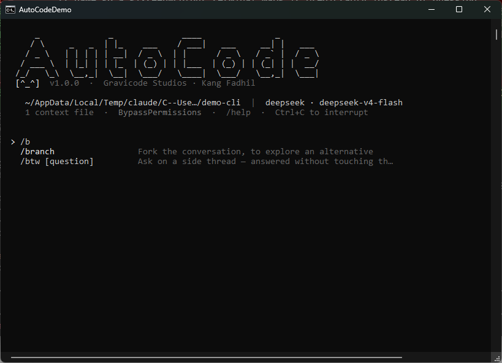

# CLI reference

> Auto Code — Gravicode Studios, led by Kang Fadhil

```
autocode [options] [prompt]
autocode <command> [args]
```

## Commands

| Command | Purpose |
| --- | --- |
| `config show` | Resolved configuration and where it came from |
| `config init` | Scaffold `.autocode/settings.json` |
| `config path` | The settings files being read |
| `mcp` | Configured MCP servers |
| `sessions` | Saved sessions for this workspace |
| `sessions rm <id>` | Delete one |
| `doctor` | Verify installation, configuration and a live model request |

## Options

| Option | Meaning |
| --- | --- |
| `-p`, `--print` | Run once, print the result, exit |
| `--output-format <fmt>` | `text` (default), `json`, `stream-json` |
| `-c`, `--continue` | Resume the most recent session in this workspace |
| `-r`, `--resume <id>` | Resume a specific session |
| `--model <id>` | Override the model for this run |
| `--provider <name>` | Override the provider profile |
| `--permission-mode <m>` | `ask`, `acceptEdits`, `plan`, `bypassPermissions` |
| `--allowed-tools <list>` | Comma-separated allow rules |
| `--disallowed-tools <list>` | Comma-separated tool names to disable |
| `--dangerously-skip-permissions` | Same as `--permission-mode bypassPermissions` |
| `--cwd <path>` | Workspace root to operate in |
| `--lang <en\|id>` | Interface and reply language |
| `--no-context` | Skip `AUTOCODE.md` / `CLAUDE.md` discovery |
| `-h`, `--help` | Show usage |
| `-v`, `--version` | Show the version |

## Slash commands

Available inside an interactive session.

Type `/` and the list appears, each command with what it does. Tab fills in as far as every
candidate agrees; the arrow keys pick one.



**Context**

| Command | Purpose |
| --- | --- |
| `/context` | Token usage and the instruction files in effect |
| `/compact [instruction]` | Summarise the conversation; the instruction steers what is kept |
| `/clear` | Start a fresh conversation |
| `/memory [note]` | Review or add to `AUTOCODE.md`, the project's standing instructions |
| `/btw [question]` | Ask on a side thread — answered without touching the main conversation |

**Session**

| Command | Purpose |
| --- | --- |
| `/rename <title>` | Name this session |
| `/resume`, `/sessions` | List saved sessions for this workspace |
| `/branch` | Fork the conversation, to explore an alternative |
| `/undo [n]`, `/rewind [n]` | Drop the last n exchanges and carry on from there |
| `/export [path]` | Write the transcript to a markdown file |
| `/recap` | One-paragraph summary of this session so far |

**Configuration**

| Command | Purpose |
| --- | --- |
| `/model [id]` | Show or switch the model |
| `/provider [name]` | Show or switch the provider profile |
| `/effort [level]` | Reasoning depth: off, low, medium, high, max |
| `/permissions [mode]` | Show or set ask, acceptEdits, plan, bypassPermissions |
| `/config` | Where settings are read from, and how to edit them |
| `/theme [name]` | Switch the colour theme: auto, plain |
| `/language <en\|id>` | Interface and reply language |

**Workflow**

| Command | Purpose |
| --- | --- |
| `/plan` | Enter plan mode: research only, no changes |
| `/diff [path]` | Show uncommitted changes |
| `/code-review` | Review the working diff for defects |
| `/security-review` | Review the working diff for vulnerabilities |
| `/init` | Generate an `AUTOCODE.md` for this project |
| `/index` | Build the semantic code index |

**Inspect**

| Command | Purpose |
| --- | --- |
| `/status` | Provider, model, workspace, permissions, session |
| `/cost` | Token and cost accounting |
| `/tools` | Tools available to the model |
| `/agents` | Subagents that can be dispatched |
| `/teams <name> <brief>` | Run an agent team on a brief |
| `/fork <agent> <brief>` | Hand a side-task to a subagent, off the main conversation |
| `/skills` | Installed skills |
| `/mcp` | MCP server connections |
| `/tasks` | Subagents running right now |
| `/about` | About Auto Code |
| `/help` | List these commands |
| `/exit` | Leave Auto Code |

Every installed skill is also a slash command: `/deploy`, `/release`, and so on.

## Input

- Enter submits.
- End a line with `\` to continue onto the next, for multi-line prompts.
- **Ctrl+C** interrupts the turn in progress; the session survives. Press it again at an idle prompt
  to exit.

## Output formats

**`text`** *(default)* — assistant prose, streamed.

**`json`** — one object, after the run:

```json
{
  "session_id": "a1b2c3d4e5f6",
  "model": "gpt-4.1",
  "provider": "openai",
  "result": "…",
  "denials": [],
  "usage": { "input_tokens": 1420, "output_tokens": 310, "requests": 3, "cost_usd": 0.0053 }
}
```

**`stream-json`** — newline-delimited JSON, one object per event, as it happens:

```json
{"type":"turn_started","session_id":"a1b2c3d4","iteration":1,"timestamp":"…"}
{"type":"tool_call_started","call_id":"c1","tool_name":"Read","summary":"Read(src/a.cs)","timestamp":"…"}
{"type":"tool_call_completed","call_id":"c1","tool_name":"Read","success":true,"display":"Read src/a.cs (120 lines)","elapsed_ms":8,"timestamp":"…"}
{"type":"assistant_text","text":"The file defines…","is_final":false,"timestamp":"…"}
{"type":"turn_completed","iterations":2,"input_tokens":1420,"output_tokens":310,"cost_usd":0.0053,"elapsed_ms":4210,"timestamp":"…"}
```

Event types: `turn_started`, `assistant_text`, `assistant_thinking`, `tool_call_started`,
`tool_call_completed`, `tool_call_denied`, `todo_updated`, `subagent_started`, `subagent_completed`,
`compaction`, `notice`, `error`, `turn_completed`.

## Exit codes

| Code | Meaning |
| --- | --- |
| `0` | Success |
| `1` | Error, or the turn was aborted |
| `2` | Bad usage — unknown option, or `--print` with no prompt |
| `130` | Cancelled |

## Environment variables

| Variable | Purpose |
| --- | --- |
| `AUTOCODE_PROVIDER` | Provider profile, same as `--provider` |
| `AUTOCODE_MODEL` | Model id, same as `--model` |
| `AUTOCODE_<PATH>` | Any setting, `__` as the section separator |
| `AUTOCODE_DEBUG=1` | Print full stack traces on failure |
| `NO_COLOR` | Disable colour output |
| `OPENAI_API_KEY` etc. | Recognised vendor keys — see [providers](providers.md) |

## Examples

```bash
autocode
autocode "why does the build fail on CI?"
autocode -p "list every public endpoint" --output-format json | jq -r .result
autocode --continue
autocode --permission-mode plan "how would you add multi-tenancy?"
autocode --provider ollama --model qwen2.5-coder:14b
git diff --staged | autocode -p "write a commit message for this"
autocode -p "fix the failing test" --permission-mode acceptEdits
autocode doctor
```

## Commands that are deliberately absent

Auto Code runs entirely in your terminal, against a session you started. Four commands people ask
for assume infrastructure it does not have, and stubs that print "coming soon" are worse than
nothing:

| Command | Why not |
| --- | --- |
| `/background` | There is no session daemon. A turn lives and dies with the process. |
| `/teleport` | There is no web session to pull down. |
| `/remote-control` | There is no server holding sessions for other devices to attach to. |
| `/batch` | Splitting a large change into independent units is a planning judgement, not a mechanism. Use `/plan`, then work through the result. |

`/focus` is also absent: the interface has no chrome to hide.

`/tasks` exists but will always report nothing running — subagents execute inline, inside the turn
that dispatched them, so nothing ever detaches.
