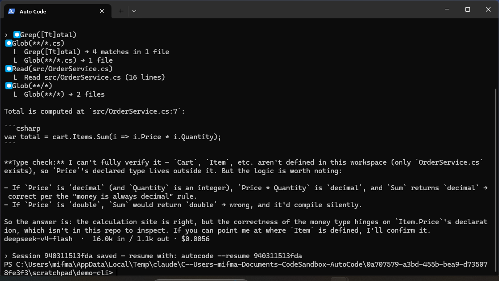

# Getting started

> Auto Code — Gravicode Studios, led by Kang Fadhil



## Install

Auto Code needs the [.NET 10 SDK](https://dotnet.microsoft.com/download).

```bash
git clone https://github.com/gravicode/autocode.git
cd autocode
dotnet build -c Release
dotnet pack -c Release
dotnet tool install --global --add-source ./src/AutoCode.Cli/nupkg Gravicode.AutoCode
```

Verify:

```bash
autocode --version
```

## Point it at a model

Auto Code has no model of its own. Give it one of three ways.

### 1. An environment variable

The conventional vendor variables are picked up with no configuration at all:

```bash
export OPENAI_API_KEY=sk-...
autocode
```

Recognised: `OPENAI_API_KEY`, `ANTHROPIC_API_KEY`, `GEMINI_API_KEY`, `DEEPSEEK_API_KEY`,
`DASHSCOPE_API_KEY` (Qwen), `OPENROUTER_API_KEY`, `GROQ_API_KEY`, `MISTRAL_API_KEY`, `XAI_API_KEY`,
`AZURE_OPENAI_API_KEY`.

### 2. A local runtime

No key, no network, nothing leaves your machine:

```bash
ollama pull qwen2.5-coder:14b
autocode --provider ollama
```

`lmstudio` works the same way against `http://localhost:1234/v1`.

### 3. A settings file

```bash
autocode config init
```

That writes `.autocode/settings.json`. Edit it, and put anything secret in
`.autocode/settings.local.json` instead — that file is meant to be gitignored.

## Check it works

```bash
autocode doctor
```

`doctor` verifies the runtime, the workspace, the provider configuration, the API key, **and** makes
a real request to the model. A green run means the whole path works, not just that the config parses.

## Your first session

```bash
cd ~/projects/my-api
autocode
```

Then just say what you want:

```
› why is OrderService returning 500 on an empty cart?
```

Auto Code will search, read what it finds, and answer. Ask it to fix something and it will edit,
then run your build and tests — asking before each change.

## Give it project context

The single highest-value thing you can do for a project:

```
› /init
```

This writes an `AUTOCODE.md` — build commands, architecture, conventions — that every future session
reads automatically. Commit it. Edit it when it drifts.

If your project already has a `CLAUDE.md`, Auto Code reads that too, unchanged.

## Set the verification commands

Tell Auto Code how to check its own work:

```jsonc
// .autocode/settings.json
{ "verifyCommands": ["dotnet build", "dotnet test"] }
```

The agent gets a `Verify` tool and is instructed to run it after making changes. Without this, it
guesses at your build system; with it, it knows.

## Working non-interactively

```bash
# Answer and exit
autocode -p "how many public endpoints does this service expose?"

# Structured output for scripting
autocode -p "list every TODO in src" --output-format json | jq -r .result

# Read the prompt from a pipe
git diff | autocode -p "review this change"
```

In `--print` mode nothing can prompt you, so tools that need approval are refused with an
explanation rather than hanging. Pass `--permission-mode acceptEdits` when you want it to actually
change files unattended.

## Where to next

- [Configuration](configuration.md) — every setting, and the order they layer in
- [Permissions](permissions.md) — how approval works, and how to stop being asked
- [Skills](skills.md) — turn a repeated workflow into `/deploy`
- [Subagents and teams](subagents.md) — keep large investigations out of your main context
