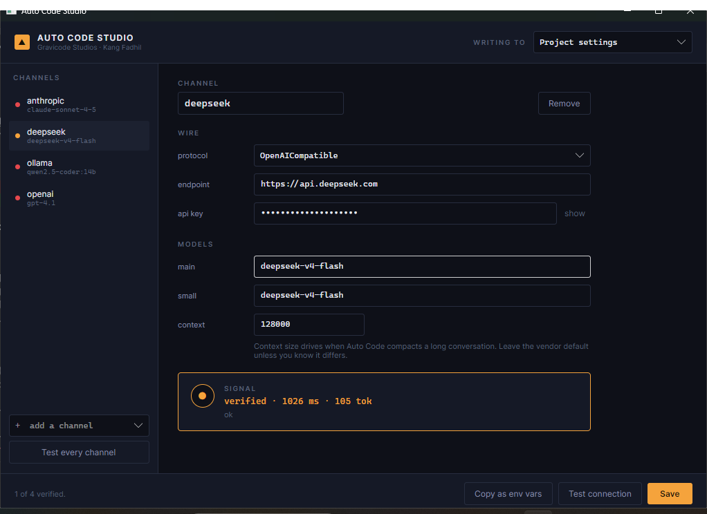

# Instalasi

> Auto Code — Gravicode Studios, dipimpin oleh Kang Fadhil

## Satu perintah

Clone repositorinya lalu jalankan installer sesuai platform Anda. Ia memeriksa prasyarat, melakukan
build, memasang `autocode` sebagai .NET global tool, menaruhnya di PATH, dan memverifikasi bahwa ia
benar-benar berjalan.

**Windows**

```powershell
git clone https://github.com/gravicode/autocode.git
cd autocode
.\install.ps1
```

**macOS dan Linux**

```bash
git clone https://github.com/gravicode/autocode.git
cd autocode
chmod +x install.sh
./install.sh
```

Keduanya tidak memerlukan hak administrator maupun `sudo`: .NET global tool dipasang di bawah profil
Anda sendiri.

Setelah selesai, buka terminal baru agar perubahan PATH berlaku, lalu:

```bash
autocode --version
```

## Opsi

| Flag | Efeknya |
| --- | --- |
| `-Studio` / `--studio` | Sekaligus membangun dan memasang aplikasi pengaturan desktop |
| `-SkipBuild` / `--skip-build` | Memakai ulang paket yang sudah ada di `artifacts/` |
| `-Uninstall` / `--uninstall` | Menghapus perintah `autocode` |
| `-h` / `--help` | Cara pakai (khusus skrip shell) |

Menjalankan ulang installer akan memutakhirkan instalasi yang ada di tempatnya; tidak perlu
di-uninstall lebih dulu.

## Apa yang dilakukan installer

1. Memastikan .NET 10 SDK tersedia, dan berhenti disertai perintah instalasinya bila tidak ada.
2. Melakukan build solusi dalam mode Release.
3. Mengemas `AutoCode.Cli` ke dalam `artifacts/`.
4. Memasang atau memutakhirkan global tool `Gravicode.AutoCode` dari paket tersebut.
5. Menambahkan direktori tools .NET ke PATH **persisten** Anda bila belum ada.
6. Menjalankan `autocode --version` untuk membuktikan seluruh jalurnya bekerja.

Tidak ada yang ditulis di luar direktori home Anda dan checkout repositori.

## Prasyarat

Auto Code membutuhkan [.NET 10 SDK](https://dotnet.microsoft.com/download). Runtime saja tidak cukup
— installer melakukan build dari kode sumber.

```powershell
winget install Microsoft.DotNet.SDK.10          # Windows
```

```bash
brew install --cask dotnet-sdk                  # macOS
curl -sSL https://dot.net/v1/dotnet-install.sh | bash -s -- --channel 10.0   # Linux
```

Periksa dengan `dotnet --list-sdks`. Entri 10.x mana pun sudah memadai.

## Arahkan ke sebuah model

Auto Code tidak membawa model. Berikan satu dari tiga cara berikut.

**Environment variable** — variabel vendor yang lazim tidak butuh konfigurasi sama sekali:

```bash
export OPENAI_API_KEY=sk-...     # atau ANTHROPIC_API_KEY, GEMINI_API_KEY, DEEPSEEK_API_KEY…
autocode
```

**Runtime lokal** — tanpa key, tanpa jaringan:

```bash
ollama pull qwen2.5-coder:14b
autocode --provider ollama
```

**Berkas settings** — `autocode config init` membuat kerangkanya, atau pakai Studio di bawah.

Lalu verifikasi semuanya, termasuk permintaan sungguhan ke model:

```bash
autocode doctor
```

## Auto Code Studio

Aplikasi desktop lintas platform untuk mengelola provider, endpoint, model, dan API key, sehingga
kredensial tidak perlu disunting sebagai JSON secara manual.



```powershell
.\install.ps1 -Studio      # Windows — menambahkan entri di Start menu
```

```bash
./install.sh --studio      # macOS/Linux — menambahkan perintah `autocode-studio`
```

Yang diberikannya dan tidak Anda dapat dari menyunting manual:

- **Verifikasi.** Tombol "Test connection" mengirim permintaan sungguhan lalu melaporkan latensi,
  token, dan balasan harfiah model. Formulir yang terisi tidak membuktikan apa pun; satu perjalanan
  bolak-balik membuktikan segalanya.
- **Berkas yang tepat.** Pilih antara settings pengguna, settings proyek, dan settings lokal yang
  masuk gitignore, disertai peringatan ketika key literal hendak mendarat di berkas yang seharusnya
  ikut di-commit.
- **Ekspor environment.** Salin seluruh profil sebagai shell export, agar key sama sekali tidak
  tersimpan di berkas.

Studio hanya menyunting bagian provider. Permissions, hooks, server MCP, dan verify command di
berkas yang sama dibiarkan persis seperti semula — termasuk profil yang tidak bisa di-parse Studio
sendiri.

## Memasang tanpa skrip

```bash
dotnet build -c Release
dotnet pack src/AutoCode.Cli -c Release -o ./artifacts
dotnet tool install --global --add-source ./artifacts Gravicode.AutoCode
```

Untuk menjalankan langsung dari checkout tanpa memasang apa pun:

```bash
dotnet run --project src/AutoCode.Cli -- --help
```

## Memutakhirkan

```bash
git pull
./install.sh          # atau .\install.ps1
```

## Menghapus

```powershell
.\install.ps1 -Uninstall
```

```bash
./install.sh --uninstall
```

Setelan dan sesi tersimpan sengaja dibiarkan. Hapus sendiri bila diinginkan:

```bash
rm -rf ~/.autocode
```

## Pemecahan masalah

**`autocode` tidak dikenali setelah instalasi.** Perubahan PATH hanya berlaku pada terminal baru.
Buka terminal baru. Bila masih gagal, periksa direktori tools ada di PATH:

```powershell
[Environment]::GetEnvironmentVariable('PATH','User') -split ';' | Select-String '.dotnet'
```

```bash
echo "$PATH" | tr ':' '\n' | grep dotnet
```

**"Project file does not exist".** Jalankan installer dari akar repositori, bukan dari dalam `src/`.

**"Auto Code needs .NET 10".** SDK yang terpasang lebih lama. `dotnet --list-sdks` menampilkan yang
ada; memasang versi 10 berdampingan dengan versi lama aman dan tidak mengganggu proyek lain.

**Build gagal pada clone baru.** Lakukan restore secara eksplisit lalu baca galat *pertama*, bukan
yang terakhir: `dotnet restore && dotnet build -c Release`.

**`autocode doctor` gagal di tahap round trip.** Instalasinya baik-baik saja; providernya yang
bermasalah. Lihat [provider](providers.md#pemecahan-masalah).
