<div align="center">

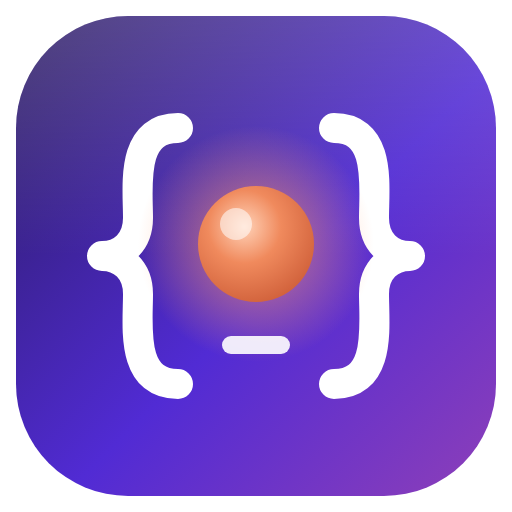

# DotCode

**Agentic coding di terminal Anda — dengan LLM apa pun.**
Port pengalaman Claude Code ke .NET 10, lengkap dengan SDK harness untuk .NET, TypeScript, Python, Go, dan Java.

*Dibuat oleh **Gravicode Studios**, dipimpin oleh **Kang Fadhil**.*

🇬🇧 [Read in English](README.md)

</div>

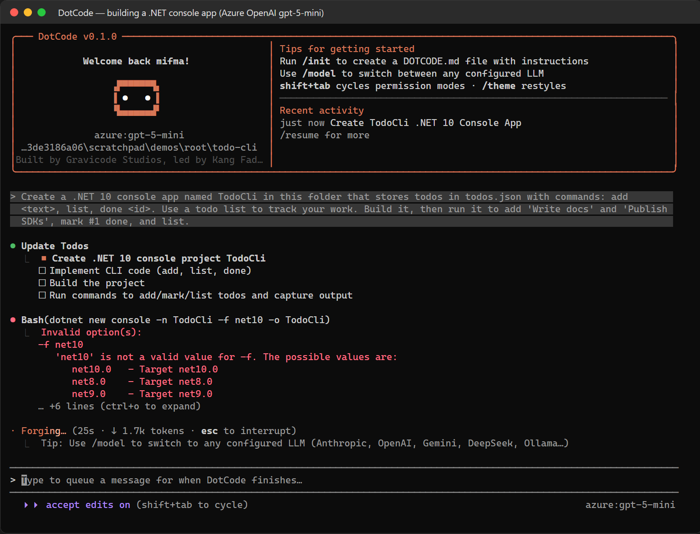

DotCode membaca codebase Anda, mengedit file, menjalankan perintah dan test, lalu menjelaskan apa yang dilakukannya — dari UI terminal yang tampilan dan rasanya seperti Claude Code (tata letak, dialog, tampilan diff, spinner, pintasan, slash command, dan mode izin yang sama), namun dengan model pilihan Anda: **Anthropic, OpenAI, Azure OpenAI, Google Gemini, DeepSeek, Ollama (sepenuhnya lokal), atau server kompatibel OpenAI**. Engine yang sama diekspos lewat JSON-RPC sehingga aplikasi Anda sendiri dapat menyematkan agen ini.

## Fitur utama

- **UI terminal ala Claude Code** — markdown streaming, blok `● Tool(argumen)` / `⎿ hasil`, diff berwarna, spinner beranimasi dengan kata berkilau, daftar tugas, dialog izin dan rencana, menu `/`, sebutan file `@`, mode bash `!`, memori `#`, rewind Esc-Esc, riwayat prompt dengan pencarian Ctrl+R, penampil transkrip Ctrl+O, mode vim, UI Inggris / Indonesia, notifikasi terminal, 15 tema, set glyph untuk semua font (unicode / ascii / Nerd Font), tema kustom, status line.
- **Model apa pun, satu engine** — adapter Anthropic Messages, OpenAI Responses & Chat, Azure, Gemini, DeepSeek, Ollama, dan server kompatibel OpenAI (profil quirk), dengan prompt caching, round-trip reasoning, sanitasi skema, retry, rantai fallback, pelacakan biaya, serta text tool protocol untuk model tanpa function calling. Ganti model di tengah sesi dengan `/model`.
- **Tool agen lengkap** — Read, Write, Edit, Glob, Grep, Bash (Git Bash di Windows), PowerShell, shell latar belakang, WebFetch, WebSearch, TodoWrite, subagent, Skill, AskUserQuestion, plan mode, notebook, tool & resource MCP.
- **Aman secara default** — mode izin (default, acceptEdits, plan, bypass lewat `--dangerously-skip-permissions`), aturan kompatibel Claude Code, analisis perintah majemuk, checkpoint dan `/rewind`, hooks.
- **Dapat diperluas dan kompatibel** — skills (`SKILL.md`), command kustom, subagent, hooks, output style, plugin & marketplace, server MCP (stdio / HTTP). Membaca `CLAUDE.md`, `AGENTS.md`, dan `.claude/`.
- **Headless & CI** — `dotcode -p` dengan output text / json / stream-json.
- **SDK harness** — `dotcode serve` (JSON-RPC 2.0 via stdio atau WebSocket) dengan SDK **.NET** (juga in-process), **TypeScript**, **Python**, **Go**, dan **Java**: tool kustom, handler izin, event streaming, BYOK.
- **Cepat dan kecil** — binary tunggal NativeAOT (~14 MB, langsung jalan).

## Screenshot

Semua screenshot diambil dari sesi nyata (Azure OpenAI gpt-5-mini dan DeepSeek V4 Flash) menggunakan harness terminal berskrip di [`tools/DotCode.TermCapture`](tools/DotCode.TermCapture).

| | |
|---|---|
| **Layar sambutan** 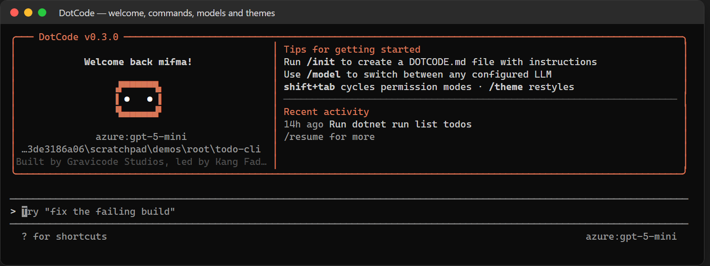 | **Slash command** 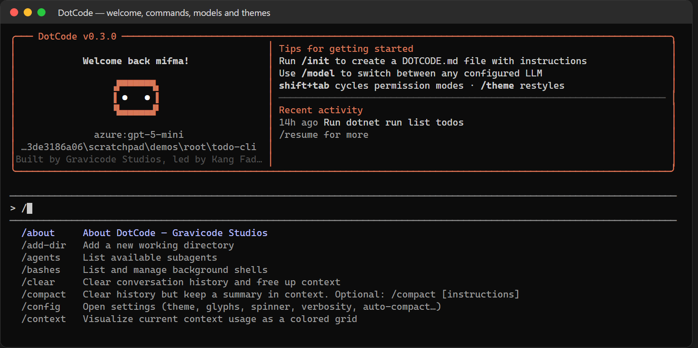 |
| **Dialog izin** 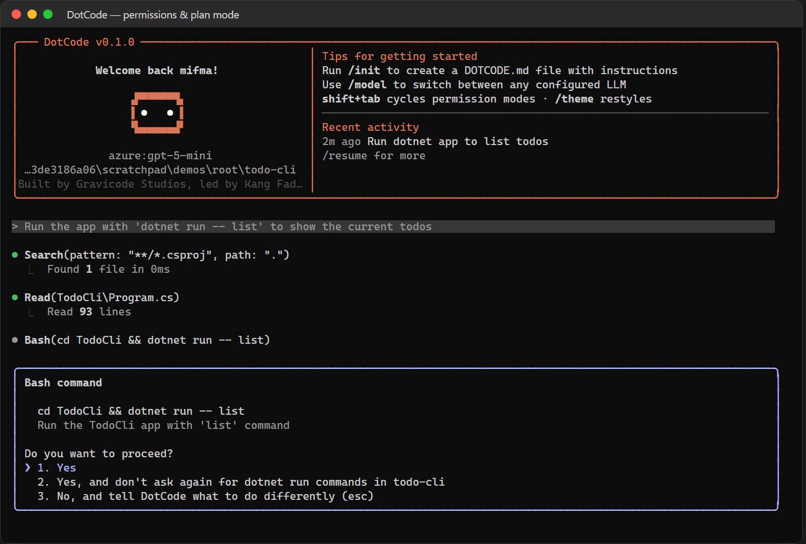 | **Plan mode** 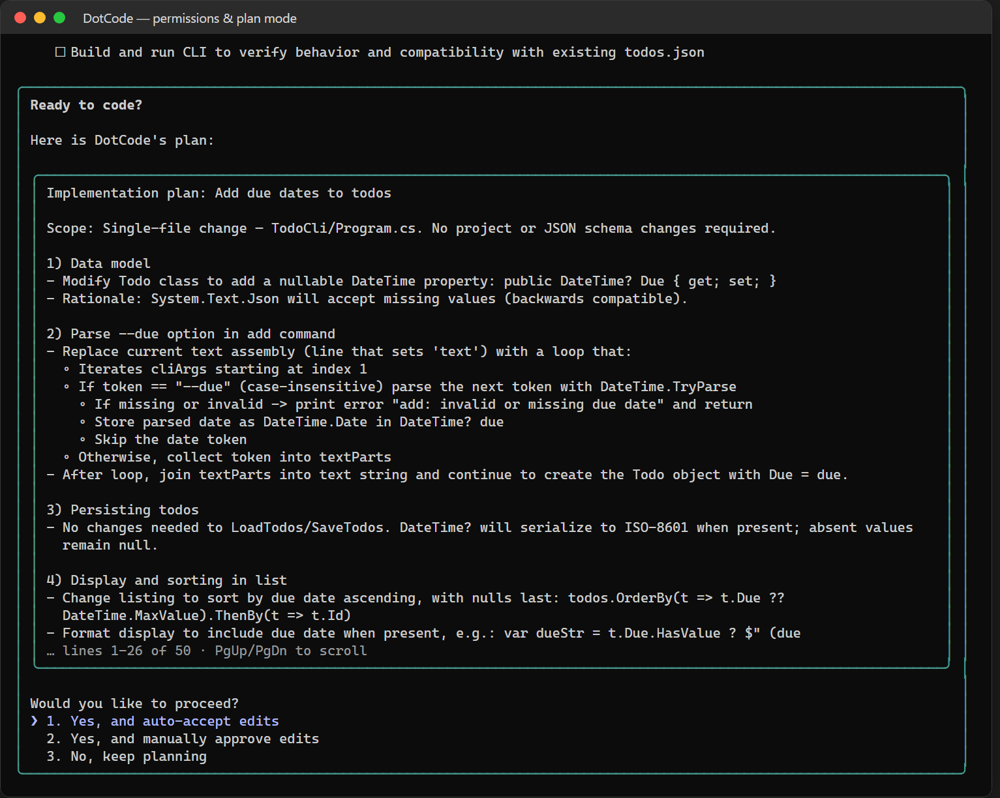 |
| **Tool server MCP** 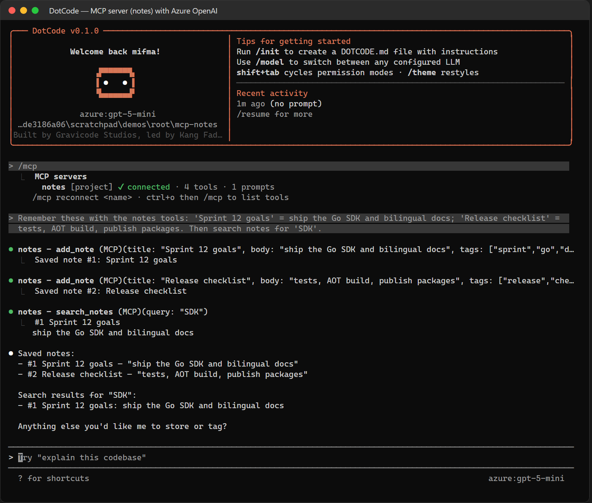 | **Pemilih model (multi-LLM)** 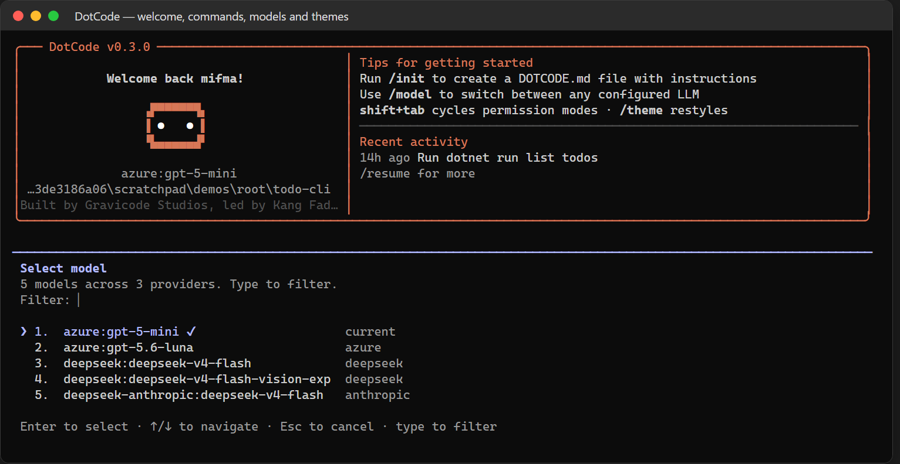 |
| **Pemakaian konteks & biaya** 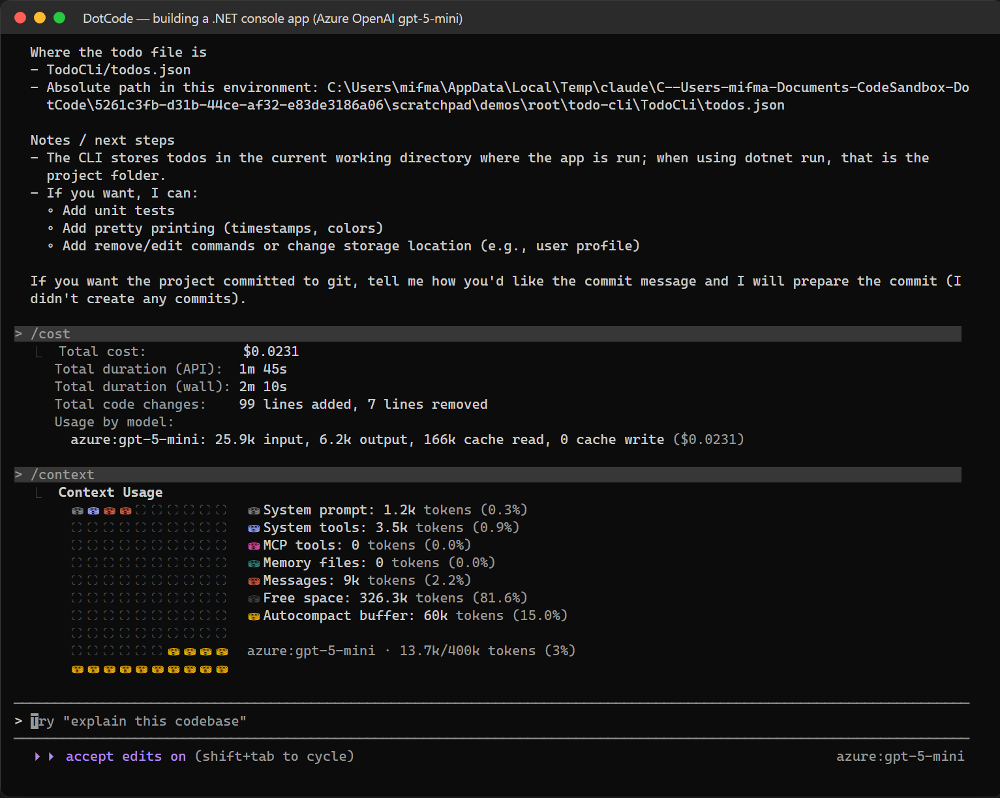 | **Tema** 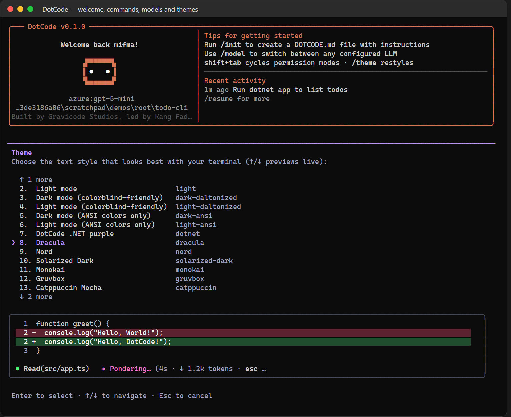 |

**Dibuat dengan DotCode** — landing page dari prompt berbahasa Indonesia (DeepSeek), aplikasi konsol .NET (Azure OpenAI), laporan insight CSV lewat skill, dan command plugin:

| Sesi | Hasil |
|---|---|
| 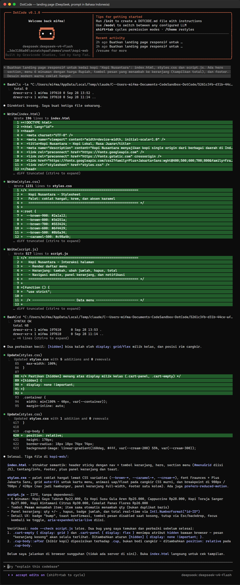 | 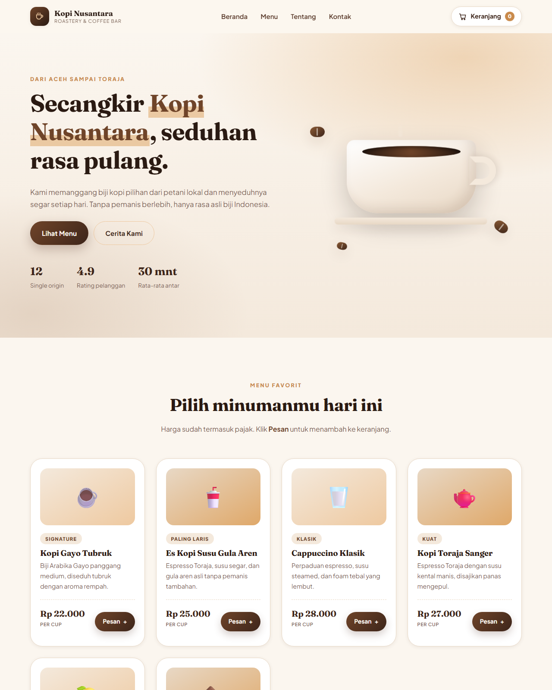 |
| 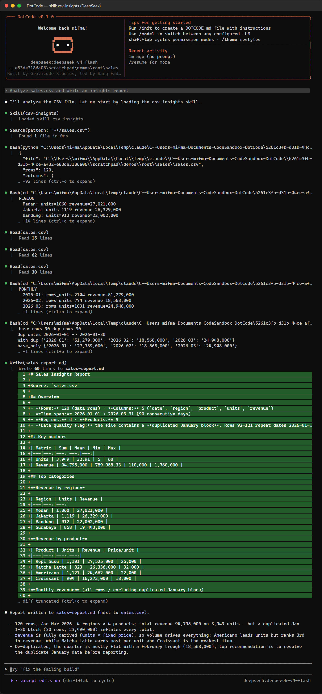 | 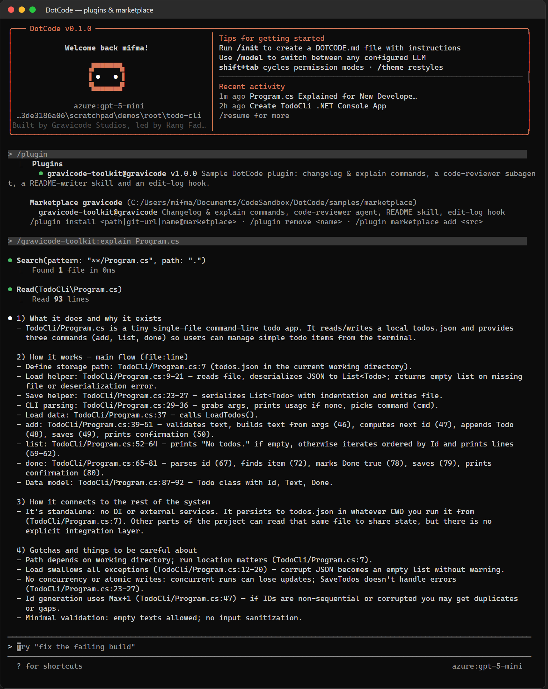 |

## Mulai cepat

```bash
# 1. Instal: unduh binary dotcode untuk OS Anda (atau: dotnet tool install -g DotCode.Cli)
# 2. Atur satu provider
export DEEPSEEK_API_KEY=...        # atau ANTHROPIC_API_KEY, OPENAI_API_KEY, GEMINI_API_KEY,
                                   # AZURE_OPENAI_API_KEY + AZURE_OPENAI_ENDPOINT, OLLAMA_HOST
# 3. Jalankan
cd proyek-anda
dotcode
```

```bash
dotcode --model deepseek:deepseek-v4-flash
dotcode -p "ringkas perubahan terbaru" --output-format json
dotcode mcp add notes node samples/mcp-server-notes/server.mjs
dotcode plugin marketplace add ./samples/marketplace && dotcode plugin install gravicode-toolkit@gravicode
dotcode --dangerously-skip-permissions              # hanya untuk sandbox / CI
```

## Dokumentasi

| Bahasa Indonesia | English |
|---|---|
| [Memulai](docs/id/memulai.md) | [Getting started](docs/en/getting-started.md) |
| [Konfigurasi](docs/id/konfigurasi.md) | [Configuration](docs/en/configuration.md) |
| [Provider LLM](docs/id/provider.md) | [LLM providers](docs/en/providers.md) |
| [Mode interaktif](docs/id/mode-interaktif.md) | [Interactive mode](docs/en/interactive-mode.md) |
| [Izin & keamanan](docs/id/izin.md) | [Permissions & safety](docs/en/permissions.md) |
| [Tools](docs/id/tools.md) | [Tools](docs/en/tools.md) |
| [Ekstensi](docs/id/ekstensi.md) | [Extensions](docs/en/extensions.md) |
| [Mode headless](docs/id/headless.md) | [Headless mode](docs/en/headless.md) |
| [SDK & protokol](docs/id/sdk.md) | [SDK & protocol](docs/en/sdk.md) |
| [Observabilitas: audit log & OpenTelemetry](docs/id/observabilitas.md) | [Observability](docs/en/observability.md) |
| [Arsitektur](docs/id/arsitektur.md) | [Architecture](docs/en/architecture.md) |
| [Pengembangan](docs/id/pengembangan.md) | [Development](docs/en/development.md) |

Roadmap: [PLAN.md](PLAN.md) · Progres: [Progress.md](Progress.md) · Desain: [solution-design.md](solution-design.md)

## Build dari source

```bash
dotnet build DotCode.slnx
dotnet test tests/DotCode.Tests
dotnet publish src/DotCode.Cli -c Release -r win-x64 -o artifacts/win-x64    # NativeAOT
```

## Kredit dan legal

DotCode adalah proyek independen (clean-room) **yang dibuat oleh Gravicode Studios, dipimpin oleh Kang Fadhil**. Terinspirasi oleh perilaku Claude Code dari Anthropic yang terdokumentasi publik dan arsitektur GitHub Copilot SDK; tidak mengandung kode dari keduanya. "Claude" dan "Claude Code" adalah merek dagang Anthropic. Dirilis di bawah [Lisensi MIT](LICENSE).
