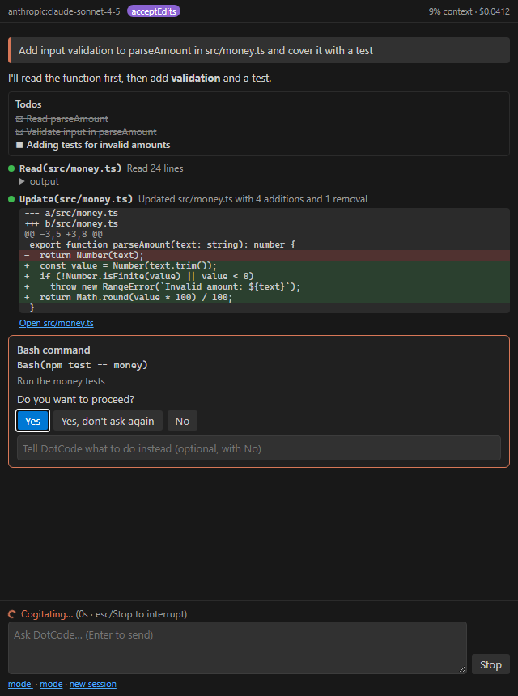

# VS Code extension

> 🇮🇩 [Bahasa Indonesia](../id/vscode.md)

The DotCode extension brings the agent into VS Code. It is a thin client of `dotcode serve`, built on the TypeScript SDK. The engine, tools, permission rules, hooks, MCP servers, skills, sandbox and LSP settings are exactly those of the terminal app, and so are your model providers.



## Install

1. Install the CLI (see [Getting started](getting-started.md#1-install)) and configure a model provider.
2. Install the extension from the release's `dotcode-vscode.vsix`:

   ```bash
   code --install-extension dotcode-vscode.vsix
   ```

   Or build it yourself: `cd ide/vscode && npm ci && npm run package`.

The extension looks for the CLI in `dotcode.cliPath`, then `DOTCODE_CLI_PATH`, `PATH`, and the installer's default folders. If it can't find it, it offers to run the installer in a terminal.

## Using it

| Where | What |
|---|---|
| Activity bar → **DotCode** (or `Ctrl/Cmd+Esc`) | The chat. Answers stream in as markdown; tool calls show live status, output, colored diffs and an *Open file* link; todo list; context use and cost in the header |
| Permission card | **Yes**, **Yes, don't ask again** (saves the suggested rule; for edits it accepts edits for the session), **No**, with optional feedback to the model. Proposed edits also open in the **diff editor** first. The same request appears as a notification when the chat is hidden |
| Editor selection → `Ctrl/Cmd+Alt+K` or context menu **Ask DotCode about Selection** | Puts the code with its path and line range into the prompt |
| Status bar | Model and permission mode; click to open the chat |
| Commands (`DotCode: …`) | Open Chat, New Session, Ask about Selection, Stop, Select Model, Set Permission Mode, Open DotCode in Terminal (the full TUI in the integrated terminal) |

Questions the agent asks (AskUserQuestion) appear as quick picks. In plan mode, the proposed plan opens as a markdown document with **Approve** / **Keep planning**. `Enter` sends a prompt, `Shift+Enter` adds a new line, and `Esc` stops the current turn.

## Settings

| Setting | Default | Description |
|---|---|---|
| `dotcode.cliPath` | *(auto)* | Path to `dotcode` or `dotcode.dll` |
| `dotcode.model` | *(your DotCode settings)* | `provider:model`, alias or role |
| `dotcode.permissionMode` | `default` | `default`, `acceptEdits`, `auto` or `plan` for new sessions |
| `dotcode.showDiffOnPermission` | `true` | Open proposed edits in the diff editor |
| `dotcode.settings` | `{}` | Inline DotCode settings (e.g. a `providers` block for a workspace-specific endpoint) |

The session runs in the workspace folder of the active editor (or the first folder), so project `.dotcode/` / `.claude/` settings, `DOTCODE.md` and `.mcp.json` apply.

## Development

```bash
cd ide/vscode
npm ci
npm run build          # bundles src/ (and the SDK) into dist/extension.js with esbuild
npm test               # launches VS Code with the extension and runs the integration suite against the
                       # real `dotcode serve` (offline scripted model; needs `dotnet build` in DotCode/)
npm run package        # dotcode-vscode.vsix
```

`demo/index.html` renders the real chat webview with a scripted conversation (used for the screenshot above). CI runs the integration tests under `xvfb` on every push and attaches the VSIX to releases.
