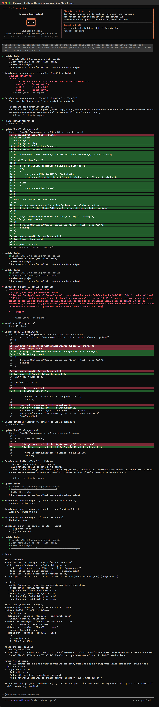
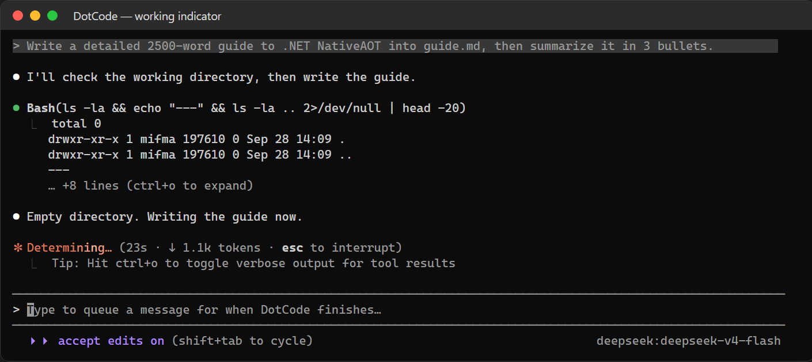
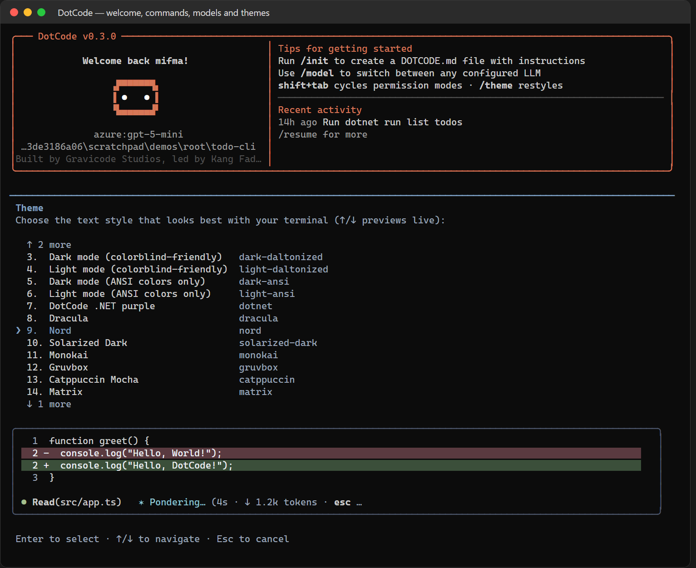
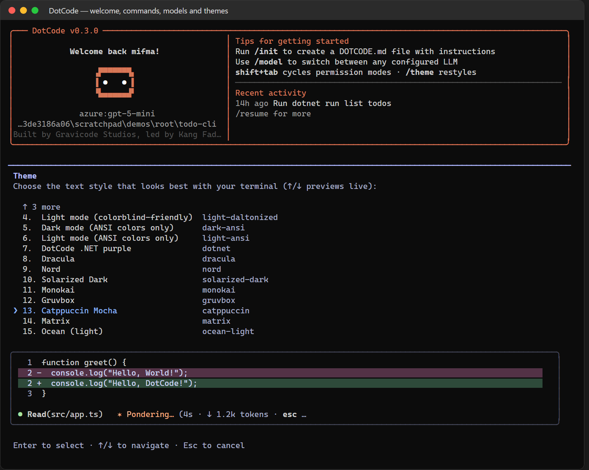
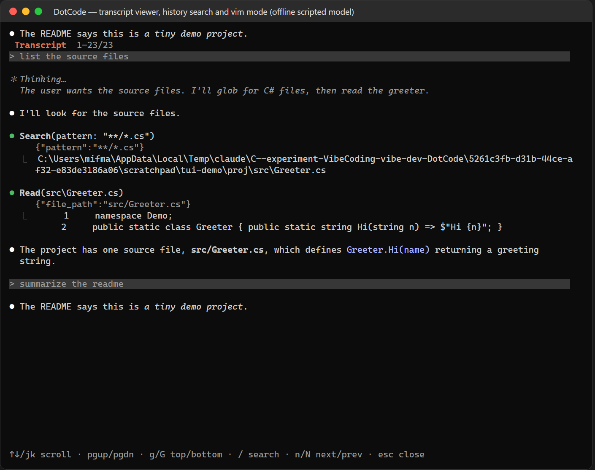
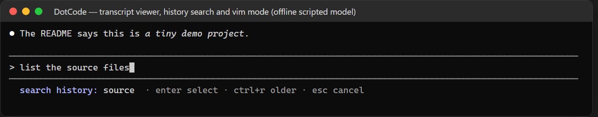
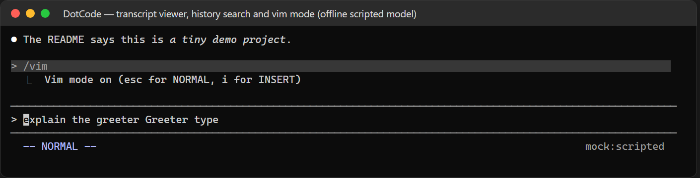
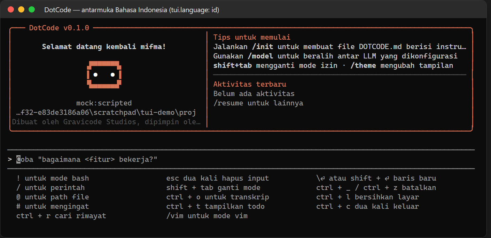

# Mode interaktif

> 🇬🇧 [English](../en/interactive-mode.md)

`dotcode` membuka UI terminal yang dibuat semirip mungkin dengan Claude Code: output yang sudah selesai ditulis sekali ke *scrollback* terminal, hanya area "live" di bawah (teks streaming, tool yang berjalan, spinner, kotak input, dialog) yang digambar ulang di tempat — dengan *synchronized update* sehingga tidak berkedip.



## Anatomi layar

| Elemen | Arti |
|---|---|
| `> prompt` (berlatar) | Pesan Anda |
| `●` + teks | Jawaban asisten (markdown: judul, daftar, tabel, kode dengan syntax highlight) |
| `● Tool(argumen)` | Pemanggilan tool — abu-abu/berkedip saat berjalan, hijau jika sukses, merah jika error |
| `⎿  ringkasan` | Ringkasan hasil tool; edit menampilkan diff berwarna dengan nomor baris |
| `☐ / ◼ / ☒` | Daftar tugas (belum / sedang / selesai) |
| `✻ Kata… (12s · ↓ 1.2k tokens · esc to interrupt)` | Indikator kerja dengan animasi kilau |
| Footer | Mode (`⏵⏵ accept edits on`, `⏵⏵ auto mode on`, `⏸ plan mode on`, `⏵⏵ bypass permissions on`), model, peringatan konteks |

Indikator kerja memutar glyph (`·✢✳✶✻✽`), menampilkan kilau pada kata kerja yang berganti-ganti selama turn berjalan (Pondering → Mulling → Whirring…), serta lama waktu (`16m 50s`), token output secara langsung (`↓ 66.4k tokens`), dan status thinking:



## Pintasan keyboard

| Tombol | Aksi |
|---|---|
| `Enter` | Kirim (saat sibuk: masuk antrean) |
| `Shift+Enter`, `Alt+Enter`, `Ctrl+J`, `\` + `Enter` | Baris baru |
| `Shift+Tab` | Ganti mode izin: default → accept edits → (auto) → plan (→ bypass bila diaktifkan) |
| `Esc` | Hentikan turn · tutup menu · dua kali: kosongkan input |
| `Esc Esc` (input kosong) | Rewind ke pesan sebelumnya (percakapan dan/atau kode) |
| `Ctrl+C` | Kosongkan input · hentikan · dua kali untuk keluar |
| `Ctrl+D` | Keluar (input kosong) |
| `↑ / ↓` | Pindah baris di input multi-baris, selain itu riwayat prompt · navigasi menu |
| `Tab` | Terima saran |
| `Ctrl+O` | Buka penampil transkrip layar penuh (thinking, input dan output tool lengkap) |
| `Ctrl+R` | Cari riwayat prompt (ketik untuk menyaring, `Ctrl+R` lagi untuk hasil lebih lama, `Enter` untuk memakai, `Esc` untuk batal) |
| `Ctrl+T` | Tampilkan daftar tugas |
| `Ctrl+L` | Bersihkan layar |
| `Ctrl+A/E`, `Ctrl+B/F`, `Alt+B/F` | Awal/akhir baris, gerak per karakter/kata |
| `Ctrl+U/K`, `Ctrl+W`, `Alt+D`, `Ctrl+Y` | Hapus ke awal/akhir, hapus kata, tempel |
| `Ctrl+_`, `Ctrl+Z` | Undo |
| `?` (input kosong) | Tampilkan pintasan |

## Awalan input

| Awalan | Mode |
|---|---|
| `/` | Slash command (autocomplete untuk bawaan, command kustom, skill, command plugin, prompt MCP) |
| `!` | Mode bash — jalankan perintah shell sendiri; outputnya masuk ke percakapan |
| `#` | Simpan ke memori (`DOTCODE.md`) |
| `@path` | Lampirkan file atau isi direktori; melengkapi path otomatis |

Tempelan panjang diringkas menjadi `[Pasted text #1 +42 lines]`.

## Slash command

| Perintah | Deskripsi |
|---|---|
| `/help` | Bantuan dan semua perintah |
| `/clear` | Hapus percakapan |
| `/compact [instruksi]` | Ringkas percakapan untuk membebaskan konteks |
| `/context` | Grid berwarna pemakaian konteks per kategori |
| `/cost` | Biaya, durasi, perubahan kode, token per model |
| `/model [provider:model]` | Pilih/atur model (semua provider terkonfigurasi) |
| `/effort [level]` | Upaya reasoning: off, low, medium, high, xhigh |
| `/theme` | Pemilih tema dengan pratinjau langsung |
| `/config` | Pengaturan: tema, set glyph (font), spinner, gaya input, reduced motion, thinking, tips, auto-compact… |
| `/output-style [nama]` | default, explanatory, learning, atau kustom |
| `/permissions` | Lihat/atur aturan izin |
| `/add-dir <path>` | Tambah direktori kerja |
| `/init` | Buat `DOTCODE.md` untuk repo |
| `/memory` | File memori; `/memory add <teks>` |
| `/resume [id]` | Lanjutkan sesi sebelumnya |
| `/rewind` | Pulihkan kode dan/atau percakapan |
| `/export [file]` | Ekspor percakapan ke Markdown |
| `/mcp` | Status server MCP; `/mcp reconnect <nama>` |
| `/agents`, `/skills`, `/hooks` | Daftar subagent, skill, hook |
| `/plugin` | Daftar/pasang/hapus plugin dan marketplace |
| `/todos`, `/bashes` | Daftar tugas; shell latar belakang |
| `/review`, `/security-review` | Review perubahan kode |
| `/status`, `/doctor` | Status sesi; diagnosis instalasi |
| `/about` | Versi dan kredit |
| `/exit` | Keluar |


## Dialog izin


Pilihan: **Yes** · **Yes, and don't ask again for `<prefix>` commands** (disimpan ke `.dotcode/settings.local.json`) atau untuk edit **Yes, allow all edits during this session** · **No, and tell DotCode what to do differently** (`Esc`). Tombol `1`–`3`, `y`/`n`, panah, dan Enter berfungsi.

## Plan mode

Tekan `Shift+Tab` dua kali: model hanya boleh meneliti lalu menyajikan rencana lewat `ExitPlanMode`:


## Tema dan font

Pilih dengan `/theme` (pratinjau langsung) atau `--theme <nama>`; simpan permanen dengan `dotcode theme set <nama>`.

Tema bawaan: `dark` (default), `light`, `dark-daltonized`, `light-daltonized`, `dark-ansi`, `light-ansi` (palet Claude Code) serta tema khas DotCode `dotnet`, `dracula`, `nord`, `solarized-dark`, `monokai`, `gruvbox`, `catppuccin`, `matrix`, `ocean-light`.

| Dracula | Nord | Catppuccin |
|---|---|---|
|  |  |  |

UI terminal tidak bisa mengganti font terminal Anda, jadi DotCode menyesuaikan diri dengan **set glyph**: `unicode` (default, tampilan Claude Code), `ascii` (untuk font tanpa simbol — border dan spinner ikut berubah) dan `nerd` (ikon Nerd Font). Opsi gaya lain: gaya input (`lines` atau kotak `rounded`/`single`/`double`/`heavy`), spinner (`claude`, `dots`, `line`, `star`, `bounce`, `arc`, `dotnet`), warna aksen, dan reduced motion — semuanya di `/config`.

Tema kustom — `~/.dotcode/themes/senja.json`:

```json
{ "base": "dark", "displayName": "Senja", "colors": { "brand": "#FF7A59", "brandShimmer": "#FFC2AE", "userMessageBackground": "#2B1F2A" }, "border": "rounded", "spinner": "dots" }
```

## Penampil transkrip, pencarian riwayat dan mode vim



**Penampil transkrip (`Ctrl+O`)** menampilkan seluruh percakapan secara lengkap: blok thinking, setiap pemanggilan tool beserta input JSON dan output lengkapnya (hingga 500 baris per hasil), serta teks yang masih mengalir. Tombol: `↑/↓` atau `j/k` gulir, `PgUp/PgDn` (`b`/`f`, `Spasi`) per halaman, `g`/`G` awal/akhir, `/` cari, `n`/`N` hasil berikut/sebelumnya, `Esc`, `q` atau `Ctrl+O` tutup. Output yang muncul selama penampil terbuka ditampilkan saat ditutup; dialog izin dari agen menutup penampil agar tidak tersembunyi. Untuk detail lebih di tampilan biasa, aktifkan *Verbose output* di `/config` (atau jalankan dengan `--verbose`).

**Pencarian riwayat (`Ctrl+R`)** — seperti reverse search di shell: ketik sebagian prompt lama, tekan `Ctrl+R` lagi untuk hasil yang lebih lama, `Enter`/`Tab` memasukkan hasil ke prompt (tidak langsung dikirim), `Esc`/`Ctrl+G` mengembalikan teks semula.



**Mode vim** — `/vim` (atau `"tui": { "vim": true }`) mengubah input prompt ke tombol vim. `Esc` masuk ke mode NORMAL, footer menampilkan `-- NORMAL --` / `-- INSERT --`. Didukung: `h l w b e W B E 0 ^ $ gg G`, hitungan (`3w`, `2dd`), operator `d c y` dengan gerakan atau ganda (`dw`, `cw`, `ce`, `d$`, `dd`, `cc`, `yy`), `x X s S D C r ~ p P u`, serta `i a I A o O`. `j`/`k` berpindah baris dan menelusuri riwayat prompt di baris pertama/terakhir. `Enter` mengirim di kedua mode; saat turn berjalan dengan prompt kosong, `Esc` tetap menghentikan.



## Notifikasi dan bahasa

- `"tui": { "notifications": "bell" }` (default) membunyikan bel terminal saat DotCode membutuhkan input Anda (izin, pertanyaan, rencana) atau menyelesaikan turn yang berlangsung 15 detik atau lebih. `"osc9"` mengirim notifikasi desktop (iTerm2, WezTerm, Windows Terminal, kitty…), `"osc777"` memakai format urxvt/foot/Ghostty, `"off"` menonaktifkan.
- `"tui": { "language": "id" }` menampilkan antarmuka dalam Bahasa Indonesia (panel sambutan, footer, pintasan, tips, dialog izin, pencarian riwayat, penampil transkrip, ringkasan keluar). `"auto"` mengikuti `DOTCODE_LANG` atau bahasa OS; default `"en"`. Jawaban model tidak terpengaruh — cukup minta model menjawab dalam bahasa Anda.



## Sesi

Setiap percakapan disimpan sebagai JSONL. `dotcode -c` melanjutkan yang terakhir, `dotcode -r` membuka pemilih, `dotcode -r <id>` melanjutkan sesi tertentu (`--fork-session` menyalinnya). Saat keluar DotCode menampilkan biaya, durasi, dan perintah untuk melanjutkan.
