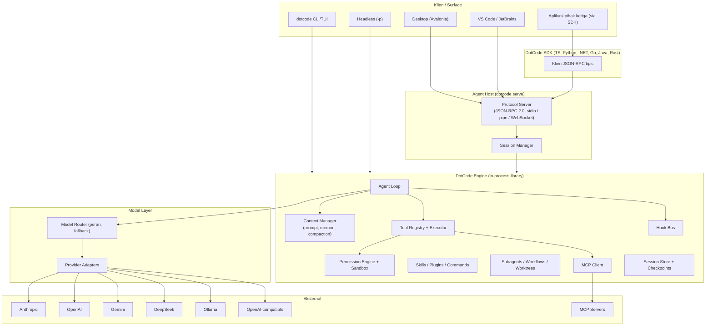
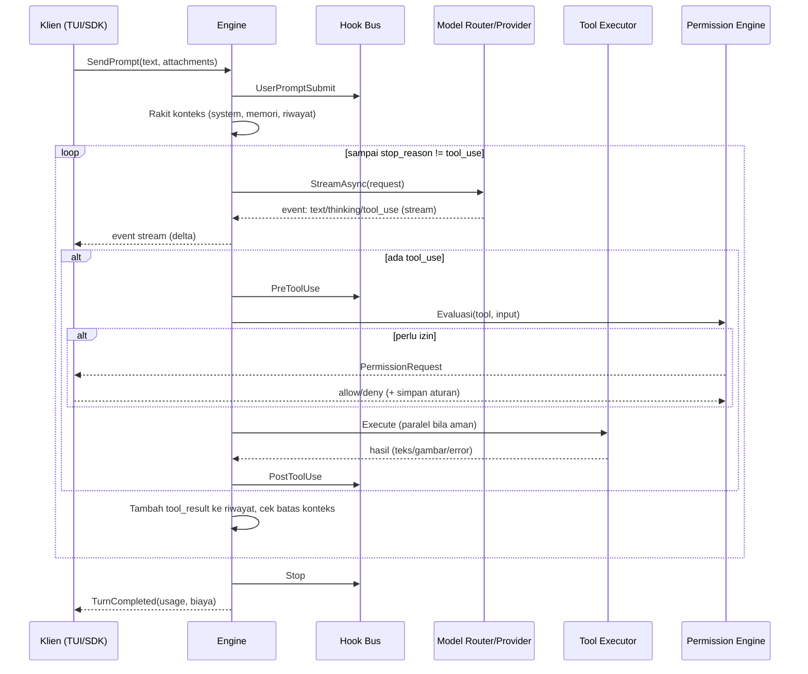

# Dokumen Desain Solusi — DotCode: Port Claude Code ke .NET 10 dengan Dukungan Multi-LLM dan Harness SDK

| | |
|---|---|
| **Nama kerja (codename)** | `DotCode` (placeholder; lihat §15 soal branding dan merek dagang) |
| **Versi dokumen** | 0.1 (draft untuk review) |
| **Tanggal** | 28 September 2026 |
| **Target runtime** | .NET 10 (LTS), C# 14, NativeAOT untuk distribusi |
| **Referensi utama** | github.com/anthropics/claude-code, dokumentasi code.claude.com, github.com/github/copilot-sdk |
| **Status** | Proposal arsitektur, belum ada implementasi |

---

## Daftar Isi

1. [Ringkasan Eksekutif](#1-ringkasan-eksekutif)
2. [Tujuan, Non-Tujuan, dan Prinsip Desain](#2-tujuan-non-tujuan-dan-prinsip-desain)
3. [Analisis Referensi](#3-analisis-referensi)
4. [Daftar Fitur dan Requirement](#4-daftar-fitur-dan-requirement)
5. [Arsitektur Tingkat Tinggi](#5-arsitektur-tingkat-tinggi)
6. [Desain Komponen Inti (Engine)](#6-desain-komponen-inti-engine)
7. [Abstraksi Multi-LLM](#7-abstraksi-multi-llm)
8. [Desain UI/UX (Paritas dengan Claude Code)](#8-desain-uiux-paritas-dengan-claude-code)
9. [Server Protokol dan Desain SDK Multi-Bahasa](#9-server-protokol-dan-desain-sdk-multi-bahasa)
10. [Konfigurasi](#10-konfigurasi)
11. [Keamanan](#11-keamanan)
12. [Strategi Pengujian](#12-strategi-pengujian)
13. [Build, Packaging, dan Distribusi](#13-build-packaging-dan-distribusi)
14. [Roadmap dan Fase Implementasi](#14-roadmap-dan-fase-implementasi)
15. [Risiko, Aspek Legal, dan Mitigasi](#15-risiko-aspek-legal-dan-mitigasi)
16. [Pertanyaan Terbuka](#16-pertanyaan-terbuka)
17. [Lampiran](#17-lampiran)

---

## 1. Ringkasan Eksekutif

**Masalah.** Claude Code adalah agen coding berbasis terminal yang kuat, tetapi terikat pada model Anthropic (atau provider yang menyajikan model Claude), dan harness-nya tidak tersedia sebagai library yang bisa disematkan ke aplikasi lain dengan kontrol penuh atas pemilihan model. Tim .NET enterprise juga tidak punya basis kode agen yang dapat mereka perluas dengan tooling .NET mereka sendiri.

**Solusi yang diusulkan.** Membangun ulang (clean-room) arsitektur dan pengalaman pengguna Claude Code di atas .NET 10 dengan tiga pilar:

1. **DotCode Engine**: agent runtime (agentic loop, tools, permissions, konteks, sesi, subagent, hooks, skills, plugins, MCP) ditulis dalam C# dan dapat berjalan in-process maupun sebagai server.
2. **Multi-LLM**: lapisan provider ternormalisasi untuk Anthropic, OpenAI, Gemini, DeepSeek, Ollama, dan endpoint OpenAI-compatible, lengkap dengan negosiasi kapabilitas dan strategi degradasi.
3. **DotCode SDK**: harness diekspos lewat protokol JSON-RPC (mirip pendekatan Copilot SDK) sehingga aplikasi dalam TypeScript, Python, .NET, Go, Java, dan Rust dapat menanamkan agen yang sama, dengan binary server yang dibundel per platform.

**Klien yang dihasilkan dari satu engine:** CLI/TUI (`dotcode`), mode headless (`dotcode -p`), desktop app (Avalonia), ekstensi VS Code/JetBrains (klien tipis via protokol), dan web/cloud runner.

**Pelajaran kunci dari referensi:**
- Claude Code: semua *surface* (terminal, IDE, desktop, web) memakai engine yang sama, sehingga `CLAUDE.md`, settings, dan MCP server bekerja lintas surface.
- Copilot SDK: semua SDK bahasa hanyalah klien JSON-RPC tipis ke proses server CLI; SDK mengelola siklus hidup proses, dan binary dibundel otomatis untuk Node.js, Python, dan .NET.

Kedua pola ini menjadi tulang punggung desain: **satu engine, banyak surface, satu protokol.**

---

## 2. Tujuan, Non-Tujuan, dan Prinsip Desain

### 2.1 Tujuan
| ID | Tujuan |
|---|---|
| G1 | Paritas fungsi setinggi mungkin dengan Claude Code (agentic loop, tools, permission modes, subagent, hooks, skills, plugins, MCP, sesi, checkpoint, scheduler). |
| G2 | Paritas UI/UX terminal semirip mungkin (layout, slash command, shortcut, mode izin, diff view, status line, pemilih sesi). |
| G3 | Provider-agnostik: pengguna memilih model per sesi, per subagent, atau per peran (utama, cepat, perencana, advisor). |
| G4 | Harness dapat disematkan: SDK resmi untuk minimal TypeScript, Python, .NET pada rilis pertama; Go, Java, Rust menyusul. |
| G5 | Berjalan lokal penuh dengan Ollama tanpa akun cloud (mode air-gapped). |
| G6 | Distribusi satu binary (NativeAOT) tanpa prasyarat runtime pada mesin pengguna. |
| G7 | Layak untuk enterprise: managed settings, telemetri OpenTelemetry, audit log, kebijakan izin terpusat. |

### 2.2 Non-Tujuan
- Bukan salinan biner atau turunan kode sumber Claude Code. Repo `anthropics/claude-code` berlisensi komersial dan tidak menyertakan kode inti; desain ini berbasis **dokumentasi publik dan perilaku yang dapat diamati** (lihat §15).
- Tidak menjanjikan kesamaan kualitas output antar model. Paritas fungsi tidak berarti paritas kualitas: model kecil lokal akan jauh kurang mampu.
- Bukan layanan cloud terkelola pada fase awal (cloud sessions, Routines, dan Projects masuk fase lanjutan dan opsional).
- Tidak mereplikasi fitur yang bergantung pada infrastruktur Anthropic (akun claude.ai, aplikasi mobile Claude, Claude Tag/Slack resmi).

### 2.3 Prinsip Desain
1. **Engine-first, UI-thin.** Semua logika ada di engine; UI hanyalah klien yang menerima event dan mengirim perintah.
2. **Protocol-first.** Kontrak JSON-RPC/JSON Schema adalah sumber kebenaran; SDK dan klien IDE dihasilkan (codegen) dari skema.
3. **Normalisasi kaya, bukan denominator terendah.** Model pesan internal mempertahankan semua fitur (thinking, cache breakpoint, tool result multimodal) dan setiap adapter menerjemahkan atau mendegradasikannya secara eksplisit.
4. **Aman secara default.** Tool berisiko meminta izin; sandbox tersedia; hook dan plugin dianggap kode tak tepercaya sampai disetujui.
5. **Dapat diuji secara deterministik.** Semua panggilan LLM lewat satu antarmuka yang dapat direkam dan diputar ulang.
6. **AOT-friendly.** Hindari refleksi dinamis; gunakan source generator (System.Text.Json, logging, DI terkompilasi).
7. **Observability bawaan.** Setiap turn, tool call, dan permintaan LLM menghasilkan trace dan metrik.

---

## 3. Analisis Referensi

### 3.1 Claude Code (dari dokumentasi resmi)

| Area | Perilaku yang harus diduplikasi |
|---|---|
| Agentic loop | Model memilih tool, engine mengeksekusi, hasil dikembalikan ke model hingga selesai. |
| Tools bawaan | Read, Write, Edit, Bash, PowerShell, Glob, Grep, LSP, NotebookEdit, WebFetch, WebSearch, TodoWrite, Skill, Agent (subagent), Monitor, Workflow, plus tool MCP (`mcp__<server>__<tool>`). |
| Aturan izin | Format `ToolName(specifier)`: `Bash(npm run *)`, `Read(~/secrets/**)`, `Edit(/src/**)`, `WebFetch(domain:example.com)`, `Skill(deploy *)`, `Agent(Explore)`; evaluasi allow/ask/deny. |
| Permission modes | default, acceptEdits, plan, auto (classifier), bypassPermissions; ganti dengan Shift+Tab. |
| Memori | `CLAUDE.md` (juga `AGENTS.md`), auto memory, nested per direktori. |
| Sesi | `--continue`, `--resume`, `--from-pr`, penamaan, fork, ekspor transkrip, `/rewind`, checkpointing. |
| Ekstensi | Skills, hooks, subagents, MCP, plugins (marketplace), output styles, custom themes. |
| Paralelisme | Subagents, agent view, agent teams, dynamic workflows, worktrees, cross-session messaging. |
| Otomasi | `-p` headless, `/loop`, `/goal`, Routines, scheduled tasks, GitHub Actions/GitLab CI, channels, deep links. |
| Surface | Terminal, VS Code, JetBrains, Desktop, Web, Mobile, Chrome, Slack. |
| Enterprise | Managed settings, gateways, OpenTelemetry, ZDR, self-hosted environments. |

### 3.2 GitHub Copilot SDK (pola yang diadopsi)

| Aspek Copilot SDK | Adopsi di DotCode SDK |
|---|---|
| Semua SDK bicara JSON-RPC ke CLI dalam *server mode* | Sama: `dotcode serve` + klien tipis per bahasa |
| SDK mengelola siklus hidup proses; bisa juga terhubung ke server eksternal | Sama: mode *spawn* dan mode *connect* |
| CLI dibundel otomatis di Node.js, Python, .NET; manual di Go, Java, Rust | Sama, tetapi target akhir: bundel untuk semua bahasa via paket platform-spesifik |
| Handler izin per SDK; tool default aktif tetapi dikendalikan permission handler | Sama: `OnPermissionRequest` wajib atau default-deny |
| Custom agents, skills, tools, hooks, MCP | Sama |
| BYOK (kunci sendiri) tanpa autentikasi GitHub | Untuk DotCode, BYOK adalah mode **utama** (multi-provider) |
| `sdk-protocol-version.json` | Versi protokol eksplisit dan negosiasi kapabilitas saat handshake |
| Semantic versioning, changelog, cookbook per bahasa | Sama |

**Catatan:** README Copilot SDK menyatakan BYOK hanya mendukung autentikasi berbasis kunci (tanpa Entra ID/managed identity). DotCode sebaiknya menyediakan hook autentikasi yang dapat dipasang (token provider) agar Azure OpenAI berbasis Entra dan Vertex berbasis ADC dapat didukung sejak awal.

---

## 4. Daftar Fitur dan Requirement

Legenda prioritas: **P0** = MVP wajib, **P1** = paritas inti, **P2** = paritas lanjutan, **P3** = opsional/cloud.
Legenda status paritas: **=** setara, **≈** setara dengan penyesuaian, **+** fitur tambahan DotCode.

### 4.1 Requirement Fungsional

#### A. Agentic Core
| ID | Requirement | Prio |
|---|---|---|
| FR-A1 | Agentic loop dengan streaming, tool call paralel, dan pembatalan (Esc/Ctrl+C) di tengah turn. | P0 |
| FR-A2 | Percakapan multi-turn dengan riwayat persisten dan pemulihan setelah crash. | P0 |
| FR-A3 | System prompt dirakit dari komponen (inti, tools, CLAUDE.md/AGENTS.md, output style, environment info, memori). | P0 |
| FR-A4 | Mode plan: model hanya membaca dan merencanakan; rencana disetujui pengguna sebelum eksekusi. | P1 |
| FR-A5 | Extended thinking / reasoning dengan level effort yang dipetakan per provider. | P1 |
| FR-A6 | Auto-compaction saat konteks mendekati batas, `/compact` manual dengan instruksi. | P0 |
| FR-A7 | Pelacakan tugas (TodoWrite) yang tampil di UI. | P1 |
| FR-A8 | `/goal`: lanjut bekerja hingga kondisi selesai dinilai terpenuhi oleh model penilai. | P2 |
| FR-A9 | Fast mode dan pemilihan model per peran (utama, cepat, perencana, advisor). | P1 |
| FR-A10 | Advisor tool: model utama berkonsultasi dengan model yang lebih kuat pada titik keputusan. | P2 |

#### B. Tools Bawaan
| ID | Tool | Perilaku | Prio |
|---|---|---|---|
| FR-B1 | Read | Baca file (offset/limit), gambar, PDF, notebook; wajib dibaca sebelum Edit/Write pada file yang ada. | P0 |
| FR-B2 | Write | Buat atau timpa file dengan cek "sudah dibaca". | P0 |
| FR-B3 | Edit | Ganti string persis (unik), opsi replace-all, cek konflik modifikasi eksternal. | P0 |
| FR-B4 | Bash | Eksekusi shell dengan timeout, output streaming, proses background, dan pembacaan output. | P0 |
| FR-B5 | PowerShell | Tool native Windows; dipilih otomatis jika Git Bash tidak ada. | P1 |
| FR-B6 | Glob | Pencarian file berpola, urut waktu modifikasi, hormati `.gitignore`. | P0 |
| FR-B7 | Grep | Pencarian regex dengan mode output (content/files/count), konteks baris, filter tipe. | P0 |
| FR-B8 | NotebookEdit | Edit sel Jupyter. | P2 |
| FR-B9 | WebFetch | Ambil URL, konversi ke markdown, ringkas dengan model cepat; filter domain. | P1 |
| FR-B10 | WebSearch | Pencarian web via *search backend* yang dapat dipasang (native provider atau Brave/Tavily/SearXNG). | P1 |
| FR-B11 | TodoWrite | Daftar tugas terstruktur. | P1 |
| FR-B12 | Agent (Task) | Meluncurkan subagent dengan konteks terisolasi. | P1 |
| FR-B13 | Skill | Memanggil skill terdaftar. | P1 |
| FR-B14 | LSP | Diagnostik setelah edit, go-to-definition, find-references via language server. | P2 |
| FR-B15 | Monitor | Memantau proses/stream berkelanjutan dan memicu respons. | P2 |
| FR-B16 | AskUserQuestion | Pertanyaan pilihan terstruktur ke pengguna di tengah turn. | P1 |
| FR-B17 | Workflow | Menjalankan dynamic workflow (skrip orkestrasi subagent). | P2 |
| FR-B18 | Computer use | Kontrol GUI (screenshot, klik, ketik) pada Windows/macOS/Linux. | P3 |

#### C. Izin, Sandbox, dan Keamanan
| ID | Requirement | Prio |
|---|---|---|
| FR-C1 | Aturan izin `ToolName(specifier)` dengan allow/ask/deny dan urutan evaluasi deterministik. | P0 |
| FR-C2 | Permission modes: default, acceptEdits, plan, auto, bypassPermissions; Shift+Tab untuk berganti. | P0 |
| FR-C3 | Auto mode: classifier LLM menilai aksi; aturan hard-deny tak dapat ditimpa. | P2 |
| FR-C4 | Pembatasan direktori kerja (`additionalDirectories`) dan pencegahan path traversal/symlink escape. | P0 |
| FR-C5 | Sandbox proses (filesystem + jaringan) untuk Bash. | P1 |
| FR-C6 | Deteksi injeksi perintah, parsing shell AST untuk mencocokkan pola `Bash(...)`. | P1 |
| FR-C7 | Redaksi rahasia pada log dan telemetri. | P1 |

#### D. Konteks, Memori, dan Sesi
| ID | Requirement | Prio |
|---|---|---|
| FR-D1 | Muat `CLAUDE.md`/`AGENTS.md`/`DOTCODE.md` hierarkis (user, project, nested), dengan direktif `@import`. | P0 |
| FR-D2 | Auto memory: agen menyimpan pembelajaran lintas sesi di direktori memori. | P2 |
| FR-D3 | Sesi persisten: `--continue`, `--resume`, `--from-pr`, penamaan, fork, ekspor transkrip. | P0 |
| FR-D4 | Checkpointing dan `/rewind` (kode dan/atau percakapan). | P1 |
| FR-D5 | `/context`: visualisasi isi jendela konteks. | P1 |
| FR-D6 | Recap sesi otomatis saat kembali. | P3 |
| FR-D7 | Pencarian riwayat perintah lintas proyek (Ctrl+R). | P2 |

#### E. Agen, Paralelisme, dan Otomasi
| ID | Requirement | Prio |
|---|---|---|
| FR-E1 | Subagent kustom (file markdown + frontmatter) dengan tool dan model terbatas; berjalan di background; boleh bersarang. | P1 |
| FR-E2 | Worktree (`--worktree`) untuk isolasi sesi paralel. | P1 |
| FR-E3 | Agent view: dasbor banyak sesi dengan status dan kebutuhan input. | P2 |
| FR-E4 | Agent teams dan pesan lintas sesi. | P3 |
| FR-E5 | Dynamic workflows (skrip C#/CSX yang mengorkestrasi banyak subagent dan dapat dijalankan ulang). | P2 |
| FR-E6 | Mode headless `-p` dengan keluaran `text`, `json`, `stream-json`; input via pipe. | P0 |
| FR-E7 | `/loop` (polling dalam sesi) dan `/schedule` (lokal via scheduler OS/daemon). | P2 |
| FR-E8 | Channels: dorong event eksternal (webhook, chat) ke sesi berjalan lewat MCP server. | P3 |
| FR-E9 | Deep links `dotcode-cli://` untuk membuka sesi dengan prompt tertentu. | P3 |
| FR-E10 | Aksi CI: GitHub Actions/GitLab CI (respons `@mention`, review PR, isu menjadi PR). | P2 |

#### F. Ekstensibilitas
| ID | Requirement | Prio |
|---|---|---|
| FR-F1 | Hooks: event siklus hidup (SessionStart, UserPromptSubmit, PreToolUse, PostToolUse, Stop, SubagentStop, dll.), handler shell/HTTP/prompt/MCP, kode keluar menentukan blok/lanjut. | P0 |
| FR-F2 | Skills: folder `SKILL.md` dengan frontmatter, dimuat on-demand (progressive disclosure), dipanggil sebagai slash command atau otomatis oleh model. | P1 |
| FR-F3 | MCP client: transport stdio, HTTP streamable, SSE; OAuth; `dotcode mcp add/login/list`; hasil besar dipotong per-tool. | P0 |
| FR-F4 | Plugins: bundel skills, agents, hooks, MCP, commands, themes; marketplace berbasis git/URL/zip; dependensi dan versi. | P1 |
| FR-F5 | Output styles (Concise, Explanatory, kustom). | P2 |
| FR-F6 | Custom slash commands (markdown) dan bundled commands. | P0 |
| FR-F7 | Tool kustom in-process untuk SDK (fungsi host didaftarkan sebagai tool). | P0 |

#### G. Multi-LLM
| ID | Requirement | Prio |
|---|---|---|
| FR-G1 | Provider: Anthropic, OpenAI, Google Gemini, DeepSeek, Ollama, OpenAI-compatible generik. | P0 (Anthropic, OpenAI, Ollama), P1 (Gemini, DeepSeek, generik) |
| FR-G2 | Format model `provider:model`, alias (`fast`, `smart`, dsb.) dan profil model di konfigurasi. | P0 |
| FR-G3 | Negosiasi kapabilitas per model; degradasi anggun jika fitur tidak ada. | P0 |
| FR-G4 | Ganti model di tengah sesi (`/model`) tanpa kehilangan riwayat (dengan konversi blok proprietari). | P1 |
| FR-G5 | Routing per peran dan fallback otomatis (rate limit, error 5xx, model tak tersedia). | P1 |
| FR-G6 | Penghitungan token dan biaya per provider; estimasi lokal bila tidak ada endpoint token. | P1 |
| FR-G7 | Autentikasi: API key, env var, token provider (Entra ID, ADC Google, OAuth), proxy/gateway. | P1 |
| FR-G8 | Tool-calling via *text protocol* sebagai fallback untuk model tanpa function calling. | P2 |

#### H. UI/UX
| ID | Requirement | Prio |
|---|---|---|
| FR-H1 | TUI interaktif: input multi-baris, riwayat, autocomplete `/`, `@` file, `!` shell mode, `#` memori. | P0 |
| FR-H2 | Render markdown, blok kode berwarna, diff inline, spinner/status tool. | P0 |
| FR-H3 | Dialog izin dengan pratinjau diff/perintah dan opsi "selalu izinkan". | P0 |
| FR-H4 | Status line kustom, tema, Vim mode, keybinding kustom. | P1 |
| FR-H5 | Fullscreen rendering tanpa flicker dengan dukungan mouse. | P1 |
| FR-H6 | Voice dictation. | P3 |
| FR-H7 | Aksesibilitas: mode screen reader, reduced motion, tema ramah buta warna. | P1 |
| FR-H8 | Desktop app (Avalonia): sesi paralel, diff visual, terminal terintegrasi. | P2 |
| FR-H9 | Ekstensi VS Code dan plugin JetBrains sebagai klien protokol. | P2 |
| FR-H10 | Artifacts: keluaran sesi menjadi halaman HTML interaktif lokal yang dapat dibagikan. | P3 |

#### I. Enterprise dan Operasional
| ID | Requirement | Prio |
|---|---|---|
| FR-I1 | Managed settings (file sistem/registry/server-delivered) dengan precedence dan kunci tak dapat ditimpa. | P1 |
| FR-I2 | Telemetri OpenTelemetry (trace, metrik, log) dengan opt-in. | P1 |
| FR-I3 | Batas biaya/token per pengguna dan per sesi. | P2 |
| FR-I4 | Gateway internal untuk kredensial terpusat. | P3 |
| FR-I5 | Audit log tak dapat diubah untuk aksi tool. | P2 |

### 4.2 Requirement Non-Fungsional
| ID | Kategori | Requirement |
|---|---|---|
| NFR-1 | Performa | Startup CLI hingga prompt siap ≤ 300 ms (NativeAOT, dingin ≤ 600 ms); overhead engine per turn ≤ 50 ms di luar latensi jaringan. |
| NFR-2 | Memori | RSS idle ≤ 120 MB; sesi panjang (≥ 8 jam) tidak membocorkan memori (target stabil). |
| NFR-3 | Portabilitas | Windows x64/ARM64, macOS x64/ARM64, Linux x64/ARM64 (glibc dan musl). |
| NFR-4 | Keandalan | Kegagalan provider tidak mematikan sesi; retry dengan backoff, resume streaming bila mungkin; transkrip ditulis append-only. |
| NFR-5 | Keamanan | Tidak ada eksekusi tanpa izin sesuai mode; rahasia tidak masuk log; sandbox opsional aktif default di mode auto. |
| NFR-6 | Kompatibilitas | Membaca `CLAUDE.md`, `.claude/` (skills, agents, commands, settings) dengan fallback bila `.dotcode/` tidak ada, untuk migrasi mulus. |
| NFR-7 | Observability | Setiap turn punya trace ID; log terstruktur; mode `--debug`. |
| NFR-8 | i18n | UI string dapat dilokalkan (id, en minimal); input/output Unicode penuh termasuk CJK dan RTL. |
| NFR-9 | Aksesibilitas | WCAG-setara untuk UI grafis; navigasi keyboard penuh; screen reader untuk TUI. |
| NFR-10 | Stabilitas API | SDK mengikuti semantic versioning; protokol punya versi mayor/minor dengan negosiasi. |
| NFR-11 | Lisensi | Kode DotCode berlisensi permisif (usulan MIT/Apache-2.0); audit dependensi otomatis. |


---

## 5. Arsitektur Tingkat Tinggi

### 5.1 Gambaran Lapisan



**Dua mode eksekusi engine:**

| Mode | Deskripsi | Dipakai oleh |
|---|---|---|
| **In-process** | Engine sebagai library .NET yang dipanggil langsung (tanpa serialisasi). | CLI/TUI, headless, aplikasi .NET yang menyematkan engine. |
| **Server (JSON-RPC)** | `dotcode serve` mengekspos engine lewat protokol; klien bahasa lain terhubung. | SDK non-.NET, IDE, Desktop, web runner. |

TUI memakai jalur in-process yang sama dengan kontrak event server. Dengan demikian **UI dan SDK melihat aliran event yang identik**, sehingga tidak ada fitur yang hanya tersedia di salah satunya.

### 5.2 Struktur Solusi (.NET 10)

```
DotCode.sln
├── src/
│   ├── DotCode.Abstractions/        # Kontrak: pesan, event, tool, provider, izin (tanpa dependensi berat)
│   ├── DotCode.Engine/              # Agent loop, konteks, sesi, subagent, hook bus
│   ├── DotCode.Tools/               # Tool bawaan (Read, Edit, Bash, Grep, ...)
│   ├── DotCode.Permissions/         # Aturan izin, parser pola, classifier auto mode
│   ├── DotCode.Sandbox/             # Isolasi proses per OS (Job Objects, seccomp/bwrap, sandbox-exec)
│   ├── DotCode.Providers.Anthropic/
│   ├── DotCode.Providers.OpenAI/    # Responses + Chat Completions; basis untuk compat
│   ├── DotCode.Providers.Gemini/
│   ├── DotCode.Providers.DeepSeek/
│   ├── DotCode.Providers.Ollama/
│   ├── DotCode.Providers.OpenAICompatible/
│   ├── DotCode.Mcp/                 # Klien MCP (membungkus ModelContextProtocol C# SDK)
│   ├── DotCode.Extensibility/       # Skills, plugins, commands, output styles, marketplace
│   ├── DotCode.Protocol/            # Skema JSON-RPC, tipe pesan, codegen sumber
│   ├── DotCode.Host/                # `serve`: stdio/pipe/WebSocket, manajemen banyak sesi
│   ├── DotCode.Tui/                 # Renderer terminal, editor input, komponen UI
│   ├── DotCode.Cli/                 # Entry point `dotcode` (System.CommandLine)
│   ├── DotCode.Desktop/             # Avalonia app
│   └── DotCode.Sdk/                 # SDK .NET (in-process dan klien remote)
├── sdk/
│   ├── typescript/  python/  go/  java/  rust/   # SDK non-.NET (dihasilkan sebagian dari skema)
├── schema/
│   ├── protocol.schema.json         # Sumber kebenaran protokol (JSON Schema/OpenRPC)
│   └── protocol-version.json
├── plugins/                         # Plugin contoh (commit-commands, code-review, ...)
├── tests/  (unit, provider-contract, golden-transcript, tui-snapshot, sdk-conformance)
└── docs/
```

### 5.3 Keputusan Arsitektural (ADR ringkas)

| ADR | Keputusan | Alasan | Alternatif yang ditolak |
|---|---|---|---|
| ADR-01 | Engine sebagai library; server dan TUI hanyalah *host*. | Satu perilaku, banyak surface. | Engine hanya sebagai proses (mempersulit embedding .NET). |
| ADR-02 | Protokol JSON-RPC 2.0 dengan skema JSON. | Netral bahasa, mudah di-codegen, cocok stdio/WebSocket, terbukti pada Copilot SDK. | gRPC (dependensi berat pada beberapa platform, sulit di IDE/browser), REST polling. |
| ADR-03 | Model pesan internal sendiri (bukan `IChatClient` mentah). | `IChatClient` tidak memodelkan cache breakpoint, blok thinking bertanda tangan, dan metadata proprietari untuk round-trip. Sediakan adapter `AsIChatClient()` untuk interop. | Membangun langsung di atas `Microsoft.Extensions.AI`; Semantic Kernel sebagai inti. |
| ADR-04 | Adapter provider dengan `HttpClient` + System.Text.Json source-gen sendiri. | Kontrol penuh atas streaming SSE, retry, dan AOT; menghindari dependensi berat. SDK resmi boleh dipakai bila lolos uji AOT. | Bergantung penuh pada SDK resmi tiap vendor (perilaku streaming/AOT bervariasi; perlu verifikasi per SDK). |
| ADR-05 | NativeAOT + source generator di seluruh jalur kritis. | Startup cepat, satu binary. | JIT + self-contained (lebih besar dan lambat mulai). |
| ADR-06 | TUI dengan renderer diferensial sendiri di atas primitif konsol; Spectre.Console hanya untuk mode non-interaktif dan komponen statis. | Paritas UX (input multi-baris, fullscreen, mouse, tanpa flicker) sulit dicapai dengan pustaka widget umum. | Terminal.Gui (model widget berbeda dari UX Claude Code), Spectre.Console penuh (tidak untuk aplikasi interaktif berdurasi panjang). Perlu spike 2 minggu untuk validasi. |
| ADR-07 | Hook, plugin, dan skrip workflow dijalankan sebagai proses/AssemblyLoadContext terisolasi; workflow dalam CSX ditandai eksperimental karena konflik dengan AOT. | Keamanan dan kompatibilitas AOT. | Kompilasi Roslyn di dalam binary AOT (tidak layak). |
| ADR-08 | Kompatibilitas baca `.claude/` dan `CLAUDE.md`. | Migrasi pengguna dan reuse skills/plugin yang ada. | Format baru tanpa kompatibilitas. |

---

## 6. Desain Komponen Inti (Engine)

### 6.1 Agent Loop



**Pseudokode inti (C# 14):**

```csharp
public async IAsyncEnumerable<AgentEvent> RunTurnAsync(
    Session session, UserInput input, [EnumeratorCancellation] CancellationToken ct)
{
    await _hooks.FireAsync(HookEvent.UserPromptSubmit, session, input, ct);
    session.Append(Message.User(input));

    while (!ct.IsCancellationRequested)
    {
        await _context.EnsureBudgetAsync(session, ct);            // auto-compact bila perlu
        var request = _promptBuilder.Build(session);               // system + tools + riwayat + cache hints
        var stream  = _router.For(session.ActiveRole).StreamAsync(request, ct);

        var assistant = new AssistantMessageBuilder();
        await foreach (var ev in stream.WithCancellation(ct))
        {
            assistant.Apply(ev);
            yield return AgentEvent.FromModel(ev);                 // delta ke UI/SDK
        }
        var message = assistant.Build();
        session.Append(message);

        var calls = message.ToolUses;
        if (calls.Count == 0) break;                               // selesai

        await foreach (var result in _executor.RunAsync(calls, session, ct))
        {
            yield return AgentEvent.ToolResult(result);
            session.Append(Message.ToolResult(result));
        }
    }
    await _hooks.FireAsync(HookEvent.Stop, session, ct);
    yield return AgentEvent.TurnCompleted(session.Usage);
}
```

**Aturan eksekusi tool:**
- Tool `read-only` (Read, Grep, Glob, WebFetch) boleh paralel; tool bermutasi (Edit, Write, Bash) berjalan serial kecuali ditandai aman.
- Setiap tool mendeklarasikan metadata: `IsReadOnly`, `IsConcurrencySafe`, `PermissionKind`, `MaxResultChars`.
- Hasil terlalu besar dipangkas dengan penanda dan disimpan ke file sementara yang dapat dibaca ulang.
- Kesalahan tool dikembalikan ke model sebagai `tool_result` bertanda error (bukan mengubur loop).

### 6.2 Sistem Tool

```csharp
public interface ITool
{
    string Name { get; }
    ToolSchema Schema { get; }                     // JSON Schema hasil source generator
    ToolTraits Traits { get; }                     // read-only, concurrency-safe, kategori izin
    PermissionRequirement DescribePermission(JsonElement input, ToolContext ctx);
    ValueTask<ToolResult> ExecuteAsync(JsonElement input, ToolContext ctx, CancellationToken ct);
}

// Pendaftaran tool kustom berbasis fungsi (dipakai SDK .NET)
public static class ToolFactory
{
    public static ITool FromDelegate<TArgs, TResult>(
        string name, string description, Func<TArgs, ToolContext, Task<TResult>> handler)
        where TArgs : notnull;   // skema dihasilkan oleh source generator (AOT-safe)
}
```

**Catatan implementasi per tool:**

| Tool | Detail desain |
|---|---|
| Read | Deteksi biner/gambar/PDF/ipynb; batas baris dan karakter; cache "file sudah dibaca" (hash + mtime) untuk pengaman Edit/Write. |
| Edit | Cocokkan string persis, tolak jika tidak unik kecuali `replace_all`; deteksi konflik (mtime/hash berubah sejak Read); pertahankan EOL dan BOM asli; hasilkan diff untuk UI. |
| Write | Wajib Read dahulu pada file yang ada; tulis atomik (temp + rename). |
| Bash | Shell persisten per sesi (env dan cwd bertahan); timeout; output streaming; background job dengan ID; pemangkasan output. Di Windows dipilih Git Bash atau PowerShell tool. |
| Grep | Prioritas: bundel `ripgrep` per platform; fallback implementasi terkelola (`Regex` + `System.IO.Enumeration`) untuk mode air-gapped. |
| Glob | `Microsoft.Extensions.FileSystemGlobbing`; hormati `.gitignore`. |
| WebFetch | `HttpClient` + konversi HTML→Markdown; ringkas dengan peran `fast`; cegah SSRF (blokir IP privat kecuali diizinkan); filter domain. |
| WebSearch | Antarmuka `ISearchBackend`; implementasi: server tool native (Anthropic/OpenAI/Gemini bila tersedia), Brave, Tavily, SearXNG, dan Bing/Google via API. |
| Agent | Membuat `SubagentSession` dengan konteks bersih, set tool terbatas, model berbeda; hasil dikembalikan sebagai satu `tool_result` ringkas. |
| LSP | Manajemen language server (OmniSharp/Roslyn LS, tsserver, pyright, gopls, rust-analyzer) via plugin "code intelligence". |

### 6.3 Mesin Izin (Permission Engine)

**Aturan:** `ToolName(specifier)` dengan tiga daftar: `allow`, `ask`, `deny`.

Urutan evaluasi (deterministik):

1. **Managed deny** (kebijakan organisasi) → tolak, tak dapat ditimpa.
2. **Hard deny mode auto** → tolak.
3. **Aturan `deny`** (semua scope) → tolak.
4. **Aturan `ask`** → minta izin.
5. **Aturan `allow`** → izinkan.
6. **Mode izin** (default/acceptEdits/plan/auto/bypass) menentukan perilaku sisanya.
7. Tool `read-only` di dalam direktori kerja → izinkan; di luar direktori → minta izin.

| Jenis specifier | Pencocokan |
|---|---|
| `Bash(npm run *)`, `PowerShell(...)`, `Monitor(...)` | Pola perintah setelah **parsing shell AST**; perintah majemuk (`a && b`, `;`, `|`, substitusi) dipecah dan setiap bagian harus lolos. |
| `Read/Edit/Write/Grep/Glob(path)` | Pola glob path setelah normalisasi (tilde, relatif, symlink → path nyata). |
| `WebFetch(domain:x)` | Pencocokan domain (termasuk subdomain bila diminta). |
| `Skill(name *)`, `Agent(type)` | Pencocokan nama. |
| `mcp__server__tool` | Nama tepat; server-level `mcp__server` mengizinkan semua tool server. |

**Auto mode (P2):** classifier LLM (peran `fast`) menilai aksi terhadap konteks lingkungan tepercaya (repo, bucket, domain) dan aturan hard-deny; keputusan dicatat ke transkrip untuk audit. Pada model lokal yang lemah, auto mode dinonaktifkan secara default dengan peringatan.

### 6.4 Sandbox

| OS | Mekanisme | Cakupan |
|---|---|---|
| Linux | `bubblewrap`/namespaces + seccomp; Landlock bila tersedia | FS tulis dibatasi ke cwd + direktori tambahan; jaringan melalui proxy allow-list |
| macOS | `sandbox-exec` (profil Seatbelt) | Sama |
| Windows | Job Objects + AppContainer/restricted token; fallback WSL sandbox | FS dan proses; jaringan lewat proxy |
| Universal | Dev container/Docker/VM (dokumentasi pilihan lingkungan) | Isolasi penuh |

Antarmuka: `ISandbox.WrapAsync(ProcessStartInfo, SandboxPolicy)`. Kegagalan sandbox → tanya pengguna atau tolak (tidak *silently fallback*).

### 6.5 Manajemen Konteks

- **Perakitan prompt:** blok berurutan dengan penanda *cache-stable prefix*: (1) instruksi inti, (2) definisi tool, (3) memori proyek (`CLAUDE.md`/`AGENTS.md`), (4) output style, (5) riwayat. Prefix stabil ditempatkan lebih awal agar prompt caching efektif; perubahan di tengah sesi (mis. edit CLAUDE.md) baru berlaku pada sesi/kompaksi berikutnya, sama seperti perilaku Claude Code.
- **Kompaksi:** pemicu pada ambang (mis. 80% jendela) atau `/compact [instruksi]`. Ringkasan dibuat oleh peran `fast`/`main`, mempertahankan: tujuan, keputusan, file yang diubah, TODO terbuka, kesalahan yang belum selesai. Transkrip asli tetap tersimpan untuk `/rewind`.
- **Anggaran token:** pelacak per komponen (system, tools, memori, riwayat, hasil tool) untuk `/context`.
- **Pemangkasan hasil tool lama:** hasil besar yang sudah tidak relevan digantikan penanda (`[dipangkas: 12.4k karakter, lihat file X]`) sebelum kompaksi penuh.
- **Memori:** pemuat hierarkis (managed → user `~/.dotcode/` → project → nested per subdirektori saat file di sana dibaca) dengan `@import`. *Auto memory* menulis catatan ke `~/.dotcode/projects/<hash>/memory/`.

### 6.6 Sesi, Checkpoint, dan Penyimpanan

- **Format:** JSON Lines append-only per sesi (`~/.dotcode/projects/<hash>/<sessionId>.jsonl`): pesan, event tool, keputusan izin, usage, dan penanda kompaksi. Crash-safe (flush per entri, pemulihan dengan membuang baris terakhir yang korup).
- **Checkpoint:** sebelum setiap tool bermutasi, snapshot file terdampak (content-addressed di `.dotcode/checkpoints/`). `/rewind` dapat memulihkan **kode**, **percakapan**, atau keduanya. Perubahan lewat Bash tidak dilacak penuh (sama seperti keterbatasan yang dikenal di ekosistem ini) sehingga UI menampilkan peringatan.
- **Fork/branch:** menyalin prefiks JSONL ke sesi baru dengan `parentId`.
- **Indeks:** SQLite (`sessions.db`) untuk pencarian judul/isi cepat (picker `/resume`, Ctrl+R).

### 6.7 Subagent, Workflow, dan Worktree

| Fitur | Desain |
|---|---|
| Subagent | File `.dotcode/agents/*.md` (frontmatter: `name`, `description`, `tools`, `model`, `permissionMode`, `isolation: worktree`). Berjalan sebagai sesi anak dengan konteks terisolasi; boleh background; kedalaman bersarang dibatasi (default 3). |
| Bawaan | `Explore` (read-only, model cepat), `Plan`, `general-purpose`. |
| Worktree | `git worktree add` otomatis untuk sesi/subagent terisolasi; pembersihan otomatis bila tanpa perubahan; `.worktreeinclude` menyalin berkas tak terlacak. |
| Agent view | Layanan daemon lokal (`dotcode daemon`) yang mendaftar semua sesi; TUI/Desktop menampilkan status *running / needs input / done*. |
| Workflow | Skrip orkestrasi (C# script atau JS) yang memanggil `agent.Run(...)` paralel; hasil digabungkan; dapat dijalankan ulang. Fase awal: DSL deklaratif YAML (AOT-aman); CSX menyusul. |
| Agent teams / pesan lintas sesi | Bus pesan lokal (named pipe/Unix socket) di daemon; tool `SendMessage`/`ListSessions`. |

### 6.8 Hooks

| Event | Kapan | Dapat memblokir? |
|---|---|---|
| `SessionStart` / `SessionEnd` | Awal/akhir sesi | Tidak |
| `UserPromptSubmit` | Sebelum prompt diproses | Ya (menambah konteks atau menolak) |
| `PreToolUse` | Sebelum tool | Ya (allow/deny/ask/ubah input) |
| `PostToolUse` | Setelah tool | Ya (umpan balik ke model) |
| `Notification` | Butuh input/izin | Tidak |
| `Stop` / `SubagentStop` | Model selesai | Ya (paksa lanjut) |
| `PreCompact` | Sebelum kompaksi | Ya |

Tipe handler: **command** (shell; JSON via stdin, keputusan via stdout/exit code), **http**, **prompt** (LLM menilai), **mcp_tool**, dan **in-process** (delegate .NET; khusus SDK). Konfigurasi di settings dengan `matcher` (nama tool/regex). Timeout dan mode async didukung.

### 6.9 Skills, Commands, Plugins

- **Skill:** folder berisi `SKILL.md` (frontmatter: `name`, `description`, `allowed-tools`, `model`) + berkas pendukung. *Progressive disclosure*: hanya nama+deskripsi dimuat awal; isi dimuat saat dipanggil (oleh pengguna `/nama` atau model lewat tool `Skill`).
- **Command kustom:** markdown di `.dotcode/commands/` dengan argumen `$ARGUMENTS`, injeksi `!`perintah`` dan `@file`.
- **Plugin:** `plugin.json` + `skills/`, `agents/`, `hooks/`, `commands/`, `.mcp.json`, tema. Marketplace = `marketplace.json` di repo git/URL/zip; scope instal user/project/local; dependensi semver; validasi dan `dotcode plugin eval`. Plugin dianggap tak tepercaya sampai pengguna menyetujui (menampilkan hook dan MCP yang akan aktif).
- **Kompatibilitas:** plugin format Claude Code yang tidak bergantung pada fitur khusus Anthropic dapat dimuat apa adanya (NFR-6).

### 6.10 Klien MCP

Membungkus paket resmi `ModelContextProtocol` (C# SDK) dengan tambahan:
- Transport stdio, streamable HTTP, SSE; OAuth 2.x dengan penyimpanan token di credential store OS (DPAPI/Keychain/libsecret).
- Penamaan tool `mcp__<server>__<tool>`; skema disaring per provider (lihat §7.5).
- *Tool search* (pemuatan malas) bila jumlah tool besar, agar definisi tidak memenuhi konteks.
- Batas ukuran hasil per tool; dukungan resource dan prompt MCP sebagai `@` mention dan slash command.
- Manajemen: `dotcode mcp add|list|remove|login`, `/mcp` di TUI; kebijakan allow/deny server untuk organisasi.

### 6.11 Pengaturan (Settings) dan Precedence

Urutan (tertinggi → terendah): **Managed (kebijakan)** → **CLI flags** → **Local project** (`.dotcode/settings.local.json`) → **Project** (`.dotcode/settings.json`) → **User** (`~/.dotcode/settings.json`). Kunci yang bersifat *permission* digabung (union) sedangkan `deny` selalu menang. Kunci managed dapat ditandai *locked*. Fallback baca ke `.claude/settings*.json` bila berkas DotCode tidak ada.

---

## 7. Abstraksi Multi-LLM

### 7.1 Model Pesan Ternormalisasi

```csharp
public enum Role { System, User, Assistant, Tool }

public abstract record ContentPart;
public sealed record TextPart(string Text, CacheHint? Cache = null) : ContentPart;
public sealed record ImagePart(BinaryData Data, string MediaType) : ContentPart;
public sealed record DocumentPart(BinaryData Data, string MediaType, string? Name) : ContentPart;   // PDF dll.
public sealed record ToolUsePart(string Id, string Name, JsonElement Input) : ContentPart;
public sealed record ToolResultPart(string ToolUseId, IReadOnlyList<ContentPart> Content, bool IsError) : ContentPart;
public sealed record ThinkingPart(string Text, ProviderOpaque? Opaque) : ContentPart;   // reasoning + tanda tangan/ID proprietari

// Metadata proprietari yang harus dikirim balik apa adanya ke provider asal
public sealed record ProviderOpaque(string ProviderId, JsonElement Payload);

public sealed record Message(Role Role, IReadOnlyList<ContentPart> Parts, MessageMeta Meta);
```

**Aturan krusial: *round-trip fidelity*.** Blok yang harus dikembalikan utuh ke provider yang sama (mis. tanda tangan blok thinking Anthropic, *thought signature* Gemini, item reasoning OpenAI, `reasoning_content` DeepSeek) disimpan di `ProviderOpaque`. Saat pengguna berpindah model di tengah sesi (FR-G4), *adapter sumber tidak sama dengan adapter tujuan* → blok opaque dari provider lain **dibuang atau diubah menjadi teks ringkas**, bukan dikirim mentah.

### 7.2 Antarmuka Provider

```csharp
public interface IModelProvider
{
    string Id { get; }                                           // "anthropic", "openai", "gemini", ...
    ValueTask<IReadOnlyList<ModelInfo>> ListModelsAsync(CancellationToken ct);
    ModelCapabilities GetCapabilities(string modelId);

    IAsyncEnumerable<ModelEvent> StreamAsync(ModelRequest request, CancellationToken ct);
    ValueTask<int?> CountTokensAsync(ModelRequest request, CancellationToken ct);   // null = tidak didukung
}

public sealed record ModelRequest(
    string Model,
    IReadOnlyList<Message> Messages,
    IReadOnlyList<ToolSchema> Tools,
    SystemPrompt System,               // blok + cache hints
    int MaxOutputTokens,
    double? Temperature,
    ReasoningOptions? Reasoning,       // effort: off|low|medium|high|xhigh + budget
    ToolChoice ToolChoice,
    IReadOnlyDictionary<string, JsonElement>? ProviderOptions);   // pintu keluar khusus provider

public abstract record ModelEvent;   // MessageStart, TextDelta, ThinkingDelta, ToolUseStart,
                                     // ToolInputDelta, ToolUseEnd, UsageUpdate, MessageStop(reason), Error
```

Interop: `public static IChatClient AsIChatClient(this IModelProvider p)` dan `IModelProvider FromChatClient(IChatClient c)` untuk memakai middleware `Microsoft.Extensions.AI` (telemetri, caching, rate limiting) atau menerima klien pihak ketiga.

### 7.3 Kapabilitas Model

```csharp
public sealed record ModelCapabilities(
    int ContextWindow, int MaxOutputTokens,
    bool Tools, bool ParallelToolCalls, bool Vision, bool Pdf,
    ReasoningSupport Reasoning,            // None | Budget | Effort | Always
    CachingSupport Caching,                // None | Implicit | ExplicitBreakpoints
    bool Streaming, bool StructuredOutput,
    JsonSchemaProfile SchemaProfile,       // Full | OpenApiSubset(Gemini) | Strict(OpenAI strict)
    bool TokenCountingEndpoint, bool ServerSideWebSearch);
```

Sumber kapabilitas (berurutan): (1) katalog bawaan yang diperbarui berkala, (2) *override* di konfigurasi pengguna, (3) *probing* runtime (`/model probe`) untuk endpoint compat dan Ollama, (4) deteksi dari respons error (mis. "tools not supported") dengan cache hasil.

### 7.4 Matriks Provider

> Ini matriks perencanaan berdasarkan pengetahuan umum tentang API masing-masing. Detail (nama field, batas, model tersedia) **harus diverifikasi terhadap dokumentasi resmi masing-masing vendor saat implementasi**, karena berubah cepat.

| Aspek | Anthropic | OpenAI | Gemini | DeepSeek | Ollama | OpenAI-compatible |
|---|---|---|---|---|---|---|
| Endpoint utama | Messages API | Responses API (utama), Chat Completions | `generateContent` / streaming | Chat Completions (kompatibel OpenAI) | `/api/chat` native (juga `/v1` kompatibel) | Chat Completions (varian beragam) |
| Prompt sistem | Field `system` terpisah (blok) | Peran `system`/`developer` atau `instructions` | `systemInstruction` | Peran `system` | Peran `system` | Peran `system` |
| Tool call | Blok `tool_use`/`tool_result` | Item function call / `tool_calls` | `functionCall`/`functionResponse` | `tool_calls` | `tool_calls` (tergantung model) | `tool_calls` (tergantung server) |
| Reasoning | Extended thinking (budget/effort), blok bertanda tangan | Reasoning effort, item reasoning | Thinking config (budget), thought signatures | Model reasoning dengan `reasoning_content` | Tergantung model (`think`) | Tidak terjamin |
| Prompt caching | Eksplisit (`cache_control`) | Implisit otomatis | Implisit dan eksplisit (context caching) | Implisit (disk cache) | Tidak ada (KV cache lokal) | Tidak terjamin |
| Vision / PDF | Ya / Ya | Ya / Ya (varian) | Ya / Ya | Tergantung model | Tergantung model | Tergantung |
| Skema tool | JSON Schema penuh | JSON Schema (mode strict lebih ketat) | Subset OpenAPI | Seperti OpenAI | Seperti OpenAI | Seperti OpenAI |
| Hitung token | Endpoint khusus | Estimasi lokal (tokenizer) | Endpoint khusus | Estimasi lokal | Dari respons | Estimasi lokal |
| Auth | API key; gateway/cloud (Bedrock, Vertex, Foundry) | API key; Azure OpenAI (key/Entra) | API key; Vertex (ADC) | API key | Tanpa/lokal | Bearer/kustom |
| Risiko utama | Kompatibilitas blok thinking saat ganti model | Dua API (Responses vs Chat) | Sanitasi skema; tanda tangan thought | Aturan pengiriman balik `reasoning_content` | Kualitas tool-calling model kecil, `num_ctx` default kecil | Variasi implementasi ekstrem |

### 7.4.1 Penanganan Khusus per Provider (ringkas)

- **Anthropic:** penempatan `cache_control` pada akhir blok system, definisi tool, dan riwayat stabil (maks. breakpoint sesuai batas API); blok thinking dan tanda tangannya dipertahankan selama loop tool; dukungan lewat gateway/cloud (Bedrock, Vertex, Foundry) sebagai varian *transport + auth*, bukan provider baru.
- **OpenAI:** adapter Responses API sebagai jalur utama (state klien, bukan server-side, agar transkrip tetap milik DotCode); adapter Chat Completions dipakai bersama DeepSeek dan endpoint compat dengan *profil kuirk*.
- **Gemini:** sanitizer skema (hapus `additionalProperties`, `$ref` diratakan, `oneOf/anyOf` disederhanakan, enum bertipe string); pertahankan thought signature; konversi peran (`assistant`→`model`).
- **DeepSeek:** basis Chat Completions + profil: pemisahan `reasoning_content` dari konten; aturan agar reasoning tidak dikirim ulang sebagai konteks bila API menolaknya (verifikasi); pemantauan cache hit di usage.
- **Ollama:** klien native `/api/chat` (kontrol `num_ctx`, `keep_alive`, `think`); **default `num_ctx` dinaikkan otomatis** sesuai kapabilitas model karena default Ollama kecil dan akan memotong konteks secara diam-diam; deteksi model tanpa tool support → fallback text protocol (§7.6); daftar model dari `/api/tags`.
- **OpenAI-compatible:** *profil kuirk* deklaratif (`supportsStreamUsage`, `toolChoiceRequired`, `roleForSystem`, `maxTokensParam`, `parallelTools`, `reasoningField`) agar pengguna menyesuaikan tanpa mengubah kode; template profil bawaan untuk LM Studio, vLLM, LiteLLM, OpenRouter, Groq, Together, Azure OpenAI.

### 7.5 Sanitasi Skema Tool

`SchemaSanitizer` menerjemahkan skema tool internal (JSON Schema penuh dari source generator dan server MCP) ke profil target:

| Profil | Transformasi |
|---|---|
| `Full` | Pass-through. |
| `Strict` (OpenAI strict) | Semua properti `required`, `additionalProperties:false`, opsional → union dengan `null`. |
| `OpenApiSubset` (Gemini) | Ratakan `$ref`, hapus kata kunci tak didukung, konversi `const`→`enum`, `anyOf` nullable→`nullable`. |
| `Minimal` (model lokal) | Hapus deskripsi berlebih, batasi kedalaman, paksa tipe sederhana. |

Skema hasil disimpan per (tool, profil) dan diuji lewat uji kontrak (§12).

### 7.6 Degradasi Anggun

| Fitur hilang | Strategi |
|---|---|
| Tanpa function calling | **Text tool protocol:** definisi tool dimasukkan ke prompt; model diminta keluaran blok terstruktur (`<tool_call>{...}</tool_call>`); parser toleran + perbaikan otomatis; ditandai *experimental* di UI. |
| Tanpa vision | Hapus gambar, sisipkan penanda; tawarkan OCR lokal (opsional). |
| Tanpa reasoning | Abaikan `effort`; tampilkan info bahwa level tidak berlaku. |
| Tanpa prompt caching | Kurangi ukuran prefiks lewat pemangkasan hasil tool lebih agresif; peringatan biaya. |
| Konteks kecil (mis. model lokal 8k) | Preset "compact": tool set dikurangi, memori dibatasi, kompaksi lebih dini, subagent lebih sering untuk isolasi. |
| Tanpa token counting | Tokenizer lokal (`Microsoft.ML.Tokenizers`) + margin keamanan 10–15%. |
| Streaming tool-args rusak | Buffer hingga blok JSON lengkap lalu validasi; retry satu kali dengan instruksi perbaikan. |

### 7.7 Routing Model, Fallback, dan Biaya

```jsonc
// ~/.dotcode/settings.json (cuplikan)
{
  "models": {
    "main":     "anthropic:claude-sonnet-5",     // contoh; nama model diisi pengguna
    "fast":     "openai:gpt-mini",               // ringkasan, judul, classifier, WebFetch
    "planner":  "anthropic:claude-opus-5",
    "advisor":  "gemini:gemini-pro",
    "subagent": "ollama:qwen3-coder"
  },
  "fallback": [
    { "on": ["rate_limit", "overloaded", "5xx"], "chain": ["openai:gpt-5", "deepseek:deepseek-chat"] }
  ]
}
```

- **Router** memilih model per **peran**; subagent dapat mengganti via frontmatter (`model: fast`).
- **Fallback** hanya terjadi pada batas *turn* yang aman (bukan di tengah tool call yang sudah berjalan), dan memberi tahu pengguna.
- **Biaya:** tabel harga di katalog model (dapat di-override); `/usage` dan `/cost` menampilkan token dan estimasi biaya per provider, per peran, dan per subagent; anggaran per sesi dengan tindakan (`warn`/`stop`).
- **Kebijakan data:** tag `dataResidency`/`allowedProviders` di managed settings agar organisasi dapat melarang provider tertentu (mis. hanya Ollama lokal untuk repo sensitif).


---

## 8. Desain UI/UX (Paritas dengan Claude Code)

> Paritas visual dan interaksi diturunkan dari dokumentasi (interactive mode, keybindings, status line, output styles). Kesamaan piksel-per-piksel tidak dapat diverifikasi tanpa uji berdampingan; lakukan *side-by-side review* di fase M2.

### 8.1 Anatomi Layar TUI

```
┌──────────────────────────────────────────────────────────────────────────┐
│ ✻ DotCode v0.1  ·  ~/proyek/app  ·  main*                                 │  ← header ringkas (opsional)
│                                                                          │
│ > refactor modul auth agar memakai IOptions                              │  ← pesan pengguna
│                                                                          │
│ ● Saya akan membaca modul auth terlebih dahulu.                          │  ← teks asisten (streaming, markdown)
│                                                                          │
│ ● Read(src/Auth/AuthService.cs)                                          │  ← baris tool call (ringkas)
│   ⎿  Read 214 lines                                                      │  ← ringkasan hasil
│                                                                          │
│ ● Edit(src/Auth/AuthService.cs)                                          │
│   ⎿  Updated with 12 additions and 4 removals                            │
│       41 -   private readonly string _secret;                            │  ← diff inline berwarna
│       41 +   private readonly AuthOptions _options;                      │
│                                                                          │
│ ☐ Perbarui DI  ☒ Ubah AuthService  ☐ Tambah tes            (todo)        │  ← daftar tugas
│                                                                          │
│ ✻ Menganalisis… (esc untuk batal · 12s · ↓ 3.2k token)                   │  ← spinner + status
├──────────────────────────────────────────────────────────────────────────┤
│ >                                                                        │  ← editor input (multi-baris)
├──────────────────────────────────────────────────────────────────────────┤
│ ⏵⏵ accept edits on (shift+tab)   sonnet · 41% konteks · $0.18   ✓ 2 MCP  │  ← status line
└──────────────────────────────────────────────────────────────────────────┘
```

Elemen yang direplikasi: penanda bulat untuk asisten/tool, garis ⎿ untuk hasil, blok todo, spinner dengan kata status yang berganti, indikator mode izin di bawah input, status line dapat disesuaikan (skrip menerima JSON: model, konteks, biaya, git).

### 8.2 Input dan Pintasan

| Input | Fungsi |
|---|---|
| `Enter` / `Shift+Enter` (juga `\`+Enter, Alt+Enter) | Kirim / baris baru |
| `/` | Menu slash command dengan autocomplete dan deskripsi |
| `@` | Mention file/folder/resource MCP dengan fuzzy search |
| `!` | Shell mode (jalankan perintah langsung; keluaran dikirim ke konteks) |
| `#` | Simpan cepat ke memori |
| `Shift+Tab` | Ganti permission mode (default → acceptEdits → plan → auto) |
| `Esc` / `Esc Esc` | Batalkan turn / buka `/rewind` |
| `Ctrl+C` / `Ctrl+D` | Batal / keluar |
| `Ctrl+R` | Cari riwayat prompt lintas proyek |
| `Ctrl+O` | Tampilkan transkrip verbose (pikiran, hasil tool penuh) |
| `Ctrl+B` | Kirim perintah/agen berjalan ke background |
| `Tab` | Toggle thinking / terima saran |
| `Ctrl+V` | Tempel gambar dari clipboard |
| Vim mode | Opsional (`/vim`) |

Semua dapat diubah via `keybindings.json`.

### 8.3 Daftar Slash Command Target (P0–P1)

`/help`, `/clear`, `/compact`, `/context`, `/model`, `/effort`, `/permissions`, `/config`, `/memory`, `/init` (buat `DOTCODE.md`), `/resume`, `/rewind`, `/cost`, `/usage`, `/mcp`, `/hooks`, `/agents`, `/skills`, `/plugin`, `/reload-plugins`, `/review`, `/code-review`, `/doctor`, `/status`, `/login`, `/logout`, `/bug`, `/vim`, `/theme`, `/statusline`, `/output-style`, `/goal`, `/loop`, `/schedule`, `/cd`, `/diff`, `/export`, `/exit`. Tambahan khas DotCode: `/provider` (kelola provider dan kunci), `/model probe`, `/route` (lihat peran → model).

### 8.4 Dialog Izin

```
╭──────────────────────────────────────────────────────────╮
│ Edit file                                                 │
│ src/Auth/AuthService.cs                                   │
│  41 -   private readonly string _secret;                  │
│  41 +   private readonly AuthOptions _options;            │
│                                                           │
│ Lanjutkan?                                                │
│ ❯ 1. Ya                                                   │
│   2. Ya, dan jangan tanya lagi untuk edit sesi ini        │
│   3. Tidak, dan beri tahu apa yang harus dilakukan (esc)  │
╰──────────────────────────────────────────────────────────╯
```

Untuk Bash: menampilkan perintah + saran aturan (`Bash(dotnet build *)`) untuk disimpan ke settings local.

### 8.5 Rendering dan Teknis TUI

| Topik | Rancangan |
|---|---|
| Renderer | Buffer layar virtual + *diff* per sel; hanya menulis perubahan; sinkronisasi output (mode 2026) bila terminal mendukung, sehingga tanpa flicker. |
| Mode | *Inline* (scrollback native terminal, default) dan *fullscreen/alt-screen* (mouse, scroll internal) yang dapat dipilih. |
| Input | Parser sekuens VT (Kitty keyboard protocol, bracketed paste, SGR mouse); editor teks multi-baris dengan undo/redo, kata/baris navigasi, penempelan besar dilipat. |
| Markdown | `Markdig` → AST → renderer ANSI (heading, list, tabel, blockquote, kode). |
| Syntax highlighting | TextMate grammar (`TextMateSharp`) atau tree-sitter; tema selaras dengan tema terminal. |
| Diff | Algoritma Myers (`DiffPlex`) + tampilan unified/side-by-side sesuai lebar. |
| Lebar karakter | Tabel lebar Unicode (East Asian Width, emoji ZWJ) untuk wrapping benar. |
| Tema | Terang/gelap/ANSI/daltonized; tema kustom via plugin. |
| Aksesibilitas | Mode screen reader (tanpa spinner beranimasi, teks linear, penanda peran eksplisit); `reduced motion`; kontras tinggi. |
| Windows | Aktifkan VT processing; dukungan Windows Terminal, ConHost lawas dengan mode terbatas. |
| Voice | Tahan-untuk-merekam → STT (provider STT pluggable; opsional lokal dengan Whisper). |

### 8.6 Surface Lain

| Surface | Teknologi | Catatan |
|---|---|---|
| Desktop | **Avalonia UI** (lintas OS) | Sesi paralel, diff visual, terminal tertanam, editor berkas, pane preview, penjadwalan lokal. Berbicara ke engine lewat protokol (in-proc host). |
| VS Code | Ekstensi TypeScript | Klien protokol; inline diff, @-mention, plan review, riwayat. Memakai SDK TypeScript. |
| JetBrains | Plugin Kotlin | Klien protokol; diff viewer IDE. Memakai SDK Java. |
| Web/cloud | Blazor + ASP.NET Core host | Fase P3: runner sesi di kontainer, WebSocket ke protokol. |
| Chrome/computer use | Ekstensi + tool `computer` | Fase P3. |

---

## 9. Server Protokol dan Desain SDK Multi-Bahasa

### 9.1 Topologi (mengikuti pola Copilot SDK)

```
Aplikasi Anda (TS / Python / .NET / Go / Java / Rust)
        ↓
   DotCode SDK Client  (tipis, dihasilkan dari skema)
        ↓  JSON-RPC 2.0  (stdio | named pipe/Unix socket | WebSocket)
   dotcode serve  (Agent Host)  →  DotCode Engine  →  Provider LLM
```

**Mode koneksi klien:**
1. **Spawn** (default): SDK menjalankan binary `dotcode` yang dibundel, mengelola siklus hidup proses (start, health, restart, shutdown).
2. **Connect**: SDK tersambung ke server eksternal (`ws://host:port` atau pipe) untuk skenario multi-tenant/remote.
3. **In-process (.NET saja)**: SDK .NET memuat `DotCode.Engine` langsung tanpa proses anak (latensi terendah, cocok untuk aplikasi .NET dan uji).

### 9.2 Kontrak Protokol

- **Transport stdio:** framing `Content-Length` (seperti LSP) atau NDJSON; keduanya didukung, dinegosiasikan di handshake.
- **Skema:** `schema/protocol.schema.json` (JSON Schema + OpenRPC) → codegen tipe untuk TS, Python (pydantic/dataclass), Go, Java, Rust, dan C#.
- **Versi:** `protocol-version.json` (`major.minor`); handshake menegosiasikan versi + *capability flags*; perubahan aditif = minor; putus kompatibilitas = major.
- **Server → klien (callback):** permintaan izin, pertanyaan pengguna, eksekusi tool kustom milik host, hook in-process, dan sampling MCP dikirim sebagai *request* dari server ke klien (klien wajib merespons).

**Metode utama (klien → server):**

| Grup | Metode |
|---|---|
| Lifecycle | `initialize`, `shutdown`, `ping`, `auth.status` |
| Sesi | `session.create`, `session.resume`, `session.fork`, `session.list`, `session.get`, `session.close`, `session.delete`, `session.export` |
| Percakapan | `session.send` (prompt + lampiran → streaming), `session.abort`, `session.compact`, `session.rewind`, `session.setMode` |
| Model | `models.list`, `models.probe`, `session.setModel`, `session.setEffort`, `providers.list`, `providers.configure` |
| Konteks | `context.usage`, `memory.list`, `memory.read/write` |
| Izin | `permissions.getRules`, `permissions.setRules` |
| Ekstensi | `tools.list`, `tools.register` (tool kustom), `skills.list`, `agents.list/define`, `mcp.list/add/remove/auth`, `plugins.list/install/remove` |
| Otomasi | `schedule.list/create/delete`, `workflow.run` |

**Notifikasi (server → klien), aliran event:**

| Event | Isi |
|---|---|
| `session.started` / `session.idle` | Status sesi |
| `assistant.text.delta` / `assistant.message` | Teks streaming / pesan final |
| `assistant.thinking.delta` | Reasoning (bila diaktifkan) |
| `tool.started` / `tool.progress` / `tool.completed` | Siklus tool (input ringkas, keluaran, durasi) |
| `permission.requested` | (juga sebagai request callback) |
| `todo.updated` | Daftar tugas |
| `subagent.started` / `subagent.completed` | Aktivitas subagent |
| `context.compacted` | Kompaksi terjadi |
| `usage.updated` | Token, biaya |
| `model.changed` / `model.fallback` | Perubahan model |
| `error` | Kesalahan terstruktur (`code`, `retryable`, `provider`) |

### 9.3 Permukaan API SDK (konsisten lintas bahasa)

Konsep inti yang harus sama di semua bahasa: **`Client`** → **`Session`** → **`send`/event stream**, plus **tool kustom**, **permission handler**, **hooks**, **agents kustom**, **MCP**, dan **konfigurasi provider (BYOK)**.

**C# (.NET 10):**

```csharp
await using var client = new DotCodeClient(new DotCodeClientOptions
{
    Mode = ClientMode.InProcess,               // atau Spawn / Connect(uri)
    Providers = { Provider.Anthropic(apiKey: env["ANTHROPIC_API_KEY"]),
                  Provider.Ollama("http://localhost:11434") },
});

var weather = ToolFactory.FromDelegate<WeatherArgs, WeatherResult>(
    "get_weather", "Ambil cuaca kota",
    async (args, ctx) => await MyWeatherApi.GetAsync(args.City));

await using var session = await client.CreateSessionAsync(new SessionOptions
{
    Model = "anthropic:claude-sonnet-5",
    WorkingDirectory = "/srv/repo",
    PermissionMode = PermissionMode.AcceptEdits,
    Tools = { weather },
    OnPermissionRequest = (req, ct) => ValueTask.FromResult(
        req.Tool == "Bash" && !req.Input.StartsWith("dotnet ")
            ? PermissionDecision.Deny("hanya dotnet CLI") : PermissionDecision.Allow()),
    Hooks = { [HookEvent.PostToolUse] = async e => { Log(e); return HookResult.Continue; } },
});

await foreach (var ev in session.SendAsync("Tambahkan tes untuk AuthService"))
{
    switch (ev)
    {
        case AssistantTextDelta d:  Console.Write(d.Text); break;
        case ToolCompleted t:       Console.WriteLine($"\n[{t.Tool}] {t.Summary}"); break;
        case TurnCompleted c:       Console.WriteLine($"\n$ {c.Usage.CostUsd:F4}"); break;
    }
}
```

**TypeScript:**

```ts
import { DotCodeClient, defineTool } from "@dotcode/sdk";

const client = new DotCodeClient({
  providers: [{ id: "openai", apiKey: process.env.OPENAI_API_KEY }],
});

const session = await client.createSession({
  model: "openai:gpt-5",
  tools: [defineTool({
    name: "lookup_ticket",
    description: "Cari tiket di sistem internal",
    schema: z.object({ id: z.string() }),
    handler: async ({ id }) => await tickets.get(id),
  })],
  onPermissionRequest: async (req) => ({ behavior: req.tool === "Read" ? "allow" : "ask" }),
});

for await (const ev of session.send("Ringkas tiket ABC-123 dan buat branch perbaikan")) {
  if (ev.type === "assistant.text.delta") process.stdout.write(ev.text);
}
await client.close();
```

**Python:**

```python
from dotcode import DotCodeClient, tool

@tool(description="Ambil harga saham")
async def get_price(symbol: str) -> dict: ...

async with DotCodeClient(providers=[{"id": "ollama", "base_url": "http://localhost:11434"}]) as client:
    async with client.create_session(model="ollama:qwen3-coder", tools=[get_price]) as s:
        async for ev in s.send("Analisis file laporan.csv"):
            if ev.type == "assistant.text.delta":
                print(ev.text, end="")
```

**Go / Java / Rust:** API setara (idiom bahasa: channel/iterator, `CompletableFuture`/`Flow`, `Stream`/`async`).

### 9.4 Cakupan Fitur SDK

| Kemampuan | Deskripsi |
|---|---|
| Sesi | Buat, resume, fork, daftar, ekspor; penyimpanan sesi dapat dialihkan ke storage eksternal (interface `ISessionStore`). |
| Streaming | Semua event §9.2; pembatalan via token/abort. |
| Tool kustom | Skema dari tipe bahasa host (Zod, pydantic, atribut/record C#); dieksekusi **di proses host**, dipanggil server lewat callback. |
| Izin | `OnPermissionRequest` wajib; tanpa handler → default-deny (aman). |
| Hooks | Hook in-process (delegate/callback) selain hook command/HTTP. |
| Agen dan skill kustom | Definisi programatik atau dari berkas. |
| MCP | Daftarkan server MCP (stdio/HTTP) atau **jadikan tool host sebagai server MCP in-process**. |
| Provider | BYOK multi-provider; `TokenProvider` async untuk Entra ID/ADC/OAuth; endpoint compat kustom. |
| Structured output | `session.SendAsync<T>(prompt)` mengembalikan objek bertipe (JSON Schema + validasi + retry perbaikan). |
| Observability | OpenTelemetry (traces/metrics) diteruskan dari host; ID korelasi. |
| Multi-tenant | Server `serve --multi-tenant` dengan isolasi per sesi (direktori kerja, kredensial, kuota); autentikasi token pada WebSocket. |

### 9.5 Packaging dan Distribusi SDK

| Bahasa | Paket | Cara bundel binary server |
|---|---|---|
| .NET | `DotCode.Sdk` (NuGet) | Mode in-process (tanpa binary); paket `DotCode.Sdk.Runtime.<rid>` untuk mode spawn. |
| TypeScript | `@dotcode/sdk` (npm) | Paket platform via `optionalDependencies` (`@dotcode/cli-win32-x64`, dst.). |
| Python | `dotcode-sdk` (PyPI) | *Platform wheels* berisi binary per OS/arsitektur. |
| Go | `github.com/<org>/dotcode/go` | Cari `dotcode` di PATH; opsi *embed* (build tag) dan unduhan terverifikasi checksum. |
| Java | `io.dotcode:dotcode-sdk` (Maven Central) | Cari di PATH atau artefak `-natives-<os>-<arch>`. |
| Rust | `dotcode-sdk` (crates.io) | Cari di PATH; fitur `bundled` untuk pengunduhan saat build. |

Semua SDK dirilis serentak dengan versi protokol yang sama; **uji konformansi lintas bahasa** (§12) menjadi gerbang rilis.

### 9.6 Model Keamanan SDK

- Default aman: tanpa `OnPermissionRequest`, semua aksi berisiko ditolak.
- Kunci API tidak pernah masuk log/telemetri (redaksi di lapisan protokol).
- Mode Connect: wajib autentikasi (token/mTLS); WebSocket hanya `localhost` secara default.
- Tool kustom host berjalan di proses host; server tidak dapat mengeksekusi kode host selain lewat kontrak tool yang didaftarkan.

---

## 10. Konfigurasi

### 10.1 Lokasi Berkas

| Cakupan | Path |
|---|---|
| Managed (kebijakan) | Windows: `%ProgramData%\DotCode\managed-settings.json` (atau Registry/MDM); macOS: `/Library/Application Support/DotCode/`; Linux: `/etc/dotcode/` ; opsional server-delivered |
| User | `~/.dotcode/settings.json`, `~/.dotcode/DOTCODE.md`, `~/.dotcode/{skills,agents,commands}/` |
| Project | `.dotcode/settings.json`, `DOTCODE.md`/`AGENTS.md`/`CLAUDE.md` |
| Local (tidak di-commit) | `.dotcode/settings.local.json` |
| Data | `~/.dotcode/projects/`, `sessions.db`, `checkpoints/` |

### 10.2 Contoh Konfigurasi Provider

```jsonc
{
  "providers": {
    "anthropic": { "type": "anthropic", "apiKey": "${env:ANTHROPIC_API_KEY}" },
    "openai":    { "type": "openai", "apiKey": "${env:OPENAI_API_KEY}", "api": "responses" },
    "azure":     { "type": "openai", "baseUrl": "https://<res>.openai.azure.com", "auth": { "type": "entra" } },
    "gemini":    { "type": "gemini", "apiKey": "${env:GEMINI_API_KEY}" },
    "deepseek":  { "type": "deepseek", "apiKey": "${env:DEEPSEEK_API_KEY}" },
    "ollama":    { "type": "ollama", "baseUrl": "http://localhost:11434", "numCtx": 32768 },
    "openrouter":{ "type": "openai-compatible", "baseUrl": "https://openrouter.ai/api/v1",
                   "apiKey": "${env:OPENROUTER_API_KEY}", "profile": "openrouter" },
    "internal":  { "type": "openai-compatible", "baseUrl": "https://llm.internal/v1",
                   "quirks": { "roleForSystem": "system", "supportsStreamUsage": false, "maxTokensParam": "max_tokens" } }
  },
  "models": { "main": "anthropic:claude-sonnet-5", "fast": "ollama:qwen3:8b" }
}
```

Nilai rahasia disarankan lewat `${env:...}` atau credential store OS (`dotcode login <provider>`), bukan teks polos.

---

## 11. Keamanan

| Ancaman | Kontrol |
|---|---|
| Eksekusi perintah berbahaya | Parsing shell AST, aturan izin, sandbox, mode default meminta izin. |
| *Prompt injection* dari file/web/hasil MCP | Konten eksternal ditandai *untrusted*; auto mode menolak aksi berisiko yang dipicu dari konten eksternal; WebFetch dengan filter domain; peringatan pada tool baru dari MCP. |
| Path traversal / symlink escape | Kanonisasi path, cek terhadap direktori kerja + `additionalDirectories`. |
| SSRF lewat WebFetch | Blokir rentang IP privat/link-local/metadata cloud secara default. |
| Kebocoran rahasia | Redaksi pola kunci di log/telemetri/transkrip ekspor; kunci di credential store; `.env` dan pola rahasia masuk daftar *deny read* bawaan yang dapat diubah. |
| Plugin/hook berbahaya | Persetujuan eksplisit, pratinjau kapabilitas, penandatanganan opsional, isolasi proses, kebijakan organisasi (allowlist marketplace). |
| Rantai pasok | Pin versi dependensi, SBOM (CycloneDX), penandatanganan binary dan paket (Sigstore/Authenticode/notarization), pemindaian dependensi di CI. |
| Data ke provider | Kebijakan `allowedProviders`; mode lokal penuh; opsi tidak ada telemetri kecuali opt-in. |
| Server SDK terbuka | Bind localhost, token wajib, mTLS opsional, batas kuota per sesi. |

Prinsip tambahan: *deny-by-default* untuk SDK, log audit append-only (hash berantai) untuk aksi tool pada mode enterprise.

---

## 12. Strategi Pengujian

| Lapisan | Teknik |
|---|---|
| Unit | xUnit/MSTest; tool (Edit edge cases: EOL, BOM, Unicode, konflik), parser izin, sanitizer skema, kompaksi. |
| **Rekam/putar ulang LLM** | `RecordingProvider` merekam sesi nyata ke fixture; `ReplayProvider` memutar deterministik di CI (tanpa jaringan/biaya). |
| **Uji kontrak provider** | Rangkaian skenario yang sama dijalankan terhadap setiap adapter (teks, tool call tunggal/paralel, tool error, thinking, gambar, hentikan di tengah, batas token, skema kompleks). Terhadap API nyata (nightly, terbatas) dan terhadap *mock server* per vendor (setiap PR). |
| Golden transcript | Percakapan referensi + *snapshot* hasil (event, urutan tool, output) untuk regresi agent loop. |
| TUI snapshot | Emulator terminal virtual (mis. buffer VT sendiri) → *snapshot* layar per langkah; uji tanpa flicker dan wrapping Unicode. |
| Konformansi SDK | Satu rangkaian uji berbasis protokol (skenario JSON) dijalankan oleh setiap SDK bahasa terhadap server yang sama; gerbang rilis. |
| Evals kualitas | Set tugas coding kecil (memperbaiki bug, menambah fitur pada repo contoh, termasuk proyek .NET) dijalankan per model untuk membangun tabel "model yang direkomendasikan" dan mendeteksi regresi prompt. |
| Keamanan | Fuzzing parser shell/izin, uji traversal, uji injeksi, uji sandbox per OS. |
| Performa | Benchmark startup, latensi first-token internal, memori pada sesi panjang. |
| Kompatibilitas | Uji membaca `.claude/` dan `CLAUDE.md` dari repo contoh. |

---

## 13. Build, Packaging, dan Distribusi

- **Build:** .NET 10 SDK, `PublishAot=true`, `InvariantGlobalization` opsional, trimming dengan peringatan diperlakukan sebagai error pada proyek inti. Source generator: `System.Text.Json`, `LoggerMessage`, skema tool, RPC stub.
- **RID target:** `win-x64`, `win-arm64`, `osx-x64`, `osx-arm64`, `linux-x64`, `linux-arm64`, `linux-musl-x64`, `linux-musl-arm64`.
- **Artefak:** binary tunggal `dotcode`; `dotnet tool` (`dotnet tool install -g dotcode`, non-AOT) untuk pengguna .NET; paket SDK per bahasa (§9.5).
- **Installer:** skrip `curl | bash` / `irm | iex`, Homebrew, WinGet, apt/dnf/apk, Scoop; auto-update di latar belakang untuk instalasi native (kanal `stable` dan `latest`), manual untuk manajer paket.
- **Bundel pihak ketiga:** `ripgrep` (opsional) per platform; lisensi dipatuhi dan diberi atribusi.
- **Rilis:** GitHub Actions matriks OS; penandatanganan (Authenticode, notarization macOS, Sigstore), SBOM, checksum; changelog dan *semantic versioning*; protokol berversi terpisah.
- **Telemetri:** nonaktif default; opt-in OpenTelemetry (OTLP) dengan skema atribut terdokumentasi.

---

## 14. Roadmap dan Fase Implementasi

Estimasi kasar untuk tim inti 5–7 engineer (2 engine/tools, 1 provider/LLM, 1 TUI, 1 protokol/SDK, 1 QA/DevEx, opsional 1 desain). Perlu dikalibrasi ulang setelah spike.

| Fase | Durasi | Cakupan | Kriteria selesai |
|---|---|---|---|
| **M0: Spike & fondasi** | 3–4 minggu | Spike TUI (renderer diferensial + editor), spike NativeAOT + HttpClient streaming, kerangka solusi, `DotCode.Abstractions`, harness rekam/putar ulang. | Demo: prompt → stream teks dari Anthropic dan Ollama di TUI, build AOT lulus. |
| **M1: MVP inti** | 8–10 minggu | Agent loop, tools P0 (Read/Write/Edit/Bash/Glob/Grep), izin dan mode dasar, sesi JSONL, kompaksi dasar, `DOTCODE.md`, provider Anthropic + OpenAI + Ollama, headless `-p`, slash command dasar, hooks dasar, MCP stdio. | Dapat menyelesaikan tugas coding nyata pada repo .NET; uji kontrak provider hijau. |
| **M2: Paritas UX** | 8 minggu | TUI penuh (diff, dialog izin, todo, status line, `@`/`!`/`#`, tema, Vim, fullscreen), `/resume`, `/rewind`, checkpoint, plan mode, Gemini + DeepSeek + compat, degradasi anggun, `/context`, `/model`. | Review berdampingan dengan Claude Code menghasilkan daftar selisih UX < ambang yang disepakati. |
| **M3: Protokol & SDK** | 8 minggu | `dotcode serve`, skema + codegen, SDK .NET (in-proc + remote), TypeScript, Python; tool kustom, izin, hooks, MCP; konformansi; dokumentasi + cookbook. | Aplikasi contoh di 3 bahasa lulus uji konformansi; paket terbit di NuGet/npm/PyPI (pre-release). |
| **M4: Ekstensibilitas** | 8 minggu | Skills, subagent, plugin + marketplace, output styles, worktree, LSP, WebFetch/WebSearch backend, sandbox per OS, auto mode. | Plugin contoh (commit-commands, code-review, feature-dev) berjalan. |
| **M5: Otomasi & enterprise** | 8 minggu | Agent view/daemon, `/loop`, `/schedule`, workflows, CI actions, managed settings, OTel, audit log, batas biaya; SDK Go/Java/Rust. | Pilot internal di satu tim dengan telemetri dan kebijakan terkelola. |
| **M6: Desktop & IDE** | 10 minggu | Avalonia Desktop, ekstensi VS Code, plugin JetBrains. | Rilis beta publik. |
| **M7 (opsional)** | — | Web/cloud runner, computer use, artifacts, voice, channels, agent teams. | Berdasarkan permintaan. |

**Jalur kritis:** spike TUI (M0) dan uji kontrak provider (M1) — keduanya paling berisiko menggeser jadwal.

---

## 15. Risiko, Aspek Legal, dan Mitigasi

### 15.1 Aspek Legal dan Branding
| Isu | Rekomendasi |
|---|---|
| Lisensi Claude Code | Repo `anthropics/claude-code` mencantumkan `LICENSE.md` komersial dan berfungsi sebagai distribusi rilis/plugin/dokumentasi; **jangan menyalin atau menerjemahkan kode proprietary**. Bangun *clean-room* dari dokumentasi publik dan perilaku yang dapat diamati; catat sumber tiap keputusan desain. |
| Prompt sistem | Tulis sendiri; jangan mengekstrak dan menggunakan ulang prompt proprietari. |
| Merek dagang | Jangan memakai "Claude" atau "Claude Code" pada nama produk/SDK/paket; gunakan nama sendiri (mis. `DotCode`) dan pernyataan "kompatibel dengan format tertentu". Lakukan pemeriksaan merek sebelum publikasi. |
| Kompatibilitas format | Membaca `CLAUDE.md`/`.claude/` adalah interoperabilitas berbasis format terdokumentasi; tinjau syarat layanan sebelum rilis komersial. |
| Ketentuan API vendor | Pastikan setiap adapter mematuhi ketentuan penggunaan (BYOK, tanpa scraping OAuth langganan konsumen). |
| Lisensi dependensi | Audit otomatis (hindari GPL pada binary terdistribusi tanpa kajian). |

Disarankan **tinjauan hukum** sebelum rilis publik. Dokumen ini bukan nasihat hukum.

### 15.2 Risiko Teknis dan Produk
| Risiko | Dampak | Kemungkinan | Mitigasi |
|---|---|---|---|
| Paritas TUI sulit (flicker, input, Unicode) | UX buruk | Tinggi | Spike M0; renderer diferensial; snapshot test; sediakan fallback mode sederhana. |
| Kualitas berbeda antar model | Pengguna menyalahkan produk | Tinggi | Katalog "direkomendasikan" berbasis evals; peringatan di `/model`; preset per kelas model. |
| Perbedaan semantik tool-calling antar provider | Bug halus, loop rusak | Tinggi | Model pesan kaya + `ProviderOpaque`; uji kontrak; profil kuirk. |
| Drift API vendor | Adapter rusak | Sedang | Uji nightly ke API nyata; versi API dipin; alert. |
| NativeAOT vs plugin/skrip dinamis | Batasan ekstensi | Sedang | Plugin sebagai proses/skrip eksternal; workflow DSL dahulu; CSX opsional non-AOT. |
| Sandbox Windows kurang matang | Keamanan lebih lemah di Windows | Sedang | Job Objects + AppContainer; rekomendasi WSL/dev container; peringatan jelas. |
| Model lokal kecil gagal pada tool-calling | Kegagalan berulang | Tinggi | Text protocol fallback, preset compact, validasi + retry perbaikan. |
| Skala tim dan cakupan (banyak surface) | Jadwal molor | Tinggi | Prioritas P0–P3, fase bertahap, engine-first agar surface murah. |
| Beban pemeliharaan 6 SDK | Kualitas tidak merata | Sedang | Codegen dari skema; uji konformansi; SDK tipis; rilis serentak. |
| Biaya token tak terduga | Kepercayaan pengguna | Sedang | Anggaran sesi, `/cost`, peringatan, kompaksi agresif opsional. |

---

## 16. Pertanyaan Terbuka

1. **Nama produk dan namespace** final (hindari merek dagang pihak lain)?
2. **Sasaran distribusi:** open source (lisensi apa) atau produk komersial/internal Gravicode?
3. **Prioritas surface:** apakah CLI + SDK cukup untuk rilis pertama, atau Desktop harus paralel?
4. **Bundel `ripgrep`:** diterima secara lisensi/ukuran, atau hanya implementasi terkelola?
5. **Pustaka TUI:** hasil spike M0 menentukan renderer sendiri vs pustaka yang sudah ada.
6. **Bahasa skrip workflow:** DSL YAML saja, atau juga CSX/JavaScript?
7. **SDK resmi vendor vs HttpClient sendiri:** perlu uji AOT dan streaming per SDK.
8. **Model referensi untuk evals** dan anggaran biaya pengujian rutin.
9. **Kebijakan telemetri** default dan hosting koleksi (bila ada).
10. **Dukungan cloud sessions/Routines:** masuk cakupan (P3) atau di luar cakupan?
11. **Kompatibilitas plugin Claude Code:** sejauh mana dijamin (skills/commands saja, atau juga hooks/agents/MCP)?

---

## 17. Lampiran

### Lampiran A — Pemetaan Fitur Claude Code → DotCode

| Fitur Claude Code | Padanan DotCode | Status | Fase |
|---|---|---|---|
| Terminal CLI | `dotcode` (TUI + headless) | = | M1–M2 |
| VS Code / JetBrains | Klien protokol (SDK TS/Java) | ≈ | M6 |
| Desktop app | Avalonia | ≈ | M6 |
| Web/cloud sessions, Routines, Projects | Web runner (opsional) | ≈ | M7 |
| Mobile, Dispatch, Claude Tag/Slack | Di luar cakupan awal | — | — |
| Remote Control | Mode Connect + WebSocket + UI web | ≈ | M7 |
| CLAUDE.md, auto memory | `DOTCODE.md`/`AGENTS.md`/`CLAUDE.md` + memori otomatis | = | M1/M4 |
| Sesi, resume, fork, rewind | Sesi JSONL + checkpoint | = | M1–M2 |
| Permission modes + auto mode | Mesin izin + classifier | ≈ | M1/M4 |
| Sandboxed Bash | `DotCode.Sandbox` per OS | ≈ | M4 |
| Hooks | Hook bus (command/HTTP/prompt/MCP/in-process) | = (+ in-process) | M1 |
| Skills | `SKILL.md` | = | M4 |
| Subagents, agent view, teams, workflows | Sub-sesi, daemon, bus pesan, workflow DSL | ≈ | M4–M5 |
| Worktrees | `git worktree` | = | M4 |
| MCP | Klien MCP | = | M1 |
| Plugins + marketplace | `plugin.json` + `marketplace.json` | ≈ | M4 |
| Output styles, themes, statusline, keybindings, Vim | Sama | = | M2 |
| `/loop`, `/goal`, `/schedule`, scheduled tasks | Sama (scheduler lokal) | ≈ | M5 |
| Channels, deep links | Sama | ≈ | M7 |
| GitHub Actions / GitLab CI, Code Review | Aksi CI + plugin code-review | ≈ | M5 |
| Chrome, computer use | Ekstensi + tool `computer` | ≈ | M7 |
| Artifacts | Halaman HTML lokal | ≈ | M7 |
| Managed settings, gateways, OTel, ZDR | Managed settings, gateway internal, OTel | ≈ | M5 |
| Agent SDK (Python/TS) | **DotCode SDK (6 bahasa)** | = (+) | M3/M5 |
| Provider Anthropic-only (+Bedrock/Vertex/Foundry) | **Multi-LLM** | + | M1–M2 |

### Lampiran B — Skema Event Ringkas (JSON)

```jsonc
// notifikasi: assistant.text.delta
{ "jsonrpc": "2.0", "method": "event", "params": {
    "sessionId": "s_01", "seq": 42, "type": "assistant.text.delta", "data": { "text": "Membaca modul auth…" } } }

// notifikasi: tool.completed
{ "jsonrpc": "2.0", "method": "event", "params": {
    "sessionId": "s_01", "seq": 51, "type": "tool.completed",
    "data": { "toolUseId": "tu_9", "tool": "Edit", "ok": true, "durationMs": 18,
              "summary": "Updated with 12 additions and 4 removals",
              "diff": "@@ -41 +41 @@ ..." } } }

// request server→klien: permintaan izin
{ "jsonrpc": "2.0", "id": 7, "method": "permission/request", "params": {
    "sessionId": "s_01", "tool": "Bash", "input": { "command": "dotnet test" },
    "suggestedRule": "Bash(dotnet test *)", "reason": "Mode default meminta izin untuk Bash" } }
// respons klien
{ "jsonrpc": "2.0", "id": 7, "result": { "behavior": "allow", "remember": "session" } }
```

### Lampiran C — Teknologi dan Pustaka Kandidat (.NET 10)

| Kebutuhan | Kandidat | Catatan |
|---|---|---|
| CLI parsing | `System.CommandLine` | AOT-friendly (verifikasi versi) |
| JSON | `System.Text.Json` (source-gen) | Wajib AOT |
| HTTP/SSE | `HttpClient` + parser SSE sendiri | Kontrol retry/backoff |
| MCP | `ModelContextProtocol` (C# SDK resmi) | Verifikasi dukungan AOT |
| Abstraksi AI (interop) | `Microsoft.Extensions.AI` | Hanya untuk adapter interop |
| Markdown | `Markdig` | |
| Diff | `DiffPlex` | |
| Syntax highlight | `TextMateSharp` | Evaluasi ukuran dan AOT |
| Globbing | `Microsoft.Extensions.FileSystemGlobbing` | |
| Git | `git` CLI (utama), `LibGit2Sharp` (opsional) | CLI lebih setia pada perilaku pengguna |
| Tokenizer lokal | `Microsoft.ML.Tokenizers` | Estimasi token |
| Penyimpanan | `Microsoft.Data.Sqlite` | Indeks sesi |
| Telemetri | OpenTelemetry .NET | |
| Desktop | Avalonia UI | |
| Uji | xUnit, Verify (snapshot), Testcontainers | |
| Skema→kode | NJsonSchema/quicktype/openapi-generator | Untuk codegen SDK |

### Lampiran D — Contoh `plugin.json` dan Skill

```jsonc
// .dotcode-plugin/plugin.json
{ "name": "commit-commands", "version": "1.0.0",
  "description": "Otomasi commit, push, dan PR",
  "commands": "./commands", "agents": "./agents", "skills": "./skills",
  "hooks": "./hooks/hooks.json", "mcpServers": "./.mcp.json",
  "dependencies": { "git-tools": "^1.2" } }
```

```markdown
---
name: review-pr
description: Tinjau pull request dan laporkan bug, risiko keamanan, dan kepatuhan pedoman
allowed-tools: Read, Grep, Glob, Bash(git diff *), Bash(gh pr *)
model: planner
---
Tinjau PR $ARGUMENTS. Baca diff, cek terhadap DOTCODE.md, lalu laporkan temuan
berdasarkan tingkat keparahan dengan referensi baris.
```

### Lampiran E — Sumber Referensi

- Repositori Claude Code: https://github.com/anthropics/claude-code (README, plugins/README.md)
- Dokumentasi Claude Code: https://code.claude.com/docs/en/overview dan indeks https://code.claude.com/docs/llms.txt
- Copilot SDK: https://github.com/github/copilot-sdk (arsitektur JSON-RPC, SDK multi-bahasa, BYOK, FAQ)
- Sumber komunitas untuk daftar tool dan aturan izin (diverifikasi silang dengan halaman *tools reference* resmi yang tersedia dalam bahasa lain).

> **Catatan verifikasi:** nama tool dan aturan izin dikonfirmasi dari halaman tools reference; perilaku detail (mis. urutan evaluasi izin, daftar event hook lengkap, opsi CLI) diringkas dari dokumentasi dan pengetahuan umum dan **perlu dicek ulang terhadap halaman resmi terkait sebelum implementasi**. Detail API provider LLM (§7.4) juga perlu diverifikasi terhadap dokumentasi vendor saat implementasi.

*— Akhir dokumen —*
