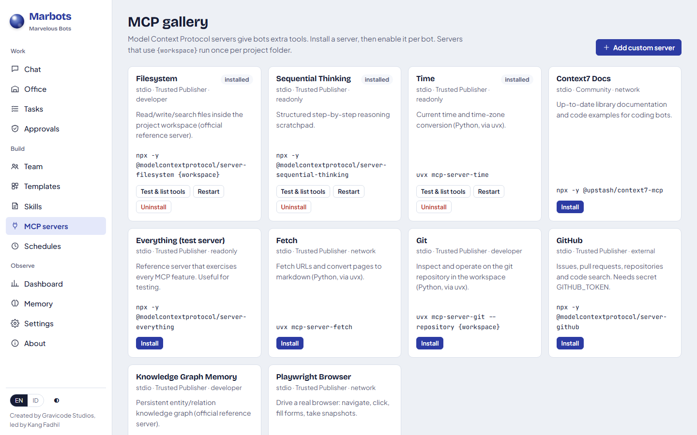
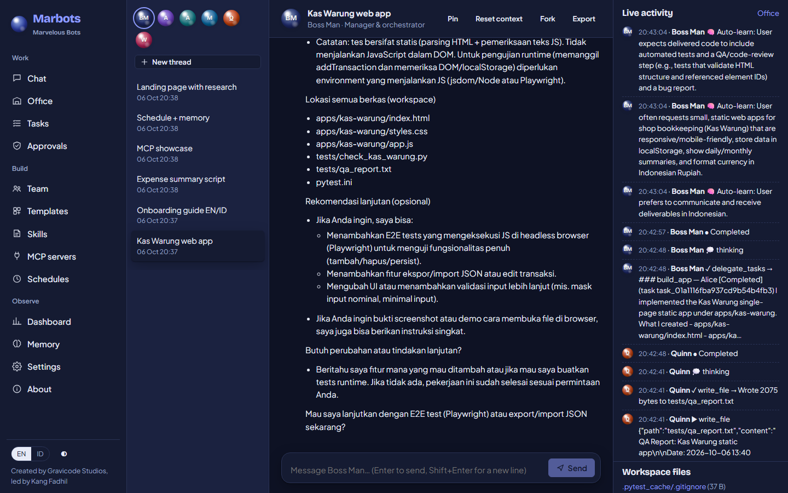
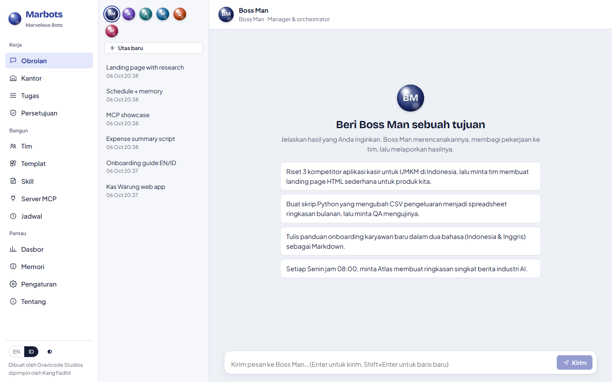
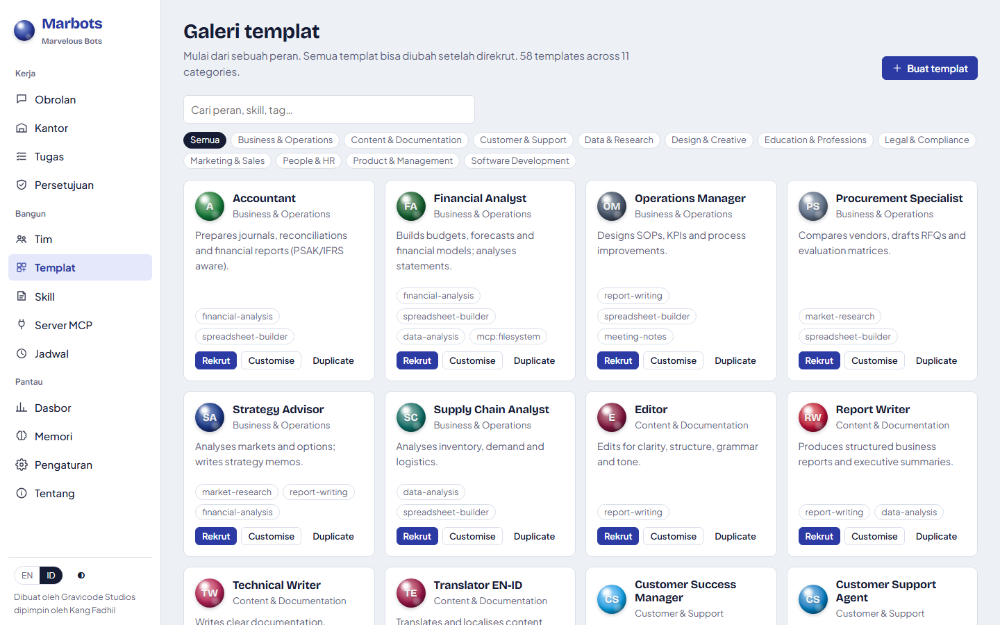

<p align="center"></p>

<h1 align="center">Marbots — Marvelous Bots</h1>

<p align="center"><b>Bentuk, rekrut, ajari, dan orkestrasi tim rekan kerja AI dari satu platform.</b><br>
Kolaborasi multi-agen di .NET 10 · Orkestrasi Boss Man · Skill · MCP · A2A · SDK</p>

<p align="center"><a href="README.md">English</a> · <a href="docs/id/index.md">Dokumentasi</a> · <a href="docs/en/index.md">Documentation</a> · <a href="PLAN.md">Peta jalan</a> · <a href="Progress.md">Progres</a></p>

<p align="center"><i>Dibuat oleh Gravicode Studios dipimpin oleh Kang Fadhil</i></p>

---


## Apa itu Marbots?

Marbots memperlakukan agen AI sebagai **rekan kerja tetap**. Setiap bot punya nama, persona, memori, skill, tool, dan
batasan izin yang jelas. Anda memberi tujuan kepada **Boss Man**. Ia merencanakannya, memecahnya menjadi sub-tugas,
membagikannya ke anggota tim yang tepat secara paralel, menunggu dependensi, meninjau hasilnya, lalu melapor kembali.
Anda juga bisa berbicara langsung dengan bot mana pun.

- **Orkestrasi Boss Man**: DAG delegasi dengan eksekusi paralel, dependensi, pembatalan, dan batas kedalaman.
- **Model per bot**: setiap bot bisa memakai modelnya sendiri (`provider/model` atau profil); bot tanpa pilihan memakai model bawaan workspace, dan model yang tidak tersedia otomatis kembali ke bawaan.
- **Bot yang tahan lama**: persona, memori jangka pendek dan panjang (BM25 dengan asal-usul), pemadatan konteks otomatis, serta Auto-Learn opsional.
- **Galeri templat**: 58 peran siap pakai dalam 11 kategori (engineering, desain, produk, keuangan, HR, legal,
  pemasaran, layanan pelanggan, pendidikan, dan lainnya). Buat templat sendiri lengkap dengan nama, instruksi, MCP, dan skill.
- **Skill**: paket `SKILL.md` (kompatibel dengan Claude/Agent Skills dan OpenClaw) dengan pengungkapan bertahap; 20 skill bawaan; bisa dipasang dari git.
- **MCP**: klien stdio dan HTTP, galeri terkurasi, server terikat workspace, server kustom, referensi secret.
- **Kernel function**: berkas, grep, shell (PowerShell/bash), pencarian/pengambilan web, memori, todo.
- **Aman sejak desain**: mesin kebijakan deterministik dengan profil izin, persetujuan manusia (sekali atau per utas),
  secret terenkripsi, *sandbox* path, dan batasan prompt injection. Tersedia mode berbahaya *lewati persetujuan* untuk
  sandbox (Pengaturan, `marbots approvals skip on`, atau `--dangerously-skip-approvals`).
- **Penjadwal**: job cron dan sekali jalan dengan zona waktu.
- **Observabilitas**: satu aliran event untuk aktivitas obrolan langsung, denah **Kantor**, dasbor, SSE, dan CLI.
- **Interoperabilitas**: API REST + SSE, OpenAPI, Agent Card dan JSON-RPC **A2A**, ekspor/impor `.marbot` tanpa secret.
- **SDK**: .NET, Python, TypeScript, dan Go, ditambah CLI `marbots` dengan tema.
- **Dwibahasa**: UI dan dokumentasi dalam Bahasa Indonesia dan Inggris.

## Mulai cepat

```bash
git clone https://github.com/DotNetVibeCoderz/Vibe_Dev.git && cd Vibe_Dev/Marbots
dotnet run --project src/Marbots.Server        # http://localhost:5170
```

Lalu buka **Pengaturan** dan tambahkan provider model (Azure OpenAI atau endpoint apa pun yang kompatibel dengan
OpenAI), atau atur lewat variabel lingkungan:

```bash
export Marbots__Providers__0__Name=azure Marbots__Providers__0__Kind=azure-openai \
       Marbots__Providers__0__Endpoint=https://<resource>.openai.azure.com/ Marbots__Providers__0__ApiKey=<key> \
       Marbots__ModelProfiles__0__Name=default Marbots__ModelProfiles__0__Provider=azure Marbots__ModelProfiles__0__Model=gpt-5-mini
```

Panduan lengkap: [Memulai](docs/id/getting-started.md).

## Tangkapan layar

| | |
|---|---|
|  **Tim**: bot tetap dengan peran, tool, dan status |  **Galeri templat**: 58 peran, pencarian, dan kategori |
|  **Editor bot**: persona, otak, kemampuan, batasan, dan catatan keamanan langsung |  **Persetujuan**: tindakan berisiko menunggu keputusan Anda langsung di obrolan |
|  **Kantor**: denah langsung; bot berpindah ke stasiun sesuai pekerjaannya |  **Dasbor**: tugas, token, biaya per bot, host, kesehatan MCP |
|  **Galeri skill**: bawaan, terpasang, dan draf hasil auto-learn |  **Galeri MCP**: pasang, uji, dan lihat daftar tool |
|  **Riset web** dengan sumber yang dikutip |  **Mode gelap** |
|  **UI Bahasa Indonesia** (tombol EN/ID di kiri bawah) |  **Galeri templat** dalam Bahasa Indonesia |

## Dibangun oleh para bot (uji coba LLM sungguhan)

Kami menjalankan tujuh pekerjaan bersamaan dengan Azure OpenAI `gpt-5-mini`: **16/16 tugas selesai, total ≈ $0,41**.
Lihat [Uji coba](docs/id/trials.md) untuk detail dan [`samples/trials/outputs`](samples/trials/outputs) untuk semua artefak.

| Aplikasi Kas Warung (Alice membangun, Quinn menguji) | Landing page Kopi Kilat (Atlas meriset → Alice membangun) |
|---|---|
|  |  |

Uji coba juga menghasilkan panduan onboarding dwibahasa (MD + HTML siap cetak), skrip laporan pengeluaran dengan XLSX
berformula SUM/SUMIF yang diverifikasi independen dengan pandas, ringkasan riset pasar bersitasi, laporan berbasis MCP
yang ditulis bot yang dibuat Boss Man di tengah percakapan, jadwal cron berulang, dan pertukaran A2A.

## CLI

```text
$ marbots status
Marbots 0.1.0
Created by Gravicode Studios, led by Kang Fadhil
Model: default → azure/gpt-5-mini
Team:  6 bots, 0 working
```

## SDK

```python
from marbots_sdk import MarbotsClient, ModelRef  # pip install marbots-sdk
mb = MarbotsClient()
mb.bots.set_model("atlas", ModelRef.of("azure", "gpt-5.6-luna"))   # setiap bot bisa punya model sendiri
print(mb.chat("boss-man", "Susun rencana peluncuran produk 3 langkah"))
```

```csharp
using var mb = new MarbotsClient(new Uri("http://localhost:5170"));   // dotnet add package Marbots.Sdk
var t = await mb.Threads.CreateAsync("atlas");
var r = await mb.Threads.SendAsync(t.Id, "3 berita AI teratas hari ini", wait: true);
```

TypeScript (`@gravicode/marbots`) dan Go (`github.com/DotNetVibeCoderz/Vibe_Dev/Marbots/sdk/go`) juga tersedia. Lihat
[API, A2A, SDK, dan CLI](docs/id/api-and-sdks.md).

## Pengembangan

```bash
dotnet build Marbots.slnx
dotnet test tests/Marbots.Tests                         # 58 tes, tanpa jaringan
dotnet test tests/Marbots.Tests --filter "FullyQualifiedName~EngineTests"
```

Desain: [solution-design.md](solution-design.md) · Peta jalan: [PLAN.md](PLAN.md) · Status: [Progress.md](Progress.md)

## Lisensi

MIT. Dibuat oleh **Gravicode Studios**, dipimpin oleh **Kang Fadhil**.
