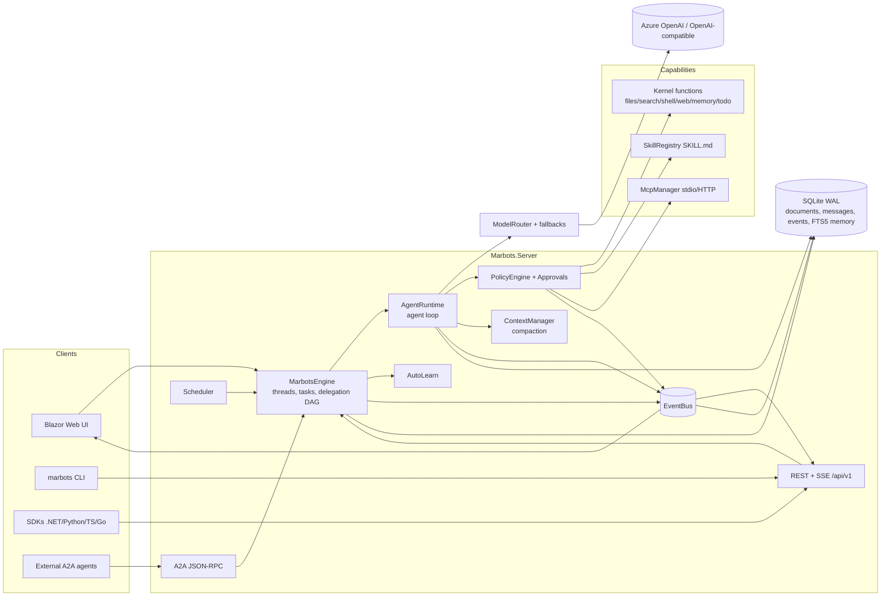

# Architecture

[English](../en/architecture.md) · [Bahasa Indonesia](../id/architecture.md)

Marbots is a **modular monolith** control plane on .NET 10: one process, hard module boundaries (one project per
concern), and contracts that let the runtime move to separate AgentHost processes later. The full target design is in
[solution-design.md](../../solution-design.md).

## Projects

| Project | Responsibility |
|---|---|
| `Marbots.Abstractions` | Contracts: models, events, interfaces (`IModelProvider`, `IKernelFunction`, `IPolicyEngine`, `IMemoryStore`, stores), source-generated JSON context |
| `Marbots.Storage` | SQLite: JSON document table, message log (per-thread sequence), event log, FTS5 memory |
| `Marbots.Providers` | OpenAI-compatible chat completions (Azure v1, OpenAI, DeepSeek, Ollama…) with retry/backoff; deterministic mock |
| `Marbots.Kernel` | Built-in tools and workspace path safety |
| `Marbots.Runtime` | Engine, agent loop, delegation, context/compaction, memory recall, skills, MCP client, policy, approvals, scheduler, auto-learn, `.marbot` packages, templates, DI |
| `Marbots.Server` | ASP.NET Core host: REST/SSE API, A2A, Blazor Server UI, API-key middleware, data protection |
| `Marbots.Sdk` | .NET client |
| `Marbots.Cli` | `marbots` command line |
| `sdk/python`, `sdk/typescript`, `sdk/go` | Other SDKs |

## A request, end to end

1. `MarbotsEngine.SendAsync` stores the user message, creates a root `TaskRecord`, and starts the run on the thread pool
   (bounded by `MaxConcurrentRuns`).
2. `AgentRuntime` assembles tools (kernel packs + skills + MCP tools for that workspace), loads history through
   `ContextManager` (compacting if needed), recalls long-term memory, and builds the system prompt.
3. Model call through `ModelRouter` (profile → provider → fallbacks). Usage and cost are metered on the task.
4. Each tool call is parsed, checked by `PolicyEngine`, optionally approved by a human, executed with a timeout, and
   persisted as a tool message. Events are emitted around everything.
5. `delegate_tasks` calls back into the engine, which runs a DAG of child tasks in parallel (bounded by
   `MaxParallelDelegations`, depth by `MaxDelegationDepth`), each with its own transcript but the shared workspace.
6. The final answer is stored, the task completes, and Auto-Learn runs in the background if enabled.

## Performance and memory

- Async I/O end to end with `CancellationToken` on every long operation; cancellation cascades to child tasks.
- Source-generated `System.Text.Json` for all persisted and transported contracts; the LLM request body is written with
  `Utf8JsonWriter` (no reflection, no intermediate DOM).
- Bounded `Channel<T>` per event-stream subscriber with drop-oldest backpressure; handler lists are immutable arrays (no locks on publish).
- SQLite in WAL mode with pooled connections; a single document table plus append-only logs; FTS5 for memory search.
- Shell output is captured into a head+tail bounded buffer; file reads, grep and web fetch are size-capped.
- Older tool outputs are truncated in the model context; the full content stays in storage.
- UI pages coalesce bursts of events into at most one re-render per throttle window.
- Rust: none of the current hot paths justify native code yet (see ADR-008 in [PLAN.md](../../PLAN.md)).

## Configuration (`appsettings.json` → `Marbots`)

| Key | Default | Meaning |
|---|---|---|
| `DataDirectory` | `data` | Database, workspaces, skills, secrets, keys |
| `Providers[]` | — | `{ Name, Kind: azure-openai\|openai, Endpoint, ApiKey }` (`ApiKey` may be `secret:NAME`) |
| `ModelProfiles[]` | auto | `{ Name, Provider, Model, Fallbacks[], MaxOutputTokens, InputCostPerMTok, OutputCostPerMTok }` |
| `MaxConcurrentRuns` | 8 | Concurrent root tasks |
| `MaxParallelDelegations` | 4 | Parallel children per delegation |
| `MaxDelegationDepth` | 2 | How deep delegation may nest |
| `ApprovalTimeoutMinutes` | 30 | Pending approval lifetime |
| `SeedStarterBots` | true | Hire Atlas, Alice, Quinn and Wren on first run |
| `ApiKey` | — | Require `X-Api-Key` on `/api` and `/a2a` |
| `Secrets:NAME` | — | Secrets from configuration |

---
*Marbots — Created by Gravicode Studios, led by Kang Fadhil.*
