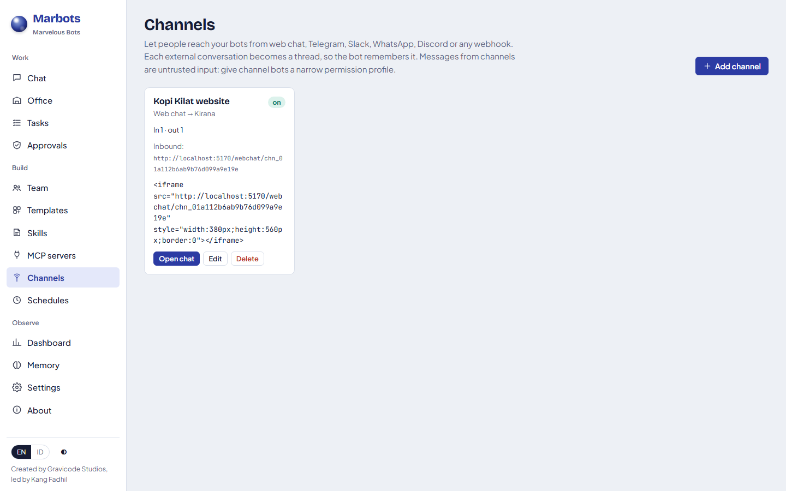
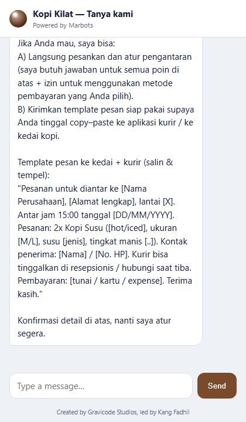
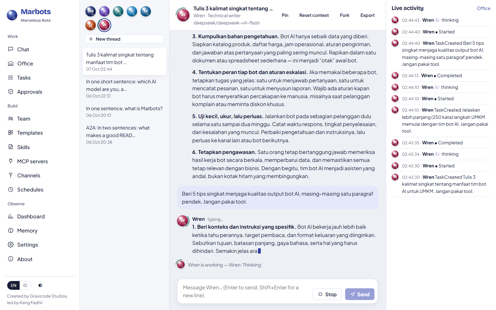

# Channels, triggers and suggest mode

[English](../en/channels-and-triggers.md) · [Bahasa Indonesia](../id/channels-and-triggers.md)

## Channels

A **channel** connects an external messaging service to one bot. Every external conversation (a Telegram chat, a Slack
channel, a WhatsApp number, a web chat visitor) becomes its own Marbots thread, so the bot remembers it, and the reply
is sent back automatically when the task finishes. If the bot waits for an approval, the channel user is told that an
operator needs to approve the next step.



| Kind | Inbound | Outbound | Secrets (stored encrypted) | Status |
|---|---|---|---|---|
| **Web chat** | Built-in page `/webchat/{id}` (embed with an iframe) | Shown in the page | none | tested end to end with a real LLM |
| **Webhook** | `POST /api/v1/channels/{id}/inbound` with `X-Marbots-Secret` | `POST` to `outboundUrl` | `inboundSecret`, `outboundSecret` | tested end to end |
| **Telegram** | Long polling (default, no public URL) or `/api/v1/channels/{id}/telegram` | Bot API `sendMessage` (4096-char chunks) | `token`, `webhookSecret` | tested with a simulated Bot API |
| **Slack** | Events API → `/api/v1/channels/{id}/slack` (signing secret, 5-minute replay window, `url_verification`) | `chat.postMessage` | `token`, `signingSecret` | tested with a simulated API |
| **WhatsApp** | Cloud API webhook `/api/v1/channels/{id}/whatsapp` (verify token, `X-Hub-Signature-256`) | Graph API `messages` | `token`, `appSecret`, `verifyToken` | tested with a simulated API |
| **Discord** | Your relay POSTs to the generic inbound URL | Channel webhook | `webhookUrl`, `inboundSecret` | tested with a simulated API |
| **E-mail** | IMAP polling of a mailbox folder (every `pollSeconds`) | SMTP reply, threaded (`Re:`, `In-Reply-To`, `References`) | `password` (app password) | tested against IMAP and SMTP protocol servers |

Microsoft Teams, Zapier, n8n and Make work through the **Webhook** channel.

### E-mail

Give the bot its own mailbox (for example `support-bot@company.com`) and an app password. Settings: `username`,
`fromAddress`, `fromName`, `imapHost`/`imapPort`/`imapSecurity` (`ssl` 993), `smtpHost`/`smtpPort`/`smtpSecurity`
(`starttls` 587), `folder` (INBOX) and `pollSeconds` (30).

- Each sender address is one conversation, so the bot remembers earlier mails from that person. The subject of a new
  mail is included in the prompt.
- Only the new text reaches the bot. Quoted history ("On … wrote:", "Pada … menulis:", `>` lines, Outlook's
  "Original Message") and signatures (`-- `) are removed, and HTML-only mails are converted to text.
- Loop protection: Marbots never answers its own address, auto-replies (`Auto-Submitted`), bulk or list mail
  (`Precedence`), `no-reply@`, `mailer-daemon@` or another Marbots channel. Its replies carry
  `Auto-Submitted: auto-replied`.
- Processed mails are marked as read; restrict who may write with the allowed-senders list.

```bash
# Generic webhook channel
curl -X POST localhost:5170/api/v1/channels/$ID/inbound -H "X-Marbots-Secret: $SECRET" \
     -H 'Content-Type: application/json' -d '{"conversationId":"order-42","senderName":"Dina","text":"Status pesanan saya?"}'
```

Safety:
- Channel messages are untrusted input. Give channel bots a narrow permission profile (e.g. `workspace-write` or
  `read-only`) and only the tools they need.
- Optional **allowed senders** list per channel.
- Provider webhooks are authenticated with their own signatures and do not need the Marbots API key; everything else under
  `/api` still does.



## Triggers

A **trigger** starts a bot without anyone typing. Configure them under **Schedules → Triggers**, through the API
(`/api/v1/triggers`) or with the .NET SDK (`client.Triggers`).

| Kind | When | Prompt placeholders |
|---|---|---|
| **Webhook** | `POST /api/v1/hooks/{id}` with `X-Marbots-Secret: <secret>` or `X-Marbots-Signature: sha256=<HMAC of the body>` | `{{payload}}` (the request body) |
| **Event** | When a bot finishes a task (optionally only a specific bot) | `{{bot}}`, `{{task}}`, `{{result}}` |

```text
Trigger "Summarise Atlas": when Atlas completes a task → Wren: "Summarise for the newsletter: {{result}}"
Trigger "CI failed": POST /api/v1/hooks/trg_… → Quinn: "Investigate this failed build: {{payload}}"
```

Loop guards: a trigger never reacts to tasks it started itself, only reacts to top-level tasks, and fires at most 10
times per minute.

## Suggest mode (delegation)

**Settings → Delegation**, `marbots delegation suggest`, or `PUT /api/v1/system/delegation {"mode":"Suggest"}`.
In Suggest mode Boss Man still plans, but before any teammate starts, the plan appears as an approval card (who does
what, in which order). Approve to run it; reject and Boss Man asks what to change. Auto mode (the default) delegates
immediately.

## A2A streaming

Every bot's Agent Card now advertises `"streaming": true`. `message/stream` returns Server-Sent Events: the task,
`status-update` events while the bot thinks, calls tools or delegates, then a final status and an `artifact-update` with
the answer.

## Live token streaming

Replies appear word by word in the web chat (with a blinking caret) and in `marbots chat`. Providers stream only when
someone is watching the output; usage and cost are still recorded from the final chunk. Streaming fragments travel as
transient `AssistantDelta` events: they reach SSE subscribers (`/api/v1/events`, `/api/v1/threads/{id}/events`) and SDK event streams but are
never written to the event log, so history stays compact.



---
*Marbots — Created by Gravicode Studios, led by Kang Fadhil.*
