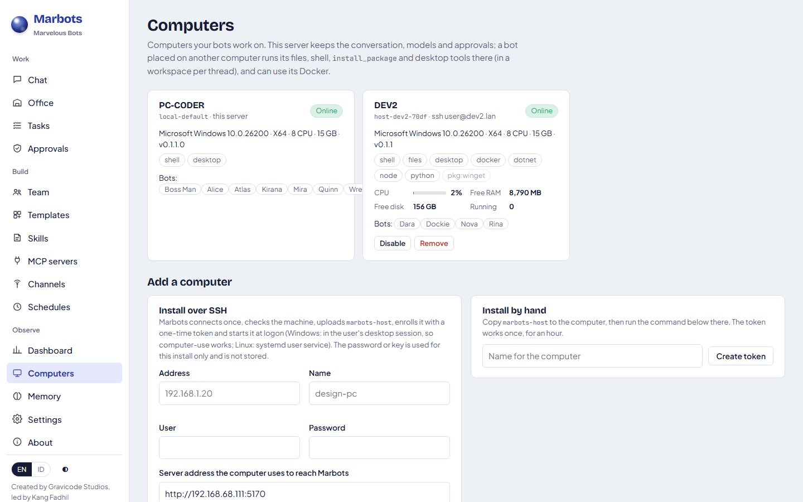

# Computers: running bots on other machines

[English](../en/computers.md) · [Bahasa Indonesia](../id/computers.md)

A Marbots server can put bots to work on other computers: a build PC, a design workstation with a big screen, a
Linux box with Docker, a VM. The server keeps what must stay central: conversations, models and API keys, policy,
approvals, memory and web search. The other computer runs the bot's environment tools in its own workspaces.

| Runs on the bot's computer | Stays on the server |
|---|---|
| `files` (read/write/edit/list/delete), `search` (grep) | the agent loop and the model calls |
| `shell` (`run_shell`, `install_package`) | approvals and the permission policy |
| `desktop` (screenshot, mouse, keyboard) | memory, todo, web search/fetch, MCP servers |
| Docker containers for the bot's shell (optional) | skills (their files are copied over when loaded) |



## Add a computer over SSH

**Computers → Install over SSH** in the web app, or the CLI:

```bash
marbots hosts bootstrap devuser@192.168.1.20 --server http://192.168.1.10:5170 --name DEV2 --password-file pw.txt
# or MARBOTS_SSH_PASSWORD=… / --key-file id_ed25519
```

What happens:

1. **Preflight.** Marbots connects once, detects the OS and CPU architecture, and checks that the computer can reach
   the server at `--server`. Use the server's LAN address, not `localhost`.
2. **Upload.** It copies the self-contained `marbots-host` binary (no .NET needed on the target) from
   `data/host-packages/marbots-host-<rid>[.exe]`.
3. **Enroll.** A one-time token (valid 10 minutes, stored only as a hash) is exchanged for the host's id and secret.
   On Windows the secret is protected with DPAPI for that user.
4. **Start at logon.** On Windows this is a scheduled task in the user's desktop session, so computer-use tools can see
   the screen. On Linux it is a systemd user service. On macOS it is a launchd agent (`id.gravicode.marbots-host`); the
   binary is signed ad hoc, which Apple silicon requires.
5. **Online.** The host connects out to the server (it works behind NAT) and reports its capabilities.

The SSH password or key is used for that request only and is never stored. Build a package for another platform with
`dotnet publish src/Marbots.AgentHost -c Release -r linux-x64 -o data/host-packages`, then rename the file to
`marbots-host-linux-x64`.

**Updates.** `marbots hosts bootstrap … --update` replaces the binary and restarts the host while keeping its enrollment.

### Install by hand

**Computers → Install by hand → Create token**, or run `marbots hosts token DEV2`, then on the computer:

```bash
marbots-host enroll --server http://192.168.1.10:5170 --token mbe_… --name DEV2
marbots-host run
```

## Put bots on a computer

| Way | How |
|---|---|
| Web | Bot editor → **Host** (each computer shows its status and capabilities). Optionally set a **Container image**. |
| CLI | `marbots bot host nova host-dev2-70df`; `marbots bot container dockie python:3.12-slim --cpus 1 --memory 1024` |
| SDK | `new BotDefinition { HostRef = host.Id, Container = new ContainerProfile { Image = "python:3.12-slim" } }` |
| Boss Man | "Create a data engineer on DEV2 that runs its shell in python:3.12-slim". Boss Man uses `list_hosts` and `create_bot` with `host` and `container_image`. |

`HostRef: "auto"` lets **placement** choose. Computers that lack a capability the bot needs (`shell`, `desktop`,
`docker`) are skipped. The rest are scored by CPU, free memory and running calls. A thread stays on the computer that
holds its workspace.

Files a remote bot makes appear in the chat's **Files** list ("on DEV2") and download through the server.

## The host console

`marbots-host run` shows who is working on the computer right now, recent tool calls with how long they took, and
the machine's load. While a bot uses the mouse and keyboard, a clear banner asks the person at the computer not to
type. When the output is redirected, it falls back to plain log lines (also written to `host.log`).

## Prerequisites: install_package

Bots install what a task needs on their computer, with the local package manager:

| Platform | Managers |
|---|---|
| Windows | winget (per-user first), scoop, choco |
| Linux | apt, dnf, yum, pacman, apk, zypper (with `sudo -n` when not root) |
| macOS | brew |
| Any | `pip:<package>`, `npm:<package>`, `dotnet-tool:<tool>` |

Common names map to the right package ids: `python`, `node`, `git`, `java`, `go`, `rust`, `ffmpeg`, `pandoc`,
`libreoffice`, `docker`. The .NET SDK uses Microsoft's `dotnet-install` script into the user profile, so it needs no
administrator rights. Before installing, the tool checks whether the program is already there. Afterwards, every
`run_shell` call reads the updated PATH, so the new tool works immediately. `install_package` asks for approval like
any shell command, unless the bot's profile is `autonomous`.

## GPUs

Hosts report their GPUs: NVIDIA (nvidia-smi, with live utilisation and free memory in the heartbeat), AMD (rocm-smi on
Linux), Apple (Metal; unified memory) and any Windows adapter (WMI). A GPU adds the capabilities `gpu` plus its API
(`cuda`, `rocm`, `metal`, `directx`). `marbots-host capabilities` lists what a machine has.

Give a bot requirements and let placement choose (`HostRef: auto`):

```json
{ "hostRef": "auto", "requires": ["cuda", "gpu:16"] }
```

`gpu:16` means at least 16 GB of memory on one GPU. Among the hosts that qualify, placement prefers idle GPUs with the
most free memory. Other requirements work the same way: `docker`, `python`, `node`, `dotnet`, `playwright`, `desktop`.
In the trial on DEV2, a bot that required `gpu:2` was placed automatically on the only machine with a 2 GB GPU, and it
reported that machine's name and GPUs.

## Mutual TLS

When a host enrolls, it makes a P-256 key that never leaves the machine and sends a certificate signing request. The
server's host CA (one per tenant, key encrypted with Data Protection) signs a client certificate with CN = host id. On
an HTTPS server the host presents that certificate when it connects, on top of its secret.

```json
"HostSecurity": { "RequireClientCertificate": true }
```

- Only the host's latest certificate is accepted, so renewal and host removal revoke the old one. Hosts renew on their
  own when a third of the lifetime is left; `marbots-host renew` renews now. A renewal must be made with the current
  certificate, so a stolen secret alone cannot obtain one.
- Behind a TLS-terminating proxy, set `ClientCertificateHeader` (for example `X-Client-Cert` with nginx
  `$ssl_client_escaped_cert`).
- A server with a private CA: `marbots-host enroll … --server-ca ca.pem`.

Tested on Windows with Kestrel over HTTPS: a host with its certificate connects; without it, the connection is refused
with 401.

## Container hosts (disposable "VMs")

A Docker-capable machine (this server or any host with the `docker` capability) can start disposable hosts:
`marbots-host` in a container that enrolls itself, keeps its identity in a named volume and restarts with Docker.

```bash
marbots hosts provision sandbox-1 --on host-dev2-bba5 --server http://host.docker.internal:5170 --cpus 1 --memory 1024
marbots hosts remove host-sandbox-1-990c      # also removes the container and its volume
```

Options: `--gpu` (`--gpus all`), `--no-network`, `--image`, `--arch arm64`. The Linux host package
(`marbots-host-linux-x64`) must be in `data/host-packages`. In the trial a container host on DEV2 ran a bot's shell
task (Ubuntu 24.04, 1 GiB memory limit enforced), and removing the host removed the container and its volume.

## Containers

With a container profile, each `run_shell` call runs in a throwaway `docker run --rm` container. The container gets
CPU and memory quotas, a `marbots.bot` label and only the workspace mounted (at `/workspace`). Network access is
optional. The bot is told it is inside the container and should use `sh`.

## Computer use

The `desktop` pack gives a bot four tools:

- `screenshot`: the model sees the image, and it is saved under `screenshots/`;
- `mouse_click`: coordinates are in screenshot pixels;
- `type_text`;
- `press_keys`.

They need a Windows computer with someone logged on, because the host runs in that desktop session. Clicks and typing
are `ProcessExecution` actions, so they ask for approval under `developer-safe`.

## Reliability

- The host reconnects on its own with back-off.
- A tool call that is in flight when the connection drops waits up to 60 s for the host to return and is then re-sent
  with the same request id. The host answers from its result cache instead of running the tool twice.
- Hosts can be disabled or removed on the Computers page or with `marbots hosts disable|remove <id>`.

## Protocol

There is one WebSocket per host at `/api/v1/hosts/connect`, authenticated with `X-Marbots-Host` and
`X-Marbots-Host-Secret`. It carries JSON frames: `hello`, `heartbeat`, `invoke`/`result`, `list-files`, `read-file`,
`put-files` and `cancel`. A WebSocket on the existing port replaced the gRPC idea in the original design for three
reasons: hosts open the connection outbound, it needs one port, and the JSON is source-generated (see ADR in `PLAN.md`).

---
*Marbots: Created by Gravicode Studios, led by Kang Fadhil.*
