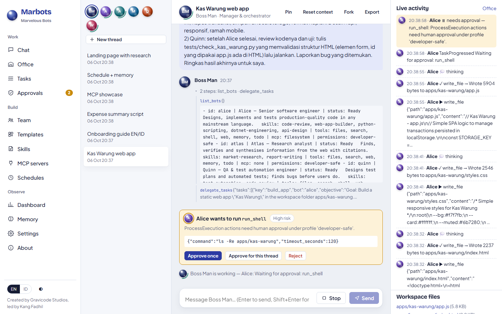

# Getting started

[English](../en/getting-started.md) · [Bahasa Indonesia](../id/getting-started.md)

This guide takes you from a fresh clone to your first multi-bot task in about ten minutes.

## Prerequisites

| Need | Version | Used for |
|---|---|---|
| .NET SDK | 10.0 or later | Server, CLI, .NET SDK |
| An LLM endpoint | Azure OpenAI, OpenAI, DeepSeek, Ollama, LM Studio, vLLM… | The bots' brains. Without one, bots run in offline mock mode. |
| Node.js (optional) | 18+ | MCP servers started with `npx` |
| uv (optional) | any | Python MCP servers started with `uvx` |
| Python (optional) | 3.9+ | Lets bots run Python scripts; Python SDK |

## 1. Run the server

```bash
git clone https://github.com/DotNetVibeCoderz/Vibe_Dev.git
cd Vibe_Dev/Marbots
dotnet run --project src/Marbots.Server
```

Open **http://localhost:5170**. On first start Marbots creates its data folder (`src/Marbots.Server/data`),
seeds 58 bot templates and 20 skills, creates **Boss Man**, and hires a starter team:
Atlas (researcher), Alice (software engineer), Quinn (QA) and Wren (technical writer).

## 2. Connect a model

Choose one option.

**A. In the UI.** Go to **Settings → Model provider**, pick *Azure OpenAI* or *OpenAI-compatible*, and enter the
endpoint, API key and model (for example `gpt-5-mini`). The key is encrypted on this computer and never displayed again.

**B. With configuration** (recommended for servers). Use environment variables or `appsettings.json`:

```bash
# Azure OpenAI
export Marbots__Providers__0__Name=azure
export Marbots__Providers__0__Kind=azure-openai
export Marbots__Providers__0__Endpoint=https://<resource>.openai.azure.com/
export Marbots__Providers__0__ApiKey=<key>
export Marbots__ModelProfiles__0__Name=default
export Marbots__ModelProfiles__0__Provider=azure
export Marbots__ModelProfiles__0__Model=gpt-5-mini
```

```bash
# Any OpenAI-compatible endpoint, e.g. DeepSeek or a local Ollama
export Marbots__Providers__0__Name=deepseek
export Marbots__Providers__0__Kind=openai
export Marbots__Providers__0__Endpoint=https://api.deepseek.com
export Marbots__Providers__0__ApiKey=<key>
export Marbots__ModelProfiles__0__Name=default
export Marbots__ModelProfiles__0__Provider=deepseek
export Marbots__ModelProfiles__0__Model=deepseek-chat
```

On Windows PowerShell use `$env:Marbots__Providers__0__Name = "azure"` and so on.

Optional: add the secret `TAVILY_API_KEY` (Settings → Secrets) for higher-quality web search. Without it, bots use
DuckDuckGo's HTML endpoint.

## 3. Give Boss Man a goal

In **Chat**, Boss Man is selected. Try one of the suggestions, for example:

> Research 3 competitors of POS apps for small shops in Indonesia, then have the team build a simple HTML landing page for our product.

Boss Man calls `list_bots`, splits the work with `delegate_tasks`, and teammates work in parallel in a shared
project workspace. Watch the **Live activity** panel or open **Office** to see who is doing what.



When a bot wants to run a shell command, an approval card appears. Choose **Approve once**,
**Approve for this thread**, or **Reject**.


Files the bots create are listed under **Workspace files** and can be opened in the browser.

## 4. Use the CLI (optional)

```bash
dotnet run --project src/Marbots.Cli -- status
dotnet run --project src/Marbots.Cli -- chat atlas "Summarise today's AI news in 5 bullets"
dotnet run --project src/Marbots.Cli -- approvals
```

Or install it as a tool: `dotnet pack src/Marbots.Cli -o out && dotnet tool install -g Marbots.Cli --add-source out`.

## 5. Next steps

- Hire more teammates from the [template gallery](bots-and-templates.md).
- Give bots [skills](skills.md) and [MCP servers](mcp.md).
- Schedule recurring work with [schedules](scheduling.md).
- Automate Marbots from code with the [API and SDKs](api-and-sdks.md).
- Read how [security and approvals](security.md) work before giving bots the `autonomous` profile.

---
*Marbots — Created by Gravicode Studios, led by Kang Fadhil.*
