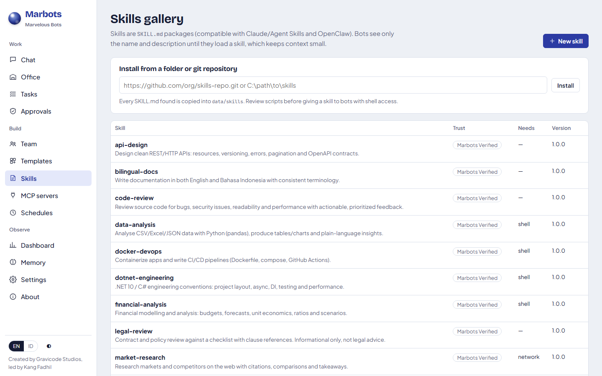

# Skills

[English](../en/skills.md) · [Bahasa Indonesia](../id/skills.md)

A **skill** is a folder with a `SKILL.md` file (plus optional `scripts/`, `references/`, `templates/`, `assets/`).
The format is compatible with Claude/Agent Skills and OpenClaw-style skills.

```markdown
---
name: weekly-report
description: Produce the weekly KPI report in our house style
version: 1.0.0
requires:
  tools: [read_file, write_file]
permissions:
  network: false
  shell: false
---

# Weekly report
1. Read data/kpi.csv ...
```

## Progressive disclosure

Only each skill's **name and description** go into a bot's system prompt. When a bot decides to use one, it calls
`load_skill` to read the full instructions, and `read_skill_file` for bundled templates or references. Bots can know
about many skills without filling their context window.

## Built-in skills

`api-design`, `bilingual-docs`, `code-review`, `data-analysis`, `docker-devops`, `dotnet-engineering`,
`financial-analysis`, `legal-review`, `market-research`, `marketing-copy`, `meeting-notes`, `product-requirements`,
`python-scripting`, `recruiting`, `report-writing` (with an HTML report template), `security-review`,
`spreadsheet-builder`, `test-automation`, `ux-design-brief`, `web-app-builder`.

## Installing and creating skills



- **From git or a folder**: Skills → *Install*, or `marbots skills install https://github.com/org/skills.git`. Every
  `SKILL.md` found is copied into `data/skills/`.
- **Create in the UI**: Skills → *New skill*.
- **Enable per bot**: Team → Edit → Skills. Boss Man has `*` (all skills).

Trust labels: `Marbots Verified` (built-in), `Local` (installed), `Unverified` (auto-learn drafts). The table shows
whether a skill needs shell or network and whether it bundles scripts. Review scripts before giving a skill to a bot
with shell access.

## Auto-learned skills

Bots in `SuggestSkills` mode can draft new skills from successful multi-step tasks. Drafts land in **Waiting for
review** on the Skills page. **Publish skill** moves a draft into `data/skills`; **Discard** deletes it.
A learned skill never grants new permissions: it runs inside the bot's existing permission profile.


## Ask Boss Man for a skill

For example: "Kirana wants to make generative art posters; find a fitting skill for her." Boss Man works like this:

1. `list_skill_catalog` lists the skills that are already available (built-in or installed) and the curated catalog:
   Anthropic's official skills, such as pptx, docx, xlsx, pdf, frontend-design, webapp-testing, canvas-design and
   algorithmic-art.
2. `install_skill` gives an available skill to the named bots right away.
3. A catalog skill is downloaded first, and only after you approve. The card shows the source and that skills may
   contain scripts. Only that skill is copied from the repository.

Skills outside the catalog are installed by a person on the Skills page. A skill never widens a bot's permission
profile.

## Learning evaluation

Every task that loads a skill counts for that skill **version**: completed tasks are successes, failed tasks are
failures, and cancelled tasks do not count. The Skills page shows a verdict for each skill, and so do
`marbots skills` and `GET /api/v1/skills/evaluations`:

| Verdict | When |
|---|---|
| Collecting evidence | fewer than 3 runs |
| Healthy | at least 80% success |
| Underperforming | less than 80% and no better earlier version |
| Rollback recommended | under 50%, and the previous version did better (or has no data) |
| Ready to publish | an auto-learned draft trialled at 80% or more |
| Discard recommended | a draft under 50% on trial |

- **Trials.** The bot that drafted a skill (auto-learn) may load it before anyone publishes it. The draft collects
  evidence, but publishing stays a human decision (`marbots skills promote <name>` or **Publish skill**).
- **Versions and rollback.** Publishing a new version of an installed skill raises its version number and keeps the
  old one in `data/skills-history`. **Roll back** (or `marbots skills rollback <name>`, or
  `POST /api/v1/skills/{name}/rollback`) restores the previous version and keeps the replaced one, so a rollback can
  itself be undone.
- **Automatic rollback.** Optional: **Roll back automatically** on the Skills page, or
  `marbots skills auto-rollback on`. When a version keeps failing and the evaluation recommends a rollback, it happens
  by itself, with a `SkillRolledBack` event in the log.
- **Skill files.** Loading a skill copies its files (scripts, templates) into the workspace at `.skills/<name>/`, also
  on remote computers, so bots can run the skill's scripts.

---
*Marbots — Created by Gravicode Studios, led by Kang Fadhil.*
