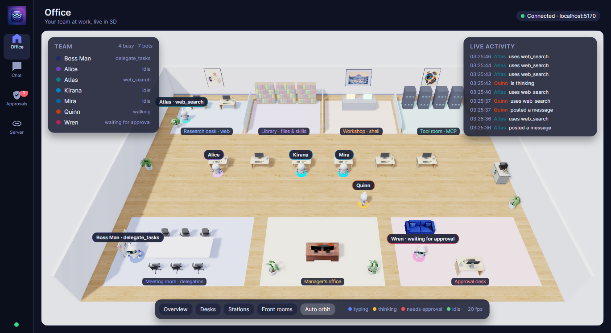
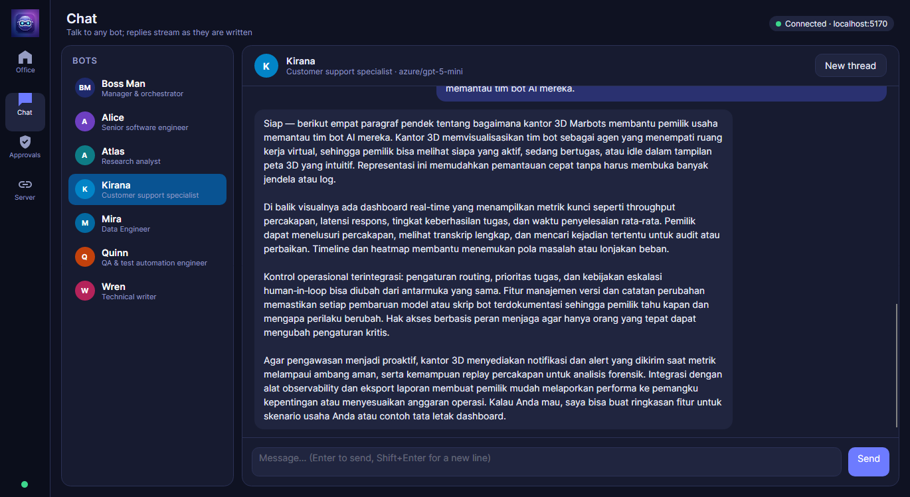
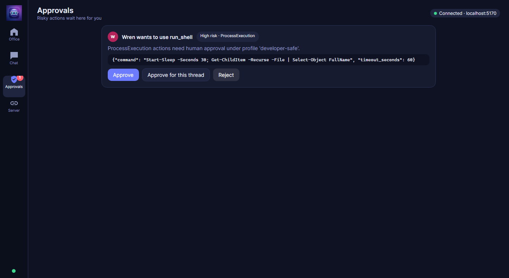
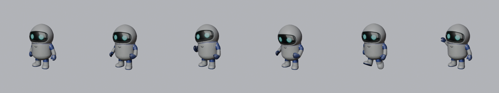
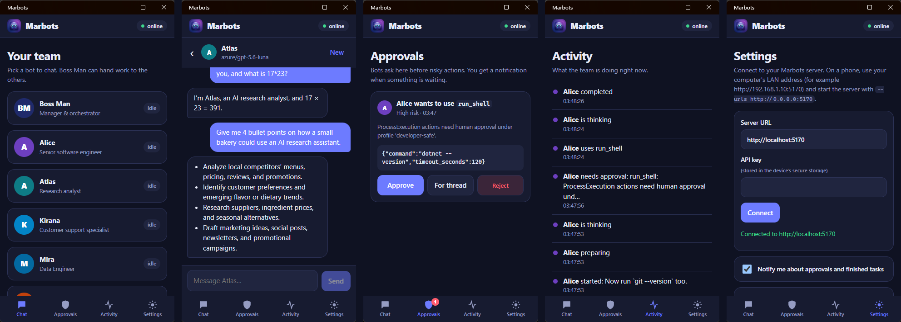

# Aplikasi desktop dan mobile

[English](../en/apps.md) · [Bahasa Indonesia](../id/apps.md)

Kedua aplikasi terhubung ke server Marbots lewat SDK .NET dan mengikuti stream event langsungnya. Aplikasi web, CLI,
desktop, dan ponsel selalu menampilkan keadaan yang sama.

## Desktop (Avalonia + Three.Net): kantor 3D

```bash
dotnet run --project src/Marbots.Desktop                  # terhubung ke MARBOTS_URL (bawaan http://localhost:5170)
dotnet run --project src/Marbots.Desktop -- --start-local # menyalakan server lokal bila belum ada
```



Denah kantornya sama dengan tampilan Office di web, hanya dirender dalam 3D:

- **Dinding belakang:** meja riset (web), perpustakaan (berkas dan skill), bengkel (shell), dan ruang tool (MCP).
- **Tengah:** deretan meja kerja.
- **Depan:** ruang rapat (delegasi), kantor manajer, dan meja persetujuan.

Setiap bot adalah robot ber-rig dengan cincin warnanya sendiri dan lampu status. Event menggerakkan robot:

| Event | Yang dilakukan robot |
|---|---|
| `ToolCallStarted` | berjalan lewat lorong ke stasiun yang sesuai dan bekerja di sana (`typing`; `talk` di ruang rapat) |
| `AgentThinkingStarted` | kembali ke mejanya, `thinking` |
| teks streaming | kembali ke mejanya, `typing` |
| `ApprovalRequested` | berjalan ke meja persetujuan dan `wave` sampai ada keputusan |
| `TaskDelegated` | sinar dari manajer ke bot selama beberapa detik |
| tugas selesai | kembali ke mejanya, `idle` |

Label nama mengikuti robot. Preset kamera: Overview, Desks, Stations, dan Front rooms, ditambah auto orbit. Halaman
lainnya adalah **Chat** (balasan streaming), **Approvals**, dan **Server** (terhubung, atau menyalakan server lokal).

 

### Cara aset kantor dibuat

| Aset | Alat |
|---|---|
| Robot, meja, kursi, meja eksekutif, tanaman, sofa, papan tulis, stasiun kopi | **Rodin** (Hyper3D) teks-ke-3D, melalui model server MCP Rodin |
| Lukisan dinding, tekstur lantai, ikon aplikasi | **Nano Banana 2** |
| Rigging dan klip animasi robot (`idle`, `walk`, `typing`, `thinking`, `wave`, `talk`); pengurangan poligon dan pengecilan tekstur semua properti | **Blender** melalui server MCP Blender |

Robot mendapat armature 11 tulang dengan bobot yang dihitung dari area tubuhnya, karena cara ini lebih andal daripada
bobot otomatis pada mesh hasil generasi. Setiap klip adalah track NLA yang diekspor sebagai animasi glTF (700 KB).
Properti dipangkas menjadi 6–10 ribu poligon dengan tekstur 1024 px, total sekitar 4 MB.




Logika kantor (`OfficeDirector`: stasiun, slot, rute lorong, aktivitas) adalah C# biasa dan diuji tanpa GPU.

## Mobile (.NET MAUI Blazor Hybrid)

```bash
dotnet build src/Marbots.Mobile -f net10.0-android     # Android (emulator menjangkau PC di http://10.0.2.2:5170)
dotnet build src/Marbots.Mobile -f net10.0-windows10.0.19041.0
```



Aplikasi ini punya empat tab:

- **Chat:** daftar tim dengan aktivitas langsung; percakapan dengan Markdown dan balasan streaming.
- **Approvals:** setujui, setujui untuk utas ini, atau tolak.
- **Activity:** feed langsung.
- **Settings:** URL server dan API key (disimpan di secure storage perangkat), serta notifikasi.

Ponsel memberi notifikasi saat bot menunggu persetujuan, dan saat tugas yang dimulai dari ponsel selesai atau gagal.
Notifikasi memakai notification channel di Android, `UNUserNotificationCenter` di iOS dan Mac, dan app notification di
Windows.

Untuk ponsel di jaringan yang sama, jalankan server dengan `--urls http://0.0.0.0:5170` lalu isi
`http://<alamat-pc>:5170`. Di luar LAN, pakai HTTPS (reverse proxy).

Proyek mobile tidak termasuk dalam `Marbots.slnx`, karena CI di Linux tidak punya workload MAUI. Build dengan perintah
di atas.

### Notifikasi saat aplikasi tertutup

**Settings → When the app is closed → Turn on push** mendaftarkan topik ntfy acak pribadi untuk ponsel. Pasang aplikasi
ntfy dan berlangganan topik itu, maka persetujuan dan tugas yang selesai tetap masuk walaupun Marbots tertutup. Token
FCM dan APNs native juga didukung server (lihat [Operasional](operations.md#notifikasi-push)).

---
*Marbots — Dibuat oleh Gravicode Studios dipimpin oleh Kang Fadhil.*
