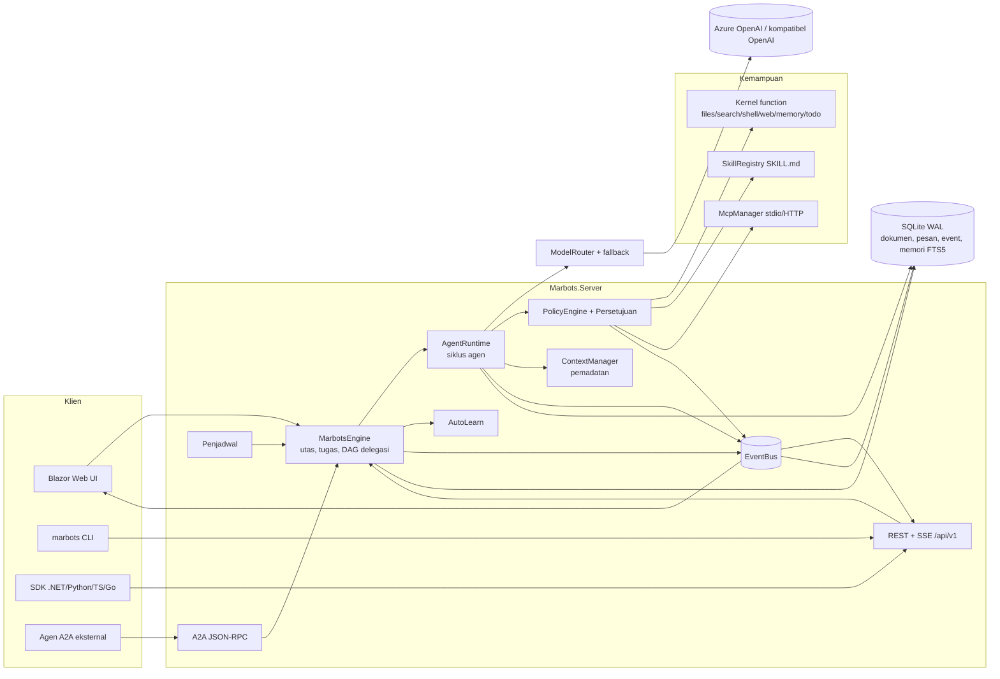

# Arsitektur

[English](../en/architecture.md) · [Bahasa Indonesia](../id/architecture.md)

Marbots adalah *control plane* **monolit modular** di atas .NET 10: satu proses, batas modul yang tegas (satu proyek
per urusan), dan kontrak yang memungkinkan runtime dipindah ke proses AgentHost terpisah di kemudian hari. Desain
target lengkap ada di [solution-design.md](../../solution-design.md).

## Proyek

| Proyek | Tanggung jawab |
|---|---|
| `Marbots.Abstractions` | Kontrak: model, event, antarmuka (`IModelProvider`, `IKernelFunction`, `IPolicyEngine`, `IMemoryStore`, store), konteks JSON *source-generated* |
| `Marbots.Storage` | SQLite, PostgreSQL, SQL Server, atau MySQL (masing-masing satu dialek): tabel dokumen JSON, log pesan (urutan per utas), log event, memori hybrid (kata kunci + vektor); setiap baris memiliki `tenant` |
| `Marbots.Providers` | Chat completions kompatibel OpenAI (Azure v1, OpenAI, DeepSeek, Ollama…) dengan retry/backoff; mock deterministik |
| `Marbots.Kernel` | Tool bawaan dan pengamanan path workspace |
| `Marbots.Runtime` | Engine, siklus agen, delegasi, konteks/pemadatan, pemanggilan memori, skill, klien MCP, kebijakan, persetujuan, penjadwal, auto-learn, paket `.marbot`, templat, DI |
| `Marbots.Server` | Host ASP.NET Core: API REST/SSE, A2A, UI Blazor Server, tenancy dan masuk (kunci API, OIDC/JWT, peran), ekspor OpenTelemetry, data protection |
| `Marbots.Sdk` | Klien .NET |
| `Marbots.Cli` | Command line `marbots` |
| `sdk/python`, `sdk/typescript`, `sdk/go` | SDK lain |

## Alur sebuah permintaan

1. `MarbotsEngine.SendAsync` menyimpan pesan pengguna, membuat `TaskRecord` akar, dan menjalankannya di thread pool
   (dibatasi `MaxConcurrentRuns`).
2. `AgentRuntime` merakit tool (paket kernel + skill + tool MCP untuk workspace tersebut), memuat riwayat melalui
   `ContextManager` (memadatkan bila perlu), memanggil memori jangka panjang, dan menyusun system prompt.
3. Panggilan model melalui `ModelRouter` (profil → provider → fallback). Pemakaian token dan biaya dicatat pada tugas.
4. Setiap pemanggilan tool di-*parse*, diperiksa `PolicyEngine`, jika perlu disetujui manusia, dijalankan dengan batas
   waktu, lalu disimpan sebagai pesan tool. Event dipancarkan di setiap tahap.
5. `delegate_tasks` memanggil kembali engine, yang menjalankan DAG tugas anak secara paralel (dibatasi
   `MaxParallelDelegations`, kedalaman oleh `MaxDelegationDepth`), masing-masing dengan transkrip sendiri tetapi
   workspace bersama.
6. Jawaban akhir disimpan, tugas selesai, dan Auto-Learn berjalan di latar belakang bila diaktifkan.

## Performa dan memori

- I/O async dari ujung ke ujung dengan `CancellationToken` di setiap operasi panjang; pembatalan merambat ke tugas anak.
- `System.Text.Json` *source-generated* untuk semua kontrak yang disimpan dan dikirim; body permintaan LLM ditulis
  dengan `Utf8JsonWriter` (tanpa refleksi, tanpa DOM perantara).
- `Channel<T>` berbatas per pelanggan aliran event dengan *backpressure* drop-oldest; daftar handler berupa array
  immutable (tanpa lock saat publish).
- SQLite mode WAL dengan koneksi ter-*pool*; satu tabel dokumen ditambah log *append-only*; FTS5 untuk pencarian memori.
- Keluaran shell ditampung dalam buffer kepala+ekor yang berbatas; baca berkas, grep, dan web fetch dibatasi ukurannya.
- Keluaran tool lama dipotong di konteks model; isi lengkap tetap ada di penyimpanan.
- Halaman UI menggabungkan rentetan event menjadi paling banyak satu render ulang per jendela *throttle*.
- Grep mencari di byte UTF-8 sebelum mendekode dan memproses file secara paralel; pencarian vektor memori hanya membaca
  id dan vektor, dengan cosine SIMD. Pengukuran: [Operasional → Performa](operations.md#performa).
- Rust: profiling menemukan biaya algoritmik, dan C# sudah memperbaikinya, jadi tidak ada library native (ADR-008/ADR-011
  di [PLAN.md](../../PLAN.md)).

## Tenancy

Di mode multi-tenant setiap tenant punya runtime sendiri: service provider terpisah dengan engine, store (terikat ke
tenant), penjadwal, kanal, proses MCP, koneksi host, dan folder data sendiri. Permintaan dan sirkuit Blazor mengambil
layanan runtime melalui `TenantAccessor` ber-scope, yang diarahkan ke tenant pemanggil oleh middleware (API) atau
circuit handler (UI). Layanan runtime tenant sengaja tidak `IDisposable`, agar scope permintaan tidak pernah membuang
singleton milik tenant (ada uji yang menjaganya). Lihat [Multi-tenant](multi-tenant.md).

## Konfigurasi (`appsettings.json` → `Marbots`)

| Kunci | Bawaan | Arti |
|---|---|---|
| `DataDirectory` | `data` | Basis data, workspace, skill, secret, kunci |
| `Providers[]` | — | `{ Name, Kind: azure-openai\|openai, Endpoint, ApiKey }` (`ApiKey` boleh `secret:NAME`) |
| `ModelProfiles[]` | otomatis | `{ Name, Provider, Model, Fallbacks[], MaxOutputTokens, InputCostPerMTok, OutputCostPerMTok }` |
| `MaxConcurrentRuns` | 8 | Jumlah tugas akar yang berjalan bersamaan |
| `MaxParallelDelegations` | 4 | Tugas anak paralel per delegasi |
| `MaxDelegationDepth` | 2 | Kedalaman delegasi bertingkat |
| `ApprovalTimeoutMinutes` | 30 | Masa berlaku persetujuan tertunda |
| `SeedStarterBots` | true | Merekrut Atlas, Alice, Quinn, dan Wren saat pertama kali berjalan |
| `ApiKey` | — | Mewajibkan `X-Api-Key` pada `/api` dan `/a2a` (kunci admin platform di mode multi-tenant) |
| `Database` | SQLite | `{ Provider: sqlite\|postgresql\|sqlserver\|mysql, ConnectionString }` |
| `EmbeddingModel` | `hash` | `hash`, `none`, atau `provider/model` untuk vektor memori |
| `MultiTenant` | false | Satu runtime per tenant ([Multi-tenant](multi-tenant.md)) |
| `Auth` | apikey | `{ Mode: apikey\|oidc, Authority, ClientId, ClientSecret, Audience, TenantClaim, RoleClaim, PlatformAdmins[], JwtSigningKey }` |
| `Telemetry` | mati | `{ OtlpEndpoint, Protocol, ServiceName, HeadersSecret, Traces, Metrics, Logs }` |
| `Push` | ntfy.sh | `{ NtfyServer, ApnsKeyId, ApnsTeamId, ApnsBundleId, PublicUrl, … }` |
| `HostSecurity` | — | `{ RequireClientCertificate, AcceptTlsClientCertificates, ClientCertificateHeader, CertificateDays }` |
| `TrustedSkillPublishers`, `RequireSignedSkills` | —, false | Paket skill bertanda tangan |
| `Secrets:NAME` | — | Secret dari konfigurasi |

---
*Marbots — Dibuat oleh Gravicode Studios dipimpin oleh Kang Fadhil.*
