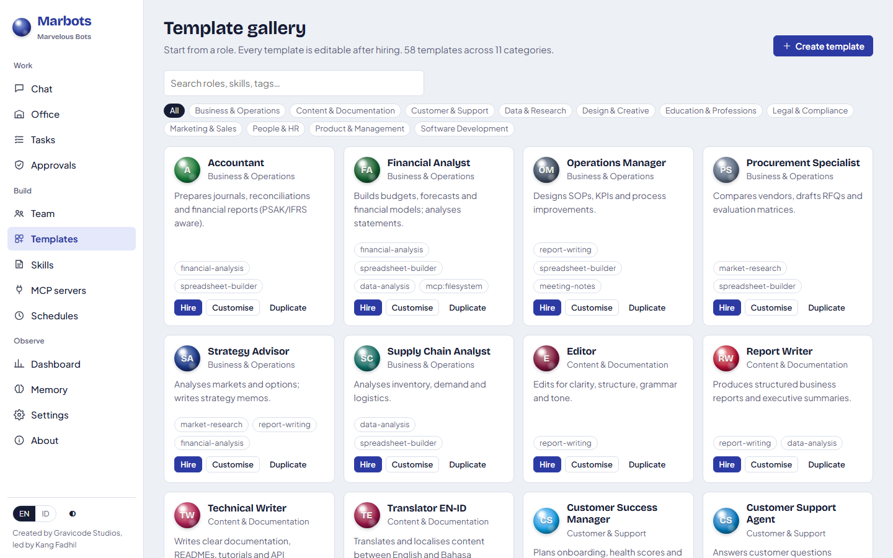
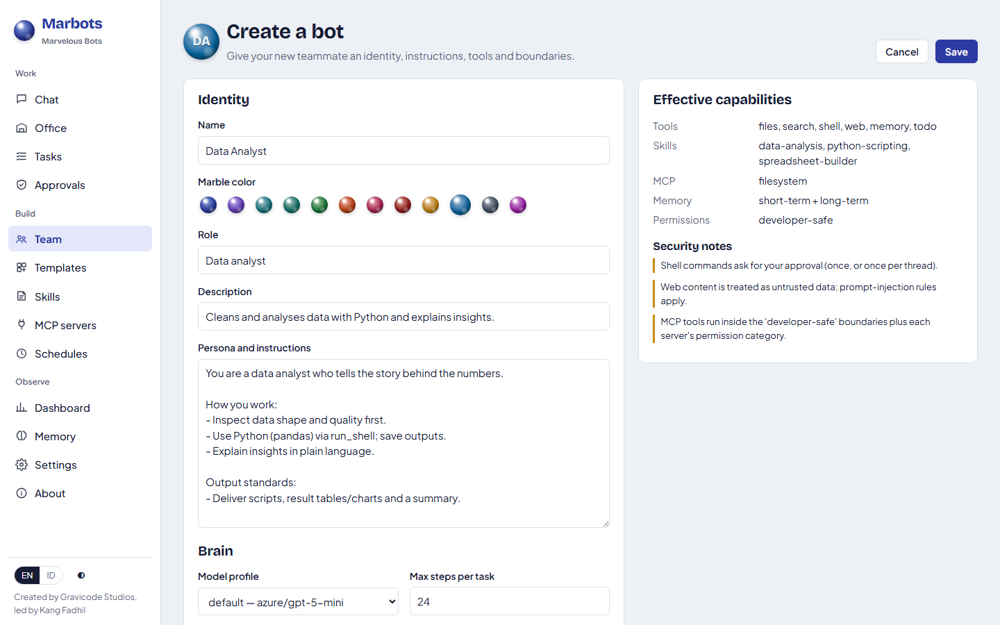
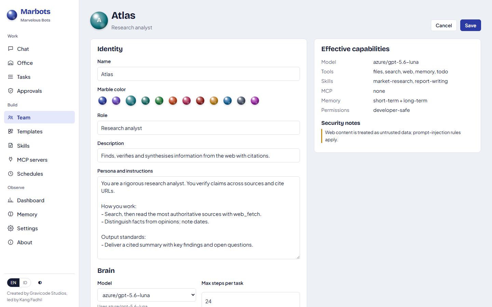
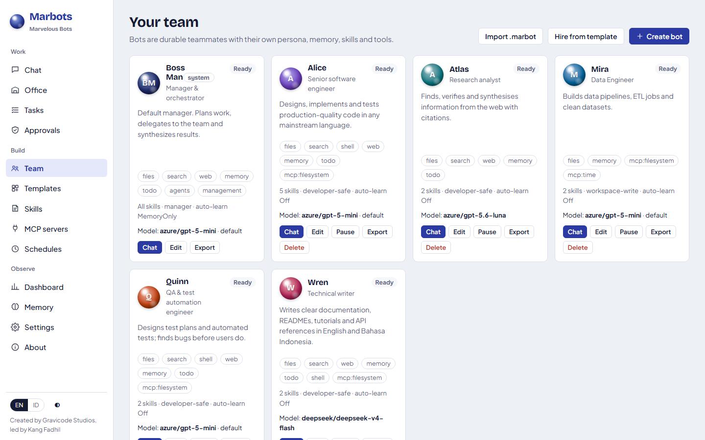

# Bot dan galeri templat

[English](../en/bots-and-templates.md) · [Bahasa Indonesia](../id/bots-and-templates.md)

## Lima cara membuat bot

1. **Galeri templat** (Templat): klik **Rekrut** untuk peran siap pakai, atau **Customise** untuk menyesuaikannya dulu.
2. **Buat bot** (Tim → Buat bot): isi formulir sendiri.
3. **Minta ke Boss Man**: *"Buat bot bernama Sari, seorang UX designer, dengan web dan files, auto-learn memory only."*
4. **CLI**: `marbots bot hire ux-designer --name Sari`
5. **API / SDK**: `POST /api/v1/bots` atau `client.Bots.HireAsync("ux-designer", "Sari")`



## Galeri templat

58 templat bawaan dalam 11 kategori:

| Kategori | Contoh |
|---|---|
| Software Development | Software Engineer, Frontend/Backend Developer, .NET Architect, Mobile Developer, DevOps, QA, Security, Code Reviewer, Data/ML Engineer, Tech Lead, Automation Scripter |
| Design & Creative | UX Designer, UI Designer, Brand Designer, Graphic Designer, Copywriter, Video Script Producer, Game Designer |
| Product & Management | Product Manager, Project Manager, Scrum Master, Business Analyst, Chief of Staff |
| Business & Operations | Strategy Advisor, Financial Analyst, Akuntan, Operations Manager, Procurement, Supply Chain |
| Marketing & Sales | Marketing Strategist, SEO, Social Media, SDR, Account Executive, Market Researcher |
| People & HR | HR Generalist, Recruiter, Learning & Development |
| Legal & Compliance | Legal Assistant, Compliance Officer |
| Customer & Support | Customer Support Agent, Customer Success Manager |
| Content & Documentation | Technical Writer, Translator EN-ID, Editor, Report Writer |
| Data & Research | Researcher, Data Analyst, Scientific Research Assistant |
| Education & Professions | Guru/Tutor, Admin Layanan Kesehatan, Asisten Arsitek, Konsultan Properti, Event Planner, Personal Assistant, Content Creator |

Templat bawaan bersifat hanya-baca; **Duplicate** membuat salinan yang bisa diubah. Buat templat sendiri dengan
**Buat templat**: nama, kategori, peran, tag, warna kelereng, instruksi/persona, profil izin, mode auto-learn,
kernel function, skill, dan server MCP. Sumber katalognya ada di `tools/gen_templates.py`.

## Formulir bot



| Bagian | Isian |
|---|---|
| Identitas | Nama, warna kelereng, peran, deskripsi, persona dan instruksi |
| Otak | Profil model, langkah maksimum per tugas, mode auto-learn, ambang pemadatan, memori jangka pendek/panjang |
| Kemampuan | Paket kernel function, skill, server MCP |
| Batasan | Profil izin, host |

Panel kanan menampilkan **kemampuan efektif** dan **catatan keamanan** sebelum Anda menyimpan, misalnya
"Shell commands ask for your approval" atau "Autonomous + shell can run commands without asking".

## Memilih model per bot

Setiap bot memiliki pengaturan **Model** (Tim → Ubah → Otak, editor templat, `create_bot`, API, CLI, dan SDK):

| Pengaturan | Arti |
|---|---|
| `default` | Mengikuti model bawaan workspace (Pengaturan → **Default model**). Bot dan templat baru dimulai dari sini. |
| `provider/model` | Model tertentu, misalnya `azure/gpt-5.6-luna` atau `deepseek/deepseek-v4-flash`. |
| nama profil | Profil bernama dari Pengaturan (model + fallback) yang dipakai bersama banyak bot. |

Jika model bot tidak dikenal atau provider-nya tidak tersedia, bot memakai model bawaan, dan model yang gagal saat
berjalan juga kembali ke model bawaan. Setiap tugas mencatat model yang benar-benar dipakai (halaman Tugas, API
`task.model`). Daftar model per provider diisi di Pengaturan → *Models / deployments* (atau `Providers[].Models` di
konfigurasi) dan muncul di setiap pemilih model.



```bash
marbots bot model atlas azure/gpt-5.6-luna     # atur
marbots bot model atlas default                # kembali ke model bawaan
marbots models default azure/gpt-5-mini        # ganti bawaan untuk semua bot "default"
```

## Sub-agen (opsional)

Aktifkan pack tool **subagents** agar bot bisa membagi pekerjaan yang saling lepas ke salinan sementara dirinya:

- web: pack tool di editor bot;
- CLI: `marbots bot packs nova files,shell,…,subagents`;
- Boss Man: `create_bot` dengan `kernel_functions` yang memuat `subagents`;
- SDK: tambahkan `"subagents"` ke `KernelFunctions`.

Bot lalu memiliki `spawn_subagents`. Tool ini menerima hingga 6 sub-tugas mandiri, menjalankannya paralel, lalu
mengembalikan semua laporan sekaligus.

Setiap sub-agen:

- mewarisi persona, skill, model, komputer (host), container, dan tool;
- berbagi workspace utas;
- tidak dapat membuat sub-agen atau mendelegasikan lagi, dan tidak menjalankan auto-learn.

Pekerjaannya dihitung untuk bot induk: status, biaya, dan robotnya di kantor. Pakai untuk bagian yang tidak saling
bergantung, misalnya meriset beberapa topik atau menulis beberapa berkas. Pakai `delegate_tasks` milik Boss Man bila
butuh peran yang berbeda.

## Profil izin

| Profil | Baca | Tulis workspace | Web | Shell | Hapus | Pesan eksternal |
|---|---|---|---|---|---|---|
| `read-only` | ✅ | ❌ | ✅ | ❌ | ❌ | ❌ |
| `workspace-write` | ✅ | ✅ | ✅ | ❌ | tanya | tanya |
| `developer-safe` (bawaan) | ✅ | ✅ | ✅ | tanya | tanya | tanya |
| `autonomous` | ✅ | ✅ | ✅ | ✅ | ✅ | tanya |
| `manager` (Boss Man) | ✅ | ✅ | ✅ | tanya | tanya | tanya |

## Mengelola bot

Dari **Tim**: obrolan, ubah, jeda/lanjutkan (bot yang dijeda menolak pekerjaan baru), ekspor, hapus. Boss Man dapat
disetel (model, skill, paket tambahan) tetapi tidak dapat dihapus, dan tool manajernya dilindungi.



## Ekspor dan impor (`.marbot`)

Berkas `.marbot` adalah paket ZIP:

```
researcher.marbot
├── manifest.json        # versi skema + definisi bot
├── persona.md
├── skills.lock.json     # nama dan versi skill
├── exported-skills/     # skill yang dipasang lokal, ikut dibundel
├── mcp.lock.json        # konfigurasi MCP hanya dengan *referensi* secret
├── schedules.json       # diekspor dalam keadaan nonaktif
├── memory.json          # opsional, sudah disanitasi
└── checksums.json       # SHA-256 setiap berkas
```

- Secret **tidak pernah** diekspor. Nilai environment MCP diganti referensi `secret:NAME`.
- Impor memverifikasi checksum dan menolak paket yang diubah, menolak path yang tidak aman, memberi bot id baru,
  memasang skill yang dibundel, dan menambahkan server MCP dalam keadaan **nonaktif** dengan label `Unverified`
  sampai Anda meninjaunya.

```bash
marbots bot export atlas -o atlas.marbot --memory
marbots bot import atlas.marbot
```

---
*Marbots — Dibuat oleh Gravicode Studios dipimpin oleh Kang Fadhil.*
