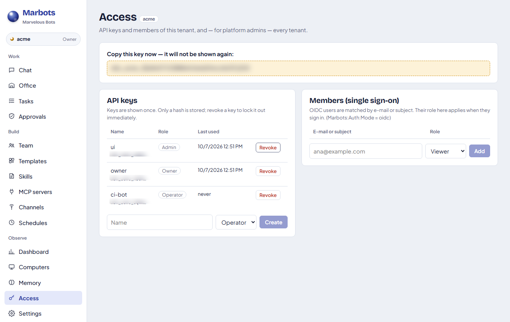

# Mode multi-tenant, database, dan masuk (sign-in)

[English](../en/multi-tenant.md) · [Bahasa Indonesia](../id/multi-tenant.md)

Satu server Marbots dapat melayani beberapa organisasi (tenant). Setiap tenant punya bot, chat, tugas, memori, skill,
server MCP, secret, jadwal, channel, komputer, dan folder workspace sendiri. Antar-tenant tidak ada yang dibagi kecuali
proses server dan, jika Anda memilih, server database.

## Database

| Penyedia | `Marbots:Database:Provider` | Cocok untuk |
|---|---|---|
| SQLite (bawaan) | `sqlite` | Satu mesin, local-first. Di mode multi-tenant setiap tenant mendapat file sendiri. |
| PostgreSQL | `postgresql` | Database server bersama, banyak tenant |
| SQL Server / Azure SQL | `sqlserver` | Database server bersama di lingkungan Microsoft |
| MySQL / MariaDB | `mysql` | Database server bersama |

```json
"Marbots": {
  "Database": { "Provider": "sqlserver", "ConnectionString": "Server=sql01;Database=marbots;User ID=marbots;Password=…;TrustServerCertificate=true" }
}
```

- Setiap baris membawa kolom `tenant`, dan setiap query memfilternya. Database server memakai tabel bernama `mb_*`.
- Tabel dan indeks dibuat saat server mulai. File SQLite dari versi lama dimigrasikan otomatis tanpa kehilangan data.
- Pencarian memori bersifat hybrid di semua penyedia. Peringkat kata kunci (BM25 FTS5 di SQLite, atau BM25 di dalam
  proses untuk yang lain) digabung dengan kemiripan vektor lewat reciprocal rank fusion.
- Uji kesesuaian penyimpanan yang sama dijalankan terhadap keempat database di CI (`MARBOTS_TEST_POSTGRES`,
  `MARBOTS_TEST_SQLSERVER`, `MARBOTS_TEST_MYSQL`).

### Embedding memori

`Marbots:EmbeddingModel` berisi `hash` (bawaan) atau `provider/model`:

- `hash`: hashing n-gram karakter secara offline. Tidak perlu jaringan dan mengenali bentuk kata
  (`invoices` → `invoicing`).
- `provider/model`, misalnya `azure/text-embedding-3-small`: endpoint `/embeddings` apa pun yang kompatibel dengan
  OpenAI, untuk ingatan yang benar-benar semantik.

## Menyalakan mode multi-tenant

```json
"Marbots": {
  "MultiTenant": true,
  "ApiKey": "<kunci admin platform>",
  "Database": { "Provider": "postgresql", "ConnectionString": "Host=db;Database=marbots;Username=marbots;Password=…" }
}
```

Tenant `default` selalu ada. Admin platform membuat tenant lain beserta kunci pemilik pertamanya:

```bash
export MARBOTS_API_KEY=<kunci admin platform>
marbots tenants create acme --name "Acme Corp"
marbots tenants key acme owner --role Owner      # mencetak mbk_acme_… sekali saja
```

Setelah itu pemilik tenant bekerja dengan kuncinya sendiri. Kunci itu terikat ke tenant, jadi tidak perlu pengaturan
tambahan:

```bash
export MARBOTS_API_KEY=mbk_acme_…
marbots whoami                                    # acme · Owner
marbots keys create ci --role Operator
marbots members add ana@acme.example --role Admin
```

Setiap tenant berjalan di runtime-nya sendiri: engine, penjadwal, poller channel, proses MCP, dan koneksi host sendiri,
yang dijalankan saat server mulai. Menonaktifkan tenant (`marbots tenants disable acme`) menghentikan runtime-nya dan
mengunci kunci-kuncinya.

### Memilih tenant dalam permintaan

| Cara | Contoh | Dipakai untuk |
|---|---|---|
| Kunci tenant | `X-Api-Key: mbk_acme_…` | Aplikasi, SDK, CLI |
| Awalan path | `https://marbots.example/t/acme/api/v1/…` | Webhook, URL masuk channel, agent host, URL dasar SDK |
| Header | `X-Marbots-Tenant: acme` | Kunci platform atau token OIDC yang bertindak di sebuah tenant |

Agent host milik sebuah tenant mendapat perintah pendaftaran yang sudah mengarah ke `/t/<tenant>`.

## Peran

| Peran | Bisa |
|---|---|
| Viewer | Membaca chat, tugas, event, pemakaian; melihat Chat, Office, Tasks, Dashboard |
| Operator | Viewer + chat, menjalankan dan membatalkan tugas, menjawab persetujuan, menulis memori, mendaftarkan perangkat push |
| Admin | Operator + bot, template, skill, MCP, channel, komputer, jadwal, model, pengaturan; melihat kunci dan anggota |
| Owner | Admin + membuat dan mencabut kunci API serta anggota tenant |
| Admin platform | Semua tenant: membuat, menonaktifkan, mengaktifkan, dan membuat kunci untuk tenant mana pun |

API menegakkan peran di setiap rute, dan UI web menyembunyikan serta memblokir halaman yang tidak boleh dipakai suatu
peran.

## Masuk

**Kunci API.** Kunci global (`Marbots:ApiKey`) memberi hak admin platform. Kunci tenant (`mbk_…`) disimpan sebagai hash
SHA-256 dan hanya ditampilkan sekali, saat dibuat.

**UI web.** Di mode multi-tenant, UI meminta kunci di `/login`. Server single-tenant tanpa kunci tetap menjadi konsol
lokal yang terbuka, seperti sebelumnya. Pengalih tenant di bagian atas rel samping menampilkan tenant yang boleh Anda
pakai.

**Single sign-on OIDC** (Microsoft Entra ID, Google, Keycloak, Auth0, …):

```json
"Auth": {
  "Mode": "oidc",
  "Authority": "https://login.microsoftonline.com/<tenant-id>/v2.0",
  "ClientId": "<app id>",
  "ClientSecret": "OIDC_CLIENT_SECRET",
  "TenantClaim": "tenant",
  "RoleClaim": "roles",
  "PlatformAdmins": ["it-admin@acme.example"]
}
```

- `ClientSecret` berisi nama secret (variabel lingkungan atau `Marbots:Secrets`), bukan nilainya.
- UI masuk dengan alur authorization code (PKCE). API menerima access token dari IdP yang sama sebagai
  `Authorization: Bearer …`.
- Tenant dan peran pengguna berasal dari **keanggotaan** mereka (halaman Access, atau `marbots members add`). Tanpa
  keanggotaan, keduanya diambil dari klaim `tenant` dan `roles`, dan klaim tenant saja memberi peran Viewer. Admin
  platform menjadi Owner di semua tenant.
- `JwtSigningKey` (HS256, minimal 32 karakter) menerima token dari gateway Anda sendiri bila tidak ada IdP.

## Halaman Access

**Access** di rel samping (Admin boleh melihat, Owner boleh mengubah) menampilkan kunci API tenant (awalan, peran,
terakhir dipakai, cabut), anggota untuk single sign-on, dan, bagi admin platform, semua tenant beserta status
runtime-nya.



---
*Marbots: Dibuat oleh Gravicode Studios dipimpin oleh Kang Fadhil.*
