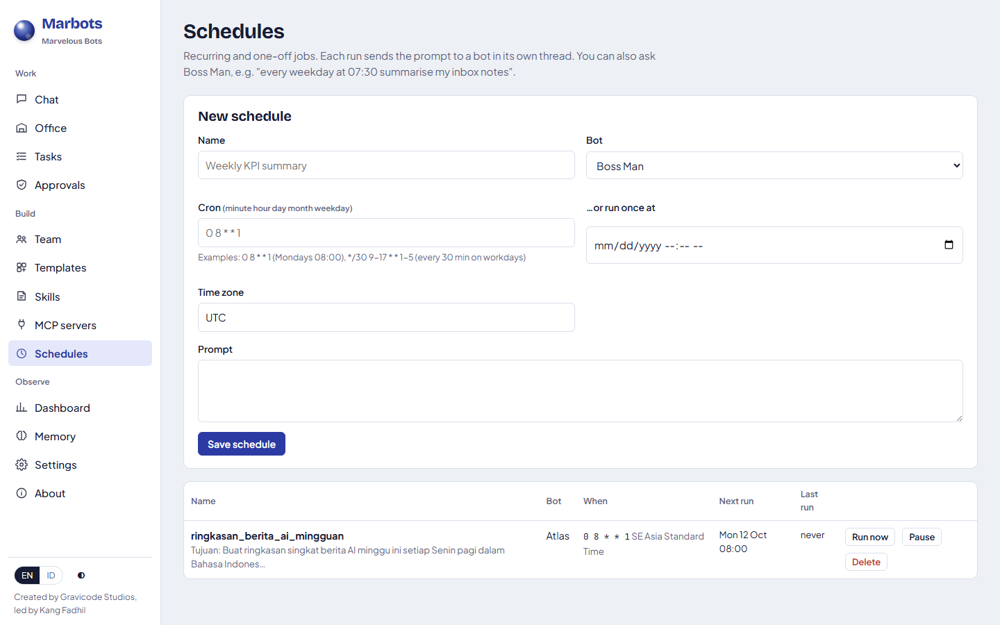

# Jadwal

[English](../en/scheduling.md) · [Bahasa Indonesia](../id/scheduling.md)

Penjadwal mengirim prompt ke sebuah bot sesuai jadwal. Setiap eksekusi menjadi tugas biasa di utas milik jadwal itu
(`⏰ <nama>`), sehingga hasil, berkas, dan persetujuan bekerja sama persis seperti obrolan.

## Membuat jadwal

- **Minta ke Boss Man**: *"Setiap Senin jam 08:00 WIB, minta Atlas membuat ringkasan singkat berita AI."* Boss Man
  memanggil `schedule_task`.
- **Halaman Jadwal**: nama, bot, ekspresi cron *atau* tanggal/jam sekali jalan, zona waktu, prompt.
- **API**: `POST /api/v1/schedules`.

## Sintaks cron

Lima kolom: `menit jam tanggal bulan hari-dalam-minggu`.

| Ekspresi | Arti |
|---|---|
| `0 8 * * 1` | Setiap Senin pukul 08.00 |
| `*/30 9-17 * * 1-5` | Setiap 30 menit, 09.00–17.59, Senin–Jumat |
| `0 7 1 * *` | Pukul 07.00 setiap tanggal 1 |
| `15 18 * * 0,6` | Pukul 18.15 di akhir pekan |

Didukung: `*`, daftar (`1,15`), rentang (`1-5`), langkah (`*/10`, `0-30/5`); hari `0` atau `7` adalah Minggu. Jika
tanggal dan hari-dalam-minggu sama-sama dibatasi, cukup salah satu yang cocok (perilaku cron klasik). Halaman ini
menampilkan jadwal berikutnya saat Anda mengetik.

Zona waktu menerima id Windows (`SE Asia Standard Time`) dan id IANA (`Asia/Jakarta`) bila didukung sistem operasi.

## Perilaku

- Penjadwal memeriksa setiap 15 detik. Job yang jatuh tempo saat Marbots mati akan dijalankan sekali pada pemeriksaan berikutnya.
- **Run now** menjalankan job segera. Menjeda job tetap menyimpan definisinya.
- Job sekali jalan menonaktifkan dirinya setelah dijalankan.

---
*Marbots — Dibuat oleh Gravicode Studios dipimpin oleh Kang Fadhil.*
