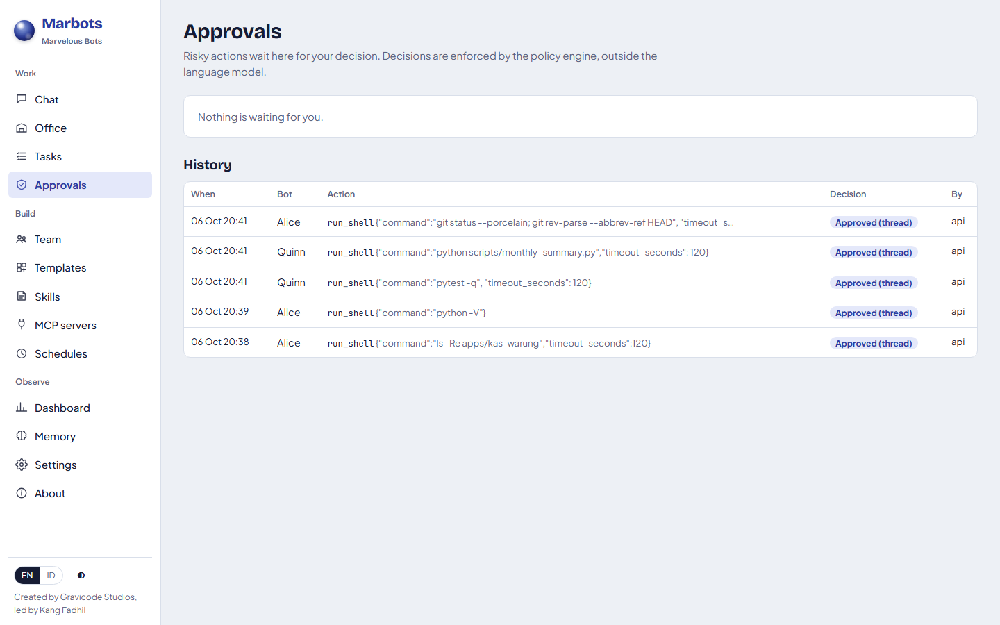
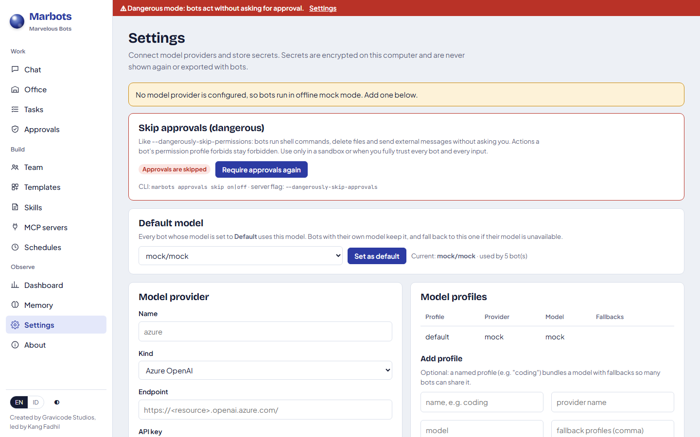

# Keamanan, persetujuan, dan secret

[English](../en/security.md) · [Bahasa Indonesia](../id/security.md)

Bot yang dapat menjalankan tool memiliki permukaan serangan yang besar, sehingga keamanan ditegakkan oleh kode di luar
model bahasa.

## Mesin kebijakan (policy engine)

Setiap pemanggilan tool (bawaan, skill, atau MCP) diperiksa oleh mesin kebijakan deterministik **sebelum** dijalankan.
Tool mendeklarasikan kategori izin dan tingkat risiko:

| Kategori | Contoh |
|---|---|
| ReadOnly | `read_file`, `grep`, `recall`, `list_bots` |
| WorkspaceWrite | `write_file`, `edit_file`, `remember` |
| Network | `web_search`, `web_fetch` |
| ProcessExecution | `run_shell` |
| DestructiveFilesystem | `delete_file` |
| ExternalCommunication | Server MCP bertanda *external* (mis. GitHub) |
| AgentControl | `delegate_tasks`, `create_bot`, `schedule_task` |
| Admin | membuat bot dengan profil `autonomous` |

Profil izin bot memetakan setiap kategori ke **Allow**, **Ask**, atau **Deny** (lihat
[bot](bots-and-templates.md#profil-izin)). Aksi berisiko kritis selalu bertanya. Pemanggilan yang ditolak dikembalikan
ke model sebagai error agar bot mengubah rencananya; pemanggilan itu tidak pernah dijalankan.

## Persetujuan

**Ask** menjeda tugas (`WaitingForHuman`) dan membuat permintaan persetujuan yang terlihat di obrolan (kartu inline),
di halaman **Persetujuan** (dengan lencana di menu), di CLI (`marbots approvals`), dan melalui API.



| Keputusan | Efek |
|---|---|
| Setujui sekali | Hanya menjalankan pemanggilan ini |
| Setujui untuk utas ini | Mengizinkan tool ini untuk bot ini di utas ini sampai server dimulai ulang |
| Tolak | Bot menerima pesan "the user did not approve" dan harus beradaptasi |

Persetujuan kedaluwarsa setelah `ApprovalTimeoutMinutes` (bawaan 30). Persetujuan yang masih tertunda saat server
dimulai ulang ditandai kedaluwarsa. Setiap keputusan tersimpan di riwayat beserta siapa yang memutuskan.

## Melewati persetujuan (mode berbahaya)

Seperti `--dangerously-skip-permissions` di Claude Code, Marbots dapat berjalan tanpa bertanya:

| Di mana | Caranya |
|---|---|
| UI web | Pengaturan → **Lewati persetujuan (berbahaya)** → *Lewati persetujuan* |
| CLI | `marbots approvals skip on` (`off`, `status`) |
| Saat server dijalankan | `dotnet run --project src/Marbots.Server -- --dangerously-skip-approvals` atau `"Marbots": { "DangerouslySkipApprovals": true }` |
| API / SDK | `PUT /api/v1/system/approvals {"dangerouslySkipApprovals": true}` · `client.Approvals.SetSkipApprovalsAsync(true)` |

Selama aktif, setiap aksi yang biasanya **bertanya** langsung dijalankan (shell, hapus berkas, pesan eksternal, aksi
berisiko kritis, membuat bot autonomous). Mengaktifkannya juga menyetujui semua yang sedang menunggu. Aksi yang
**ditolak** profil izin bot tetap ditolak, jadi bot `read-only` tetap tidak bisa menulis. Setiap aksi yang disetujui
otomatis tetap tercatat di riwayat persetujuan dengan `ResolvedBy = dangerously-skip-approvals`, dan spanduk merah
tampil di setiap halaman. Pengaturan ini bertahan setelah restart sampai Anda mematikannya. Gunakan hanya di sandbox atau
dengan masukan yang sepenuhnya Anda percayai.



## Workspace dan path

Tool berkas memetakan setiap path ke dalam workspace utas dan menolak *traversal* (`../`) maupun path absolut di luar
workspace. `run_shell` dimulai di folder workspace. Gunakan `developer-safe` (bawaan) kecuali Anda memercayai bot
menjalankan perintah tanpa pengawasan.

## Secret

- Secret yang dimasukkan di Pengaturan dienkripsi dengan ASP.NET Core Data Protection (kunci dilindungi DPAPI di
  Windows) dalam `data/secrets.dat`. UI dan API hanya menampilkan **nama** secret.
- Key provider dan secret juga dapat berasal dari konfigurasi atau variabel lingkungan.
- Nilai environment MCP dapat merujuk secret (`secret:GITHUB_TOKEN`) sehingga nilainya tidak pernah ada di konfigurasi
  atau berkas ekspor.
- Ekspor `.marbot` tidak pernah berisi secret; `remember` dan Auto-Learn menolak konten yang tampak seperti kredensial.

## Prompt injection

Bot diberi tahu bahwa keluaran tool, halaman web, berkas, dan pesan dari agen lain adalah **data yang tidak tepercaya**.
Bahkan jika model berhasil dikelabui, mesin kebijakan tetap yang menentukan apa yang boleh dijalankan. Konten web
diubah menjadi teks biasa sebelum dilihat model.

## Akses API

API REST dan endpoint A2A terbuka di localhost secara bawaan. Untuk membuka Marbots ke jaringan, atur API key:

```json
{ "Marbots": { "ApiKey": "nilai-acak-yang-panjang" } }
```

Klien lalu mengirim `X-Api-Key: <key>` (atau `Authorization: Bearer <key>`). Tempatkan server di belakang HTTPS
(*reverse proxy*) jika dapat diakses dari mesin lain.

## Pengaman Auto-Learn

Memori hasil belajar disaring dari secret dan dibatasi panjangnya, lalu disimpan dengan keyakinan lebih rendah dan
asal-usul `autolearn:<tugas>`. Skill hasil belajar masuk antrean tinjauan dan tidak pernah diterbitkan otomatis.

---
*Marbots — Dibuat oleh Gravicode Studios dipimpin oleh Kang Fadhil.*
