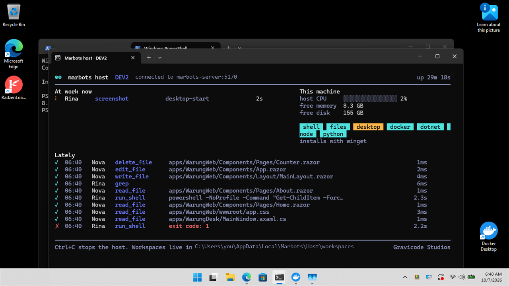
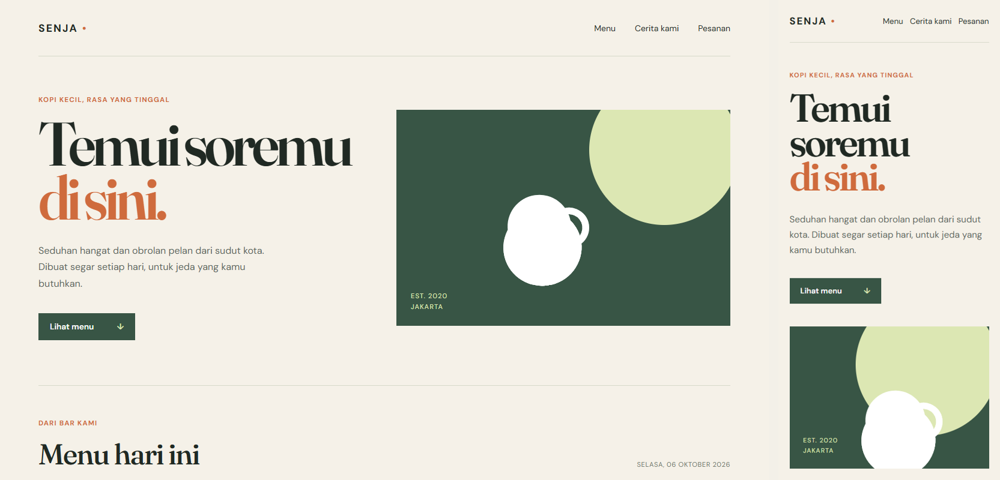
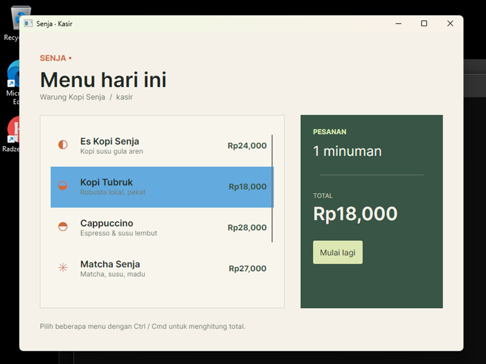

# Uji coba dengan LLM sungguhan

[English](../en/trials.md) · [Bahasa Indonesia](../id/trials.md)

Kami menjalankan Marbots dengan model sungguhan (**Azure OpenAI `gpt-5-mini`**) pada instalasi baru: Boss Man dan tim
awal (Atlas, Alice, Quinn, Wren), profil izin bawaan, pencarian web Tavily, serta server MCP Filesystem, Sequential
Thinking, dan Time. Tujuh pekerjaan berjalan **bersamaan**, ditambah satu panggilan A2A, dengan skrip
[`samples/trials/run_trials.py`](../../samples/trials/run_trials.py). Sebuah *auto-approver* berperan sebagai manusia
dan menyetujui perintah shell setelah 60 detik. Semua artefak buatan bot ada di
[`samples/trials/outputs`](../../samples/trials/outputs) dan hasil mentahnya di
[`samples/trials/trial-results.json`](../../samples/trials/trial-results.json).

## Hasil

| Pekerjaan | Siapa yang bekerja | Hasil | Waktu |
|---|---|---|---|
| **Aplikasi web**: "Kas Warung" pencatat kas untuk warung (prompt Bahasa Indonesia) | Boss Man → Alice (membangun) → Quinn (menguji, bergantung pada Alice) | ✅ Aplikasi statis (HTML/CSS/JS, localStorage, format Rupiah, saldo harian/bulanan); Quinn menulis dan menjalankan 4 pemeriksaan pytest: 4 lulus | 5,0 menit |
| **Dokumen dwibahasa**: panduan onboarding EN + ID + HTML siap cetak | Boss Man → Wren | ✅ `onboarding-en.md`, `onboarding-id.md`, `onboarding.html` (dari templat skill report-writing) dan peta istilah dwibahasa | 2,7 menit |
| **Skrip + spreadsheet**: CSV pengeluaran → XLSX bulanan dengan formula, diverifikasi independen | Boss Man → Alice → Quinn | ✅ Data contoh, `monthly_summary.py`, `monthly-summary.xlsx` (satu sheet per bulan, formula SUM/SUMIF, sheet ringkasan); Quinn menjalankan ulang dan mencocokkan total dengan pandas | 6,8 menit |
| **Riset web** dengan sitasi | Atlas (obrolan langsung) | ✅ `research/pos-indonesia.md`: Kasir Pintar, Pawoon, dan iREAP dibandingkan dari sisi harga, fitur, kekuatan, dan kelemahan, lengkap dengan tautan sumber primer | 2,0 menit |
| **MCP + pembuatan bot lewat percakapan** | Boss Man membuat **Mira** (templat data-engineer + MCP `filesystem` + `time`) → Mira | ✅ `mcp__time__get_current_time` ×2 dan `mcp__filesystem__write_file` → `reports/world-clock.md`. Mira sempat gagal karena folder belum ada, lalu memperbaikinya sendiri dengan `mcp__filesystem__create_directory` | 1,0 menit |
| **Jadwal + memori** (Bahasa Indonesia) | Boss Man | ✅ `remember` menyimpan nama perusahaan dan preferensi bahasa; `schedule_task` membuat *setiap Senin 08.00 WIB → Atlas, ringkasan berita AI* (cron `0 8 * * 1`, jadwal berikutnya terhitung) | 0,6 menit |
| **Riset → landing page** dengan dependensi | Boss Man → Atlas (riset) → Alice (halaman, bergantung pada Atlas) | ✅ `research/kopi-competitors.md` dan `apps/kopi-kilat/index.html` (hero, 3 keunggulan dibanding kompetitor, 3 langkah pesan, testimoni, CTA WhatsApp) | 4,7 menit |
| **A2A** `message/send` ke Wren | Wren via JSON-RPC | ✅ `completed`, jawaban dikembalikan dalam task A2A | < 1 menit |

Total uji coba: **16 tugas** (akar dan delegasi), **16 selesai, 0 gagal**, sekitar 1,02 juta token, estimasi biaya
model **≈ $0,41**.

## Apa yang dibangun para bot

**Kas Warung**, dibangun Alice dan diuji Quinn. Kami menambahkan tiga transaksi dengan Playwright: saldo diperbarui
dengan benar (185.000 − 64.000 + 72.000 = Rp 193.000).


**Landing page Kopi Kilat**, dibangun Alice berdasarkan riset kompetitor dari Atlas:


**Panduan onboarding dwibahasa** (versi HTML), ditulis Wren dengan templat dari skill report-writing:


## Apa yang dilakukan platform

Delegasi, dengan aktivitas langsung tiga bot dalam satu utas:


Riset web dengan langkah `web_search` dan `web_fetch` yang terlihat di panel aktivitas:


Peragaan MCP: Boss Man membuat Mira lalu mendelegasikan pekerjaan MCP kepadanya:


Persetujuan shell saat Alice menjalankan skrip spreadsheet, dan tampilan Kantor pada saat yang sama:


Auto-Learn (Boss Man, `MemoryOnly`) menyimpan preferensi dari uji coba, misalnya *"User prefers to communicate and
receive deliverables in Indonesian"*. Memori ini tampil di halaman Memori dengan asal-usul `autolearn:<tugas>`.


Dasbor armada setelah uji coba:


## Catatan jujur

- Pekerjaan spreadsheet meminta 60 baris data contoh; Alice membuat 93 (sekitar 30 per bulan). Total dan formula
  benar, dan pemeriksaan independen Quinn cocok.
- Tes Kas Warung dari Quinn memeriksa struktur HTML/JS secara statis. Quinn menyebutkan bahwa langkah berikutnya
  adalah tes E2E di browser; tangkapan layar di atas dihasilkan dari tes semacam itu.
- Paket komunitas `mcp-server-sqlite` gagal berjalan dengan pustaka MCP Python terbaru saat pengujian. Marbots
  melaporkan error dengan jelas, dan entri tersebut dihapus dari galeri bawaan.

## Mengulang uji coba

```bash
dotnet run --project src/Marbots.Server              # dengan provider yang sudah dikonfigurasi
python samples/trials/run_trials.py --approve-delay 30
node tools/screenshots/shoot.mjs http://localhost:5170 docs/images
```


## PC kedua: bot bekerja di komputer lain (DEV2)

7 Oktober 2026. Server berjalan di satu PC Windows dengan Azure OpenAI dan DeepSeek. PC Windows 11 kedua di LAN yang
sama ("DEV2") memiliki Docker Desktop, .NET 8 SDK, Node, dan Python, tanpa office suite. DEV2 dipasang dengan satu
perintah lewat SSH (`marbots hosts bootstrap … --name DEV2`), diperbarui dua kali dengan `--update`, dan
pendaftarannya tetap sama sepanjang uji coba. Semua hasil di bawah dibuat di DEV2 dan diunduh melalui server.



*Konsol `marbots-host` di DEV2, diambil dengan tool `screenshot` milik Rina sendiri. "At work now" menunjukkan Rina
sedang mengambil screenshot itu; "Lately" menunjukkan suntingan berkas Nova dan satu perintah shell yang gagal.*

### Empat bot, dibuat dengan empat cara

| Bot | Dibuat dengan | Pengaturan |
|---|---|---|
| **Dara**, dokumen | CLI: `bot hire technical-writer`, `bot host`, `bot skills pptx,docx,xlsx,pdf`, `bot profile autonomous` | model bawaan (gpt-5-mini) |
| **Nova**, engineer .NET | SDK .NET, [`samples/remote-host/create-nova.cs`](../../samples/remote-host/create-nova.cs) (aplikasi berbasis berkas `dotnet run`) | azure/gpt-5.6-luna, skill frontend-design dan webapp-testing |
| **Rina**, QA computer-use | Editor bot di web, dijalankan oleh Playwright ([`tools/screenshots/create-bot-ui.mjs`](../../tools/screenshots/create-bot-ui.mjs)) | pack `desktop`, host dipilih di dropdown Host |
| **Dockie**, data engineer | Boss Man, lewat pesan chat berbahasa Indonesia | `list_hosts`, lalu `create_bot` dengan `host: DEV2` dan `container_image: python:3.12-slim`. Pembuatan bot autonomous meminta persetujuan, dan saya menyetujuinya. |

### Yang mereka kerjakan

| Tugas | Hasil |
|---|---|
| Dockie: skrip statistik di dalam Docker | Skrip berjalan di `python:3.12-slim` di DEV2 (image ditarik di sana): rata-rata 143, median 142,5, sd 16,02, disimpan ke `stats.json`. |
| Dara: riset Tavily, lalu PPTX, DOCX, XLSX, dan PDF dengan skill Anthropic | Enam fakta bersumber: AWS/Strand 2025, Microsoft Work Trend Index 2026, KADIN, Digital in Asia. Dara memasang `python-pptx`, `python-docx`, `openpyxl`, `reportlab`, dan `pptxgenjs` sendiri, lalu menjalankan `recalc.py` milik skill xlsx dari `.skills/xlsx/`. Hasilnya: dek 6 slide, laporan (judul, ringkasan, temuan, rekomendasi, sumber), workbook (sheet Data dan Summary, 5 formula, 1 grafik), dan PDF 2 halaman. [Berkas](../../samples/trials/remote-dev2/dara/deliverables) |
| Nova: aplikasi web Blazor, desktop Avalonia, dan CLI Spectre.Console di .NET 10 | Ketiganya ter-build dengan 0 peringatan dan 0 galat. Aplikasi web mengikuti skill frontend-design: Fraunces dan DM Sans, palet sendiri, harga dalam rupiah. |
| Nova: Playwright, Docker | Nova menyiapkan Playwright, yang memakai Edge setelah unduhan Chromium timeout, lalu mengambil screenshot desktop dan mobile. Nova menulis Dockerfile multi-stage di atas `sdk:10.0` dan `aspnet:10.0`, mem-build `warungweb:latest`, dan menjalankannya di :8090. Server dev dan container sama-sama menjawab HTTP 200. |
| Rina: computer use | Rina mengambil screenshot desktop, mem-build dan menjalankan WarungDesk, mengklik item menu, membuka situs Docker di Edge, lalu menutup kedua jendela, dan melihat screenshot sebelum setiap langkah. |




### Catatan jujur

- **Batas langkah.** Batas 24 langkah pada templat penulis menghentikan Dara di tengah jalan. Menaikkannya ke 80
  membuat Dara bisa menyelesaikan tugas. PDF pertama hanya satu paragraf; permintaan lanjutan meminta ringkasan yang
  layak.
- **Rendering office.** Kedua PC tidak punya Office atau LibreOffice, sehingga langkah rekalkulasi skill xlsx tidak bisa
  berjalan, dan formula baru dihitung saat berkas dibuka. Dokumen diperiksa dengan python-pptx, python-docx, openpyxl,
  dan PyMuPDF, bukan dengan merender slide.
- **Percobaan pertama Nova** masih menyisakan chrome templat Blazor bawaan (sidebar ungu). Permintaan lanjutan
  menghapusnya. Screenshot "cart"-nya menampilkan menu, bukan keranjang, sehingga klaim "dua item terlihat" berlebihan.
- **Jalannya Rina.** Percobaan pertamanya gagal karena saya memberi path workspace yang salah (folder berupa slug:
  `thr-…`, bukan `thr_…`). Klik keduanya menggantikan klik pertama, karena daftar butuh Ctrl+klik untuk memilih lebih
  dari satu, sehingga total menunjukkan satu minuman (Rp18.000).
- **Dockie** mencoba memanggil `docker` dari dalam container-nya. Catatan container kini menyebut bahwa ia sudah berada
  di dalam container.
- **Bug yang ditemukan dan diperbaiki selama uji coba:**
  - `create_bot` timeout saat persetujuannya masih menunggu; kini menunggu hingga satu jam.
  - `install_package openpyxl` mencoba winget; paket `pip:`, `npm:`, dan `dotnet-tool:` kini didukung.
  - Skrip skill tidak tersedia di komputer jarak jauh; kini disalin ke `.skills/<nama>/`.

---
*Marbots — Dibuat oleh Gravicode Studios dipimpin oleh Kang Fadhil.*
