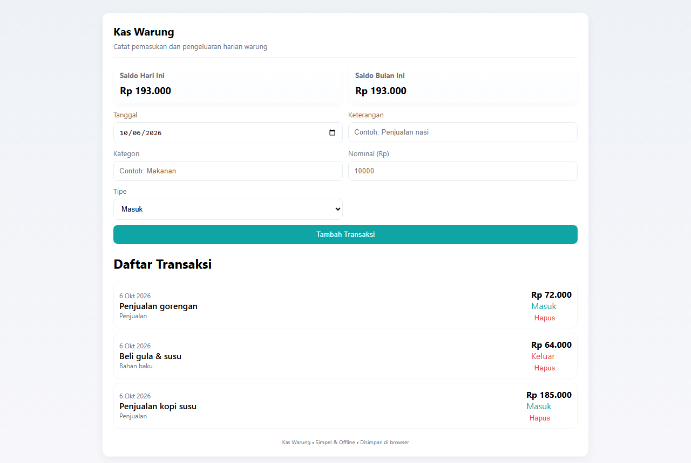
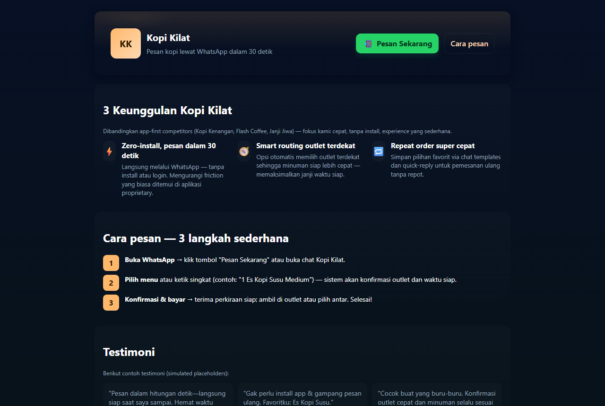
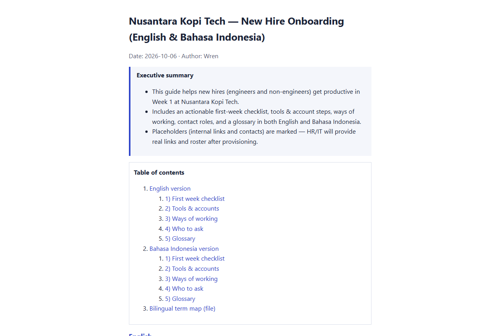
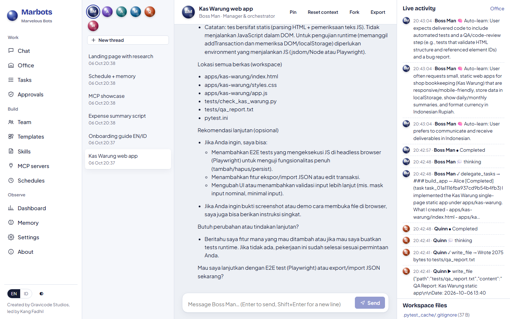
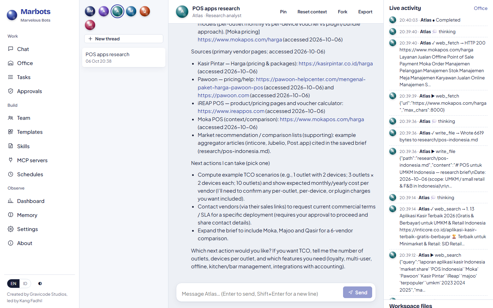
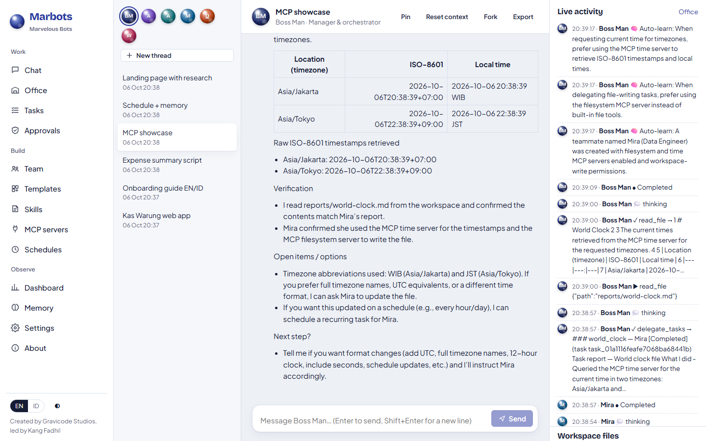
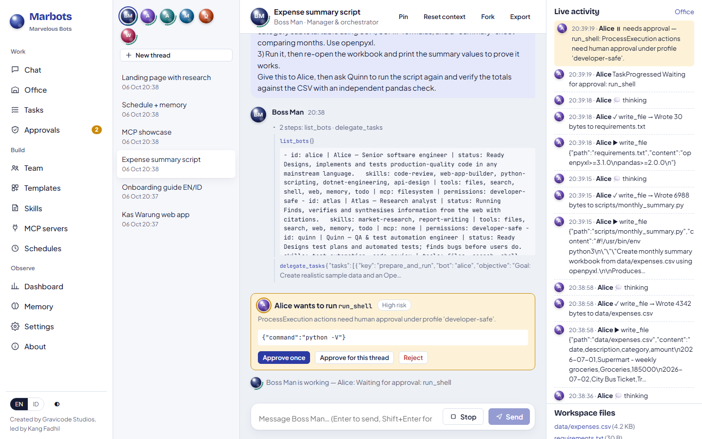
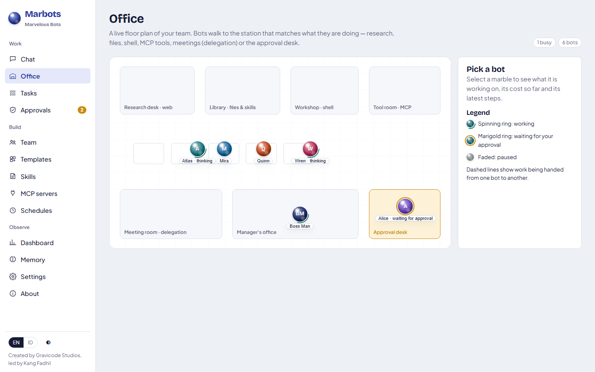
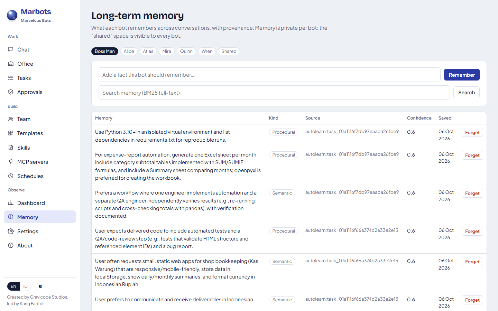
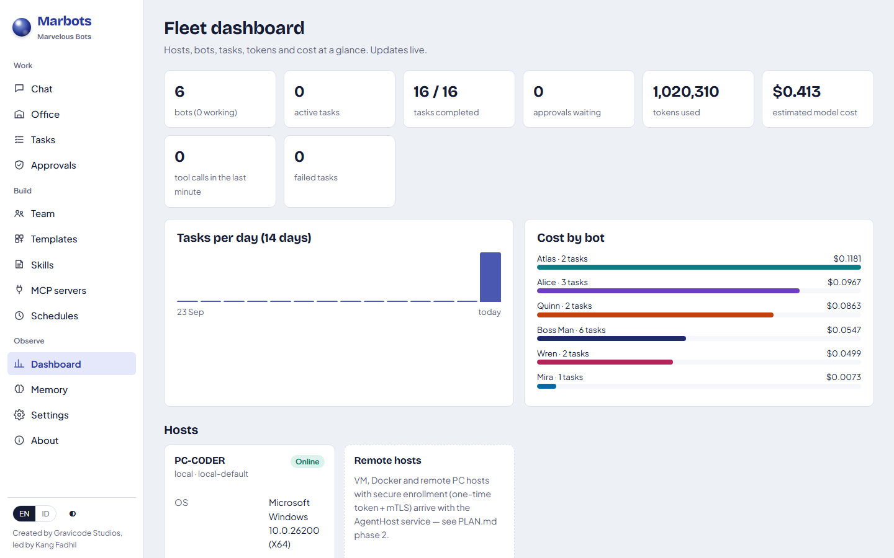

# Uji coba dengan LLM sungguhan

[English](../en/trials.md) · [Bahasa Indonesia](../id/trials.md)

Kami menjalankan Marbots dengan model sungguhan (**Azure OpenAI `gpt-5-mini`**) pada instalasi baru: Boss Man dan tim
awal (Atlas, Alice, Quinn, Wren), profil izin bawaan, pencarian web Tavily, serta server MCP Filesystem, Sequential
Thinking, dan Time. Tujuh pekerjaan berjalan **bersamaan**, ditambah satu panggilan A2A, dengan skrip
[`samples/trials/run_trials.py`](../../samples/trials/run_trials.py). Sebuah *auto-approver* berperan sebagai manusia
dan menyetujui perintah shell setelah 60 detik. Semua artefak buatan bot ada di
[`samples/trials/outputs`](../../samples/trials/outputs) dan hasil mentahnya di
[`samples/trials/trial-results.json`](../../samples/trials/trial-results.json).

## Hasil

| Pekerjaan | Siapa yang bekerja | Hasil | Waktu |
|---|---|---|---|
| **Aplikasi web**: "Kas Warung" pencatat kas untuk warung (prompt Bahasa Indonesia) | Boss Man → Alice (membangun) → Quinn (menguji, bergantung pada Alice) | ✅ Aplikasi statis (HTML/CSS/JS, localStorage, format Rupiah, saldo harian/bulanan); Quinn menulis dan menjalankan 4 pemeriksaan pytest: 4 lulus | 5,0 menit |
| **Dokumen dwibahasa**: panduan onboarding EN + ID + HTML siap cetak | Boss Man → Wren | ✅ `onboarding-en.md`, `onboarding-id.md`, `onboarding.html` (dari templat skill report-writing) dan peta istilah dwibahasa | 2,7 menit |
| **Skrip + spreadsheet**: CSV pengeluaran → XLSX bulanan dengan formula, diverifikasi independen | Boss Man → Alice → Quinn | ✅ Data contoh, `monthly_summary.py`, `monthly-summary.xlsx` (satu sheet per bulan, formula SUM/SUMIF, sheet ringkasan); Quinn menjalankan ulang dan mencocokkan total dengan pandas | 6,8 menit |
| **Riset web** dengan sitasi | Atlas (obrolan langsung) | ✅ `research/pos-indonesia.md`: Kasir Pintar, Pawoon, dan iREAP dibandingkan dari sisi harga, fitur, kekuatan, dan kelemahan, lengkap dengan tautan sumber primer | 2,0 menit |
| **MCP + pembuatan bot lewat percakapan** | Boss Man membuat **Mira** (templat data-engineer + MCP `filesystem` + `time`) → Mira | ✅ `mcp__time__get_current_time` ×2 dan `mcp__filesystem__write_file` → `reports/world-clock.md`. Mira sempat gagal karena folder belum ada, lalu memperbaikinya sendiri dengan `mcp__filesystem__create_directory` | 1,0 menit |
| **Jadwal + memori** (Bahasa Indonesia) | Boss Man | ✅ `remember` menyimpan nama perusahaan dan preferensi bahasa; `schedule_task` membuat *setiap Senin 08.00 WIB → Atlas, ringkasan berita AI* (cron `0 8 * * 1`, jadwal berikutnya terhitung) | 0,6 menit |
| **Riset → landing page** dengan dependensi | Boss Man → Atlas (riset) → Alice (halaman, bergantung pada Atlas) | ✅ `research/kopi-competitors.md` dan `apps/kopi-kilat/index.html` (hero, 3 keunggulan dibanding kompetitor, 3 langkah pesan, testimoni, CTA WhatsApp) | 4,7 menit |
| **A2A** `message/send` ke Wren | Wren via JSON-RPC | ✅ `completed`, jawaban dikembalikan dalam task A2A | < 1 menit |

Total uji coba: **16 tugas** (akar dan delegasi), **16 selesai, 0 gagal**, sekitar 1,02 juta token, estimasi biaya
model **≈ $0,41**.

## Apa yang dibangun para bot

**Kas Warung**, dibangun Alice dan diuji Quinn. Kami menambahkan tiga transaksi dengan Playwright: saldo diperbarui
dengan benar (185.000 − 64.000 + 72.000 = Rp 193.000).



**Landing page Kopi Kilat**, dibangun Alice berdasarkan riset kompetitor dari Atlas:



**Panduan onboarding dwibahasa** (versi HTML), ditulis Wren dengan templat dari skill report-writing:



## Apa yang dilakukan platform

Delegasi, dengan aktivitas langsung tiga bot dalam satu utas:



Riset web dengan langkah `web_search` dan `web_fetch` yang terlihat di panel aktivitas:



Peragaan MCP: Boss Man membuat Mira lalu mendelegasikan pekerjaan MCP kepadanya:



Persetujuan shell saat Alice menjalankan skrip spreadsheet, dan tampilan Kantor pada saat yang sama:




Auto-Learn (Boss Man, `MemoryOnly`) menyimpan preferensi dari uji coba, misalnya *"User prefers to communicate and
receive deliverables in Indonesian"*. Memori ini tampil di halaman Memori dengan asal-usul `autolearn:<tugas>`.



Dasbor armada setelah uji coba:



## Catatan jujur

- Pekerjaan spreadsheet meminta 60 baris data contoh; Alice membuat 93 (sekitar 30 per bulan). Total dan formula
  benar, dan pemeriksaan independen Quinn cocok.
- Tes Kas Warung dari Quinn memeriksa struktur HTML/JS secara statis. Quinn menyebutkan bahwa langkah berikutnya
  adalah tes E2E di browser; tangkapan layar di atas dihasilkan dari tes semacam itu.
- Paket komunitas `mcp-server-sqlite` gagal berjalan dengan pustaka MCP Python terbaru saat pengujian. Marbots
  melaporkan error dengan jelas, dan entri tersebut dihapus dari galeri bawaan.

## Mengulang uji coba

```bash
dotnet run --project src/Marbots.Server              # dengan provider yang sudah dikonfigurasi
python samples/trials/run_trials.py --approve-delay 30
node tools/screenshots/shoot.mjs http://localhost:5170 docs/images
```

---
*Marbots — Dibuat oleh Gravicode Studios dipimpin oleh Kang Fadhil.*
